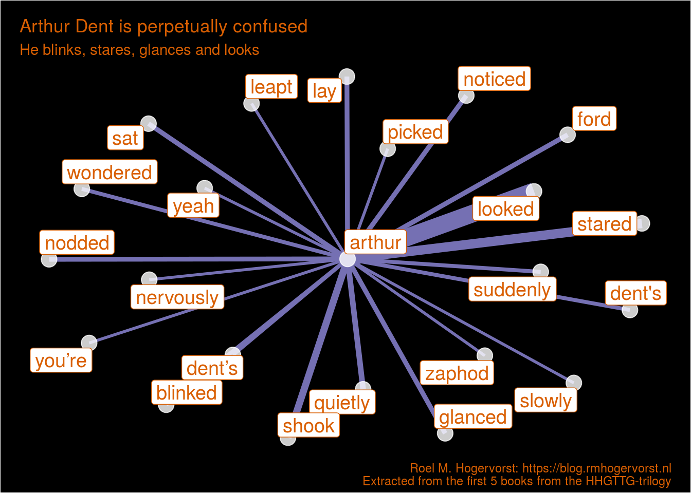

Can we make the computer say something about characters in a book? In this piece I will search for the names of characters and the words around those names in books. What can we learn about a character from text analysis? Of course it's also just another excuse for me to read the Hitchhikers series! I will break down the text into chunks of two words, extract the word pairs that matter and visualize the results. Come an play along with your favorite book.


# Inspiration
The Hitchhiker's Guide to the Galaxy (HHGTTG for short) is a series of scifi novels[^1] about the last surviving man, Arthur Dent, after the destruction of earth. And I love it.

Arthur is an anti-hero, he's not brave, he's not smart, he sort of stumbles through life and things happen to him, he has almost no agency. That is something you realize while you are reading the book, but can we find that in the text as well? What can we find out about the actions of people in a book by looking at words around subjects in a book?

I'm inspired by the amazing text work of Julia Silge. For instance on "She giggles, he gallops"[^2] Julia and her co-writers scanned through 2000 movie manuscripts and extracted words around gender pronouns. They show that  women will more likely snuggle, giggle, squeal, and sob, relative to men. Conversely, men are more likely to strap, gallop, shoot, howl, and kill. See more in [she giggles, he gallops](https://pudding.cool/2017/08/screen-direction/). 

So what can we do with these books? I will walk through all the main characters (and Marvin) and at the end I also look at gender pronouns (he vs she). There is already a problem: there is only one woman in the cast. This could be a problem. 

Many of the steps I take here are copied from the [tidytextmining book](www.tidytextmining.com). 

# Analyses

## Approach

- I used the pubcrawl package to load in every book. 
- use the packages tidygraph, tidyverse, tidytext, ggraph
- create bigrams of text, (go through and extract every two words)
- take more frequent subset of that
- select characters or actions and display them.

leading to:

{width=80% height=80%}

## Data
The books are of course copyrighted so I cannot share the files with you, that would be piracy.
books loaded, cannot do it per chapter, because the chapters are messed up in some of the books. I do it per book. that's life.

## packages

- I use pubcrawl to read in the files [see previous post](/blog/2018/07/19/reading-in-an-epub-file-with-the-pubcrawl-package/)
- tidytext for the tokenization, part of speech tagging
- tidygraph not that much, but for the conversion to graph (could do it with igraph too)
- ggraph to plot the images
- tidyverse (mostly dplyr, and ggplot, a bit of stringr ) for everything else


## Loading the data

```{r, include=FALSE}
HHGTTG <- readr::read_rds("~/Documents/projecten/blog/ignore/HHGTG.RData")
```

```
HHGTTG <- readr::read_rds("link_to_your_book")
```

## Loading the packages

```{r,message=FALSE}
# I know, a lot! 
library(tidytext)
library(tidygraph)
library(ggraph)
library(tidyverse)
library(scales)
```

## create bigrams of text, (go through and extract every two words)

```{r}
unnested_hhgttg <- 
    HHGTTG %>% 
    unnest_tokens(output = "bigram", content, token = "ngrams", n=2) %>% 
    group_by(book) %>% 
    count(bigram,sort = TRUE)
unnested_hhgttg %>% head()
```

Oh no, too many stop words! We have to remove them with the stop words data set from tidytext.

```{r remove stopwords}
unnested_hhgttg <- 
    unnested_hhgttg %>%
    separate(bigram, c("word1", "word2"), sep = " ") %>%
    filter(!word1 %in% stop_words$word) %>%
    filter(!word2 %in% stop_words$word)
unnested_hhgttg %>% head()
```

Hmm these people are called by their complete name a lot. 

## Take only the most frequently used bigrams

I am no longer really interested in the book I found words in.

```{r}
person_actions <- 
    unnested_hhgttg %>% 
    filter(n >1) %>% 
    filter(word2 != "er") %>%  # don't know what it is, but I don't want it
    ungroup() %>% 
    filter(word1 %in% c("ford", "zaphod", "arthur", "tricia", "trillian")) %>% 
    group_by(word1, word2) %>% 
    summarise(n = sum(n))
head(person_actions,4)
```


### Create a cool plotting theme

I will plot several of the same sort of network plots and I don't want to set 
the theme every time. You could use: `theme_set()` but I created a function here.
the function takes data, and you can set a title and subtitle, no need for NSE here. 

I use a black background, because, you know, space! it's big! And empty, and empty is black, because absence of light is dark... Or something. 
And there is a lot of black because the Guide says:

> Space is big. You just won't believe how vastly, hugely, mind- bogglingly big it is. I mean, you may think it's a long way down the road to the chemist's, but that's just peanuts to space.

So.. black background and other colors, I've tried out several color schemes from [colorbrewer](http://colorbrewer2.org) and this sort of looked nice.

```{r}
create_hhgttg_plot <- function(data, title = "what an amazing title!", subtitle = "donkeyballs"){
  # setting some colors
  c3_purple <- "#7570b3"
  c3_orange <- "#d95f02"
  # making a igraph object  
  data %>% 
        as_tbl_graph() %>%
        ggraph(layout = "kk") + 
        geom_edge_link(aes(edge_width = sqrt(n)),colour = c3_purple, show.legend = FALSE) +
        geom_node_point(color = "white", size = 5,alpha = 4/5 ) +
        geom_node_label(aes(label = name),color = c3_orange, repel = TRUE,size = 5) +
        labs(
            title = title,
            subtitle = subtitle,
            caption = "Roel M. Hogervorst: https://blog.rmhogervorst.nl\nExtracted from the first 5 books from the HHGTTG-trilogy"
        )+
        theme_void()+
        theme(
            plot.background = element_rect(fill =  "black"),
            text = element_text(colour = c3_orange),
            plot.margin = unit(c(.3,.6,.2,.5), "cm")
        )
}
set.seed(42) # if I redo everything looks the same
```

## A plot per character

The main character Arthur Dent:


```{r}
person_actions %>% 
    filter(word1 == "arthur") %>%
    filter(word2 != "dent") %>% 
    filter(n >2) %>% 
    create_hhgttg_plot("Arthur Dent is perpetually confused", "He blinks, stares, glances and looks")
```


What about the Hitchhikers' guide writer Ford Prefect?

```{r}
person_actions %>% 
    filter(word1 == "ford") %>%
    filter(!str_detect(word2, "prefect")) %>% 
    filter(n>2) %>% 
    create_hhgttg_plot("Ford is a man of action and disinterest", "He moves, he's hurled, he looks, frowns and shrugs")
```

Than there is the the President of the Galaxy: Zaphod Beeblebrox.

```{r}
person_actions %>% 
    filter(word1 == "zaphod") %>%
    filter(!str_detect(word2, "beeblebrox")) %>% 
    create_hhgttg_plot("Zaphod is more emotional", "He stares, is angry, bitterly and shrugs")
```

Tricia McMillan, the smartest person in the book^[a brilliant mathematician and astrophysicist ] (after Marvin, the android with a brain the size of a galaxy; and should we count him as a person?), mostly just stands and watches what the others are doing. She has two names, and the two names do not appear to have overlapping words. Tricia is most commonly referred to simply as "Trillian", a modification of her birth name, which she adopted because it sounded more "space-like". 

```{r}
person_actions %>% 
    filter(word1 %in% c("tricia", "trillian")) %>% 
    filter(word2 != "mcmillan") %>% 
    create_hhgttg_plot("Tricia sighes", "quickly and quietly")
```

What's up with Marvin?

```{r}
unnested_hhgttg %>% 
  filter(word1 == "marvin") %>%   # oops forgat to include him (it? not sure...)
  ungroup() %>% 
  inner_join(  parts_of_speech %>% 
                 filter(str_detect(pos, "Verb")) %>% 
                 group_by(word) %>%  
                 distinct(pos),
               by = c("word2"="word")) %>% 
  group_by(word1,word2) %>% 
  summarise(n = sum(n)) %>% 
  create_hhgttg_plot("Marvin mostly moves, but in a depressing way", "Marvin: 'Life, don't talk to me about life' ")
  
```


## looking at it from the word perspective

Using the parts of speech data frame in tidytext I can select all 
verbs and select verbs I'm interested in. 

```{r}
verbs <- parts_of_speech %>% filter(str_detect(pos, "Verb")) %>% distinct(word)
action_words <- 
    unnested_hhgttg %>% 
    ungroup() %>% 
    group_by(word1, word2) %>% 
    summarise(n = sum(n)) %>% 
    inner_join(verbs ,by = c("word2"="word"))


# action_words %>% pull(word2) %>% unique() # choose some words
action_words %>% filter(n>3) %>% pull(word2) %>% unique()
```


```{r}
action_words %>% 
    filter(word2 == "realised") %>% 
    filter(n>0) %>% 
    create_hhgttg_plot("Tricia, Arthur and Ford realise", 
                       "")
```

```{r}
action_words %>% 
    filter(word2 == "noticed") %>% 
    create_hhgttg_plot("Arthur and Ford notice", "Arthur noticed a lot")
```

```{r}
action_words %>% 
    filter(word2 == "leapt") %>% 
    create_hhgttg_plot("Not only Zaphod and Arthur leap", "civilization, beer, gold, rocket and flames leap too")
```


```{r}
action_words %>% 
    filter(word2 == "shrugged") %>% 
    create_hhgttg_plot("Who shrugs?", "Mostly Ford")
```

```{r}
action_words %>% 
    filter(word2 == "moved") %>% 
    filter(n>1) %>% 
    create_hhgttg_plot("Who moved?", subtitle = "only the male main characters")
```

## He vs She

Let's try again with the basics, he vs she.
She is used a lot less. he is used 1413 times, and she 373 times.
And disproportionately in the last book 'mostly harmless'. 
I recall that there is a new character in the final book,
Random, the daughter of Arthur. 


```{r}
she_he <- HHGTTG %>% 
    unnest_tokens(output = "bigram", content, token = "ngrams", n=2) %>% 
    group_by(book) %>% 
    count(bigram,sort = TRUE) %>%
    separate(bigram, c("word1", "word2"), sep = " ") %>% 
  filter(word1 %in% c("he", "she") )

she_he %>% 
  filter(word1 == "she") %>% 
  count(book)
```

What verbs are more he-like, and she-like?

I threw away the he and she when I did a anti_join of stop words, so 
let's start over again. 

I'm following parts of the procedures from here: <https://www.tidytextmining.com/twitter.html#word-frequencies-1> 

To account for the difference in numbers I calculate the 
frequency per he and per she and divide those 2. 

```{r}
logratio_she_he <- 
  she_he %>% 
  group_by(word1,word2) %>% 
  summarise(n = sum(n)) %>%  #stopped caring about the book
  group_by(word1) %>% 
  mutate(
    total_count = sum(n),
    freq_type = n/total_count
  ) %>% 
  group_by(word2) %>% 
  mutate(total_count_w = sum(n)) %>% 
  filter(total_count_w >3) %>% 
  inner_join(  parts_of_speech %>% 
                 filter(str_detect(pos, "Verb")) %>% 
                 group_by(word) %>%  
                 distinct(word),
               by = c("word2"="word")) %>% # only keep verbs
  select(word1, word2, freq_type, total_count_w) %>% 
  spread(word1, freq_type) %>% 
  filter(!is.na(he) & !is.na(she)) %>% 
  ungroup() %>% 
  mutate(
    likelihood = he/she,
    logratio = log(he / she),
    label = reorder(word2, logratio)
    )
logratio_she_he %>%  
  filter(total_count_w > 25) %>% # select only more occuring words
  ggplot(aes(label, logratio, size = total_count_w)) +
  geom_point(aes(color = logratio < 0),show.legend = FALSE)+
  geom_hline(yintercept = 0, color = "#d95f02")+
  coord_flip()+
  labs(
    title = "Log odds ratio he/she ",
    subtitle = "Left from the line is more typical for he, right for she",
    caption = "Roel M. Hogervorst: https://blog.rmhogervorst.nl\nExtracted from the first 5 books from the HHGTTG-trilogy",
    x = "", y = "log ratio (left [green] he, right [yellow] she )"
  )+
    scale_color_manual(name = "", values = c("yellow", "green") )+ # define ugly colors. 
  theme_dark() +
  theme(
            plot.background = element_rect(fill =  "black"),
            panel.background = element_rect(fill =  "black"),
            text = element_text(colour = "#d95f02"),
            plot.margin = unit(c(.3,.5,.1,.5), "cm"),
            axis.text = element_text(colour = "#d95f02")
        )
```


# Final thoughts

I think it's a nice way to visualize information from a book. Some characters are more active and others more emotional. _Edit 2022: Since there is only one female lead character and the other leads are all male there is more diversity in words for men. The female characters are described by words like 'stared', 'paused', 'tried'. This matches my memory of these books, the female characters are perpetually perplexed by what stupidity the male characters possess._ 


# References

[^1]: ...and radio plays and a TV-show and a movie, but we don't talk about the movie and TV-series, it's like jar-jar binks. The radio plays are amazing though.
[^2]: find Julia at https://juliasilge.com and [twitter](https://twitter.com/juliasilge) and mastodon

- love the amount of detail in [the wikipedia pages about HHGTTG](https://en.wikipedia.org/wiki/The_Hitchhiker's_Guide_to_the_Galaxy)

- ["she giggles, he gallops", an amazingly insight into screenplays and the way men and women are portrayed, written Julia Silge and others. ](https://pudding.cool/2017/08/screen-direction/)

- if you want to go crazy on tagging parts of speech (POS), you can use [the udpipe package](https://bnosac.github.io/udpipe/en/), it has POS annotations for many languages, automatic keyword extraction, topic modeling, lemmatization and dependency parsing. 

### State of the machine
<details>
<summary> At the moment of creation (when I knitted this document ) this was the state of my machine: **click here to expand** </summary>

```{r}
sessioninfo::session_info()
```

</details>


