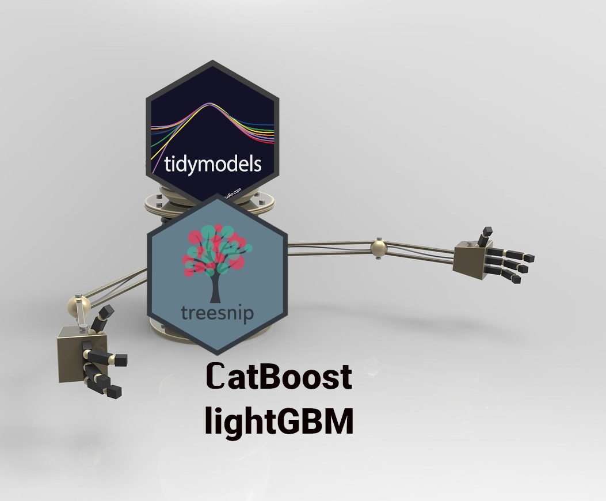

<!-- useful settings for rmarkdown-->


<!-- content  -->
So you want to compete in a kaggle competition with R and you want to use
[tidymodels](https://www.tidymodels.org/). In this howto I show how you can use lightgbm (LGBM) with tidymodels. I give very terse descriptions
of what the steps do, because I believe you read this post for implementation, not background on how the elements work.

Why tidymodels? It is a unified machine learning framework that uses sane
defaults, keeps model definitions andimplementation separate and allows you
to easily swap models or change parts of the processing. 
*In this howto I signify r packages by using the {packagename} convention, f.e.: {ggplot2}* Tidymodels already works with XGBoost and many many other machine learning 
algorithms. However it doesn't yet work with the successors of XGBoost: lightgbm
and catboost. There is an experimental package called [{treesnip}](https://curso-r.github.io/treesnip/) that lets you use lightgbm and catboost with tidymodels. 
This is a howto based on a very sound example of tidymodels with xgboost by [Andy Merlino and Nick Merlino on tychobra.com](https://www.tychobra.com/posts/2020-05-19-xgboost-with-tidymodels/)
from may 2020. In their example and in this one we use the [AmesHousing](https://cran.r-project.org/package=AmesHousing) dataset
about house prices in Ames, Iowa, USA. The model will predict sale price. 
Andy and Nick give a great explanation for all the steps and what to think about.
I highly recommend their tuturial and all tutorials created by 
[Julia Silge](https://juliasilge.com/). 
**TL;DR: With treesnip you can just start using lightgbm and catboost in tidymodels without big changes to your workflow, it is awesome! It brings the state of the art models into the tidymodels framework.** 
The template I'm using can also be found on [this github project](https://github.com/RMHogervorst/templates_ml/blob/master/R/example_lightgbm.R)



Some basics before we go on:
Normally I would do an extensive exploration of the data to see how the variables
interact and influence the house price. In this example I want to focus on
how you can use lightgbm with tidymodels, so I skip this part and use Andy and 
Nick's feature engineering with a small change.

## Basic steps for machine learning projects
The steps in most machine learning projects are as follows:
- Loading necessary packages and data
- split data into train and test ({rsample})
- light preprocessing ({recipes})
- find the best hyperparameters by
  - creating crossvalidation folds ({rsample})
  - creating a model specification ({tune, parsnip, treesnip, dials})
  - creating a grid of values ({dials})
  - using a workflow to contain the model and formula ({workflows})
  - tune the model ({tune})
- find the best model from tuning
- retrain on entire test data
- evaluate on test data ({yardstick})
- check residuals and model diagnostics

## Loading necessary packages and data

```r 
# data
library(AmesHousing)

# data cleaning
library(janitor)

# data prep
library(dplyr)

# visualisation
library(ggplot2)

# tidymodels
library(rsample)
library(recipes)
library(parsnip)
library(tune)
library(dials)
library(workflows)
library(yardstick)
library(treesnip)
```

Setting up some settings, this is optional but can help speed things 
up.
```r 
## 
# speed up computation with parallel processing
library(doParallel)
all_cores <- parallel::detectCores(logical = FALSE) 
registerDoParallel(cores = all_cores) 
```

And setting up data:

```r 
# set the random seed so we can reproduce any simulated results.
set.seed(1234)

# load the housing data and clean names
ames_data <- make_ames() %>%
    janitor::clean_names()
```


## Split data into train and test
```r 
ames_split <- rsample::initial_split(
    ames_data, 
    prop = 0.8, 
    strata = sale_price
)
```

## Some light preprocessing 
Many models require careful and extensive variable preprocessing to produce 
accurate predictions. 
Boosted tree models like XGBoost,lightgbm, and catboost are quite robust against 
highly skewed and/or correlated data, so the amount of preprocessing required 
is minimal. In contrast to XGBoost, both lightgbm and catboost are very capable
of handling categorical variables (factors) and so you don't need to turn 
variables into dummies (one hot encode), in fact you shouldn't do it, it makes
everything slower and might give you worse performance.

```r 
preprocessing_recipe <- 
    recipes::recipe(sale_price ~ ., data = training(ames_split)) %>%
    # combine low frequency factor levels
    recipes::step_other(all_nominal(), threshold = 0.01) %>%
    # remove no variance predictors which provide no predictive information 
    recipes::step_nzv(all_nominal()) %>%
    # prep the recipe so it can be used on other data
    prep()
```


## Find the best hyperparameters
Create crossvalidation folds. This means the data is split into 5 chunks, the model trained on four of them and predicts on the fifth chunk. This
is done five times (predicting every time on a different chunk) and the
metrics will be averaged over the chunks as a measure of out of sample performance.

```r 
ames_cv_folds <- 
    recipes::bake(
        preprocessing_recipe, 
        new_data = training(ames_split)
    ) %>%  
    rsample::vfold_cv(v = 5)
```

Create a model specification for lightgbm 
The treesnip package makes sure that boost_tree understands what engine
lightgbm is, and how the parameters are translated internaly. 
We don't know yet what the ideal parameter values are for
this lightgbm model. So we have to tune the parameters.

```r 
lightgbm_model<- 
    parsnip::boost_tree(
        mode = "regression",
        trees = 1000,
        min_n = tune(),
        tree_depth = tune(),
    ) %>%
    set_engine("lightgbm", objective = "reg:squarederror",verbose=-1)
```

Grid specification by dials package to fill in the model above
This specification automates the min and max values of these
parameters. 

According to the [lightgbm parameter tuning guide](https://lightgbm.readthedocs.io/en/latest/Parameters-Tuning.html)
the hyperparameters `number of leaves`, `min_data_in_leaf`, and `max_depth` are the most important features. 
Currently implemented for lightgbm in [(treesnip)](https://github.com/curso-r/treesnip) are:

- feature_fraction (mtry)
- num_iterations (trees)
- min_data_in_leaf (min_n)
- max_depth (tree_depth)
- learning_rate (learn_rate)
- min_gain_to_split (loss_reduction)
- bagging_fraction (sample_size)

(so we do not yet have number of leaves).

```r 
lightgbm_params <- 
    dials::parameters(
      # The parameters have sane defaults, but if you have some knowledge 
      # of the process you can set upper and lower limits to these parameters.
        min_n(), # 2nd important
        tree_depth() # 3rd most important
    )
```

And finally construct a grid with actual values to search for. 

```r 
lgbm_grid <- 
    dials::grid_max_entropy(
        lightgbm_params, 
        size = 30 # set this to a higher number to get better results
        # I don't want to run this all night, so I set it to 30
    )
head(lgbm_grid)
```

```
# A tibble: 6 x 2
  min_n tree_depth
  <int>      <int>
1    10          9
2    19         11
3    40          8
4    12          1
5    19          5
6    31          8
```

To tune our model, we perform grid search over our lightgbm_grid’s grid space
to identify the hyperparameter values that have the lowest prediction error.

Actual workflow object
```r 
lgbm_wf <- 
    workflows::workflow() %>%
    add_model(lightgbm_model
             ) %>% 
    add_formula(sale_price ~ .)
```

**so far little to no computation has been performed except for preprocessing calculations**
But the machine will start to run hot in the next step, where we call tune_grid.
If you look at the process for xgboost and in the next tutorial for catboost
the steps remain the same, with a few details different but mostly the same!

We call tune_grid with: 
- “object”: lgbm_wf which is a workflow that we defined by the parsnip and
 workflows packages
- “resamples”: ames_cv_folds as defined by rsample and
 recipes packages
- “grid”: lgbm_grid our grid space as defined by the dials
 package
 - “metric”: the yardstick package defines the metric set used to
 evaluate model performance


```r 
lgbm_tuned <- tune::tune_grid(
    object = lgbm_wf,
    resamples = ames_cv_folds,
    grid = lgbm_grid,
    metrics = yardstick::metric_set(rmse, rsq, mae),
    control = tune::control_grid(verbose = FALSE) # set this to TRUE to see
    # in what step of the process you are. But that doesn't look that well in
    # a blog.
)
```


## Find the best model from tuning results
hyperparameter values which performed best at minimizing RMSE.

```r 
lgbm_tuned %>%
    tune::show_best(metric = "rmse",n = 5) 
```

```
# A tibble: 5 x 8
  min_n tree_depth .metric .estimator   mean     n std_err .config
  <int>      <int> <chr>   <chr>       <dbl> <int>   <dbl> <chr>  
1     8          3 rmse    standard   24555.     5   1192. Model30
2    13          4 rmse    standard   24647.     5   1042. Model29
3    12          1 rmse    standard   25195.     5   1281. Model04
4    19          5 rmse    standard   25206.     5   1079. Model05
5     6          5 rmse    standard   25382.     5    858. Model18
```

plot the performance per parameter. 

```r 
lgbm_tuned %>%  
  tune::show_best(metric = "rmse",n = 10) %>% 
  tidyr::pivot_longer(min_n:tree_depth, names_to="variable",values_to="value" ) %>% 
  ggplot(aes(value,mean)) + 
  geom_line(alpha=1/2)+ 
  geom_point()+ 
  facet_wrap(~variable,scales = "free")+
  ggtitle("Best parameters for RMSE")
```

Since we asked for multiple metrics we can see the best performance for different
metrics too.

```r 
lgbm_tuned %>%  
  tune::show_best(metric = "mae",n = 10) %>% 
  tidyr::pivot_longer(min_n:tree_depth, names_to="variable",values_to="value" ) %>% 
  ggplot(aes(value,mean)) + 
  geom_line(alpha=1/2)+ 
  geom_point()+ 
  facet_wrap(~variable,scales = "free")+
  ggtitle("Best parameters for MAE")
```


Than we can select the best parameter combination for a metric, or do it manually. 

```r 
lgbm_best_params <- 
  lgbm_tuned %>%
    tune::select_best("rmse")
```

Finalize the lgbm model to use the best tuning parameters.
```r 
lgbm_model_final <- 
  lightgbm_model%>% 
  finalize_model(lgbm_best_params)
```

The finalized model is filled in:

```r 
# empty
lightgbm_model
```

```
Boosted Tree Model Specification (regression)

Main Arguments:
  trees = 1000
  min_n = tune()
  tree_depth = tune()

Engine-Specific Arguments:
  objective = reg:squarederror
  verbose = -1

Computational engine: lightgbm 
```


```r 
# filled in
lgbm_model_final
```

```
Boosted Tree Model Specification (regression)

Main Arguments:
  trees = 1000
  min_n = 8
  tree_depth = 3

Engine-Specific Arguments:
  objective = reg:squarederror
  verbose = -1

Computational engine: lightgbm 
```

## Retrain on entire training data 

<details>
  <summary> This is giving me a lot of warnings and lgbm isn't giving us the warnings in warning type, so I've hidden this ugly part. <b> click to unhide</b> But I fit the finalized model again on new data. </summary>


</details>

## And evaluate on test data (yardstick)

```r 
test_processed  <- bake(preprocessing_recipe, new_data = testing(ames_split))
test_prediction <- 
    trained_model_all_data %>% 
    # use the training model fit to predict the test data
    predict(new_data = test_processed) %>%
    bind_cols(testing(ames_split))
```

measure the accuracy of our model on training set (overestimation)
```r 
train_prediction %>%
    yardstick::metrics(sale_price, .pred) %>% 
  mutate(.estimate = format(round(.estimate, 2), big.mark = ",")) %>% 
  knitr::kable()
```


|.metric |.estimator |.estimate |
|:-------|:----------|:---------|
|rmse    |standard   |17,575.38 |
|rsq     |standard   |0.95      |
|mae     |standard   |12,473.87 |

measure the accuracy of our model on data it hasn't seen before (testset)

```r 
test_prediction %>%
    yardstick::metrics(sale_price, .pred) %>% 
  mutate(.estimate = format(round(.estimate, 2), big.mark = ",")) %>% 
  knitr::kable()
```


|.metric |.estimator |.estimate |
|:-------|:----------|:---------|
|rmse    |standard   |33,966.76 |
|rsq     |standard   |0.83      |
|mae     |standard   |18,040.51 |

Not a bad score.

## look at residuals

```r 
house_prediction_residual <- test_prediction %>%
    arrange(.pred) %>%
    mutate(residual_pct = (sale_price - .pred) / .pred) %>%
    select(.pred, residual_pct)
```

```r 
ggplot(house_prediction_residual, aes(x = .pred, y = residual_pct)) +
    geom_point() +
    xlab("Predicted Sale Price") +
    ylab("Residual (%)") +
    scale_x_continuous(labels = scales::dollar_format()) +
    scale_y_continuous(labels = scales::percent)
```



So that works quite well, there are some outliers in low price. And we can probably discover what cases are doing badly and maybe add more information to the model to discover and distinguish.

# Other stuff

Installing lightgbm can be done following the [official instructions](https://lightgbm.readthedocs.io/en/latest/R/index.html) or see this post
on my [other blog for macos specific instructions](https://notes.rmhogervorst.nl/post/2020/07/16/installing-lightgbm-on-macos-catalina/)

Find the original tutorial for tidymodels with xgboost [here](https://www.tychobra.com/posts/2020-05-19-xgboost-with-tidymodels/).


### Reproducibility

<details>
  <summary> At the moment of creation (when I knitted this document ) this was the state of my machine: <b> click to expand</b> </summary>
  
  
```r 
sessioninfo::session_info()
```

```
─ Session info ───────────────────────────────────────────────────────────────
 setting  value                       
 version  R version 4.0.2 (2020-06-22)
 os       macOS Catalina 10.15.6      
 system   x86_64, darwin17.0          
 ui       X11                         
 language (EN)                        
 collate  en_US.UTF-8                 
 ctype    en_US.UTF-8                 
 tz       Europe/Amsterdam            
 date     2020-08-27                  

─ Packages ───────────────────────────────────────────────────────────────────
 package     * version    date       lib source                           
 AmesHousing * 0.0.4      2020-06-23 [1] CRAN (R 4.0.2)                   
 assertthat    0.2.1      2019-03-21 [1] CRAN (R 4.0.0)                   
 class         7.3-17     2020-04-26 [1] CRAN (R 4.0.2)                   
 cli           2.0.2      2020-02-28 [1] CRAN (R 4.0.0)                   
 codetools     0.2-16     2018-12-24 [1] CRAN (R 4.0.2)                   
 colorspace    1.4-1      2019-03-18 [1] CRAN (R 4.0.0)                   
 crayon        1.3.4      2017-09-16 [1] CRAN (R 4.0.0)                   
 data.table    1.13.0     2020-07-24 [1] CRAN (R 4.0.2)                   
 dials       * 0.0.8      2020-07-08 [1] CRAN (R 4.0.2)                   
 DiceDesign    1.8-1      2019-07-31 [1] CRAN (R 4.0.0)                   
 digest        0.6.25     2020-02-23 [1] CRAN (R 4.0.0)                   
 doParallel  * 1.0.15     2019-08-02 [1] CRAN (R 4.0.2)                   
 dplyr       * 1.0.2      2020-08-18 [1] CRAN (R 4.0.2)                   
 ellipsis      0.3.1      2020-05-15 [1] CRAN (R 4.0.1)                   
 evaluate      0.14       2019-05-28 [1] CRAN (R 4.0.0)                   
 fansi         0.4.1      2020-01-08 [1] CRAN (R 4.0.0)                   
 farver        2.0.3      2020-01-16 [1] CRAN (R 4.0.0)                   
 foreach     * 1.5.0      2020-03-30 [1] CRAN (R 4.0.1)                   
 furrr         0.1.0      2018-05-16 [1] CRAN (R 4.0.0)                   
 future        1.18.0     2020-07-09 [1] CRAN (R 4.0.2)                   
 generics      0.0.2      2018-11-29 [1] CRAN (R 4.0.0)                   
 ggplot2     * 3.3.2      2020-06-19 [1] CRAN (R 4.0.1)                   
 globals       0.12.5     2019-12-07 [1] CRAN (R 4.0.0)                   
 glue          1.4.1      2020-05-13 [1] CRAN (R 4.0.1)                   
 gower         0.2.2      2020-06-23 [1] CRAN (R 4.0.1)                   
 GPfit         1.0-8      2019-02-08 [1] CRAN (R 4.0.0)                   
 gtable        0.3.0      2019-03-25 [1] CRAN (R 4.0.0)                   
 highr         0.8        2019-03-20 [1] CRAN (R 4.0.0)                   
 htmltools     0.5.0      2020-06-16 [1] CRAN (R 4.0.1)                   
 ipred         0.9-9      2019-04-28 [1] CRAN (R 4.0.0)                   
 iterators   * 1.0.12     2019-07-26 [1] CRAN (R 4.0.0)                   
 janitor     * 2.0.1      2020-04-12 [1] CRAN (R 4.0.2)                   
 jsonlite      1.7.0      2020-06-25 [1] CRAN (R 4.0.1)                   
 knitr         1.29       2020-06-23 [1] CRAN (R 4.0.1)                   
 labeling      0.3        2014-08-23 [1] CRAN (R 4.0.0)                   
 lattice       0.20-41    2020-04-02 [1] CRAN (R 4.0.2)                   
 lava          1.6.7      2020-03-05 [1] CRAN (R 4.0.0)                   
 lhs           1.0.2      2020-04-13 [1] CRAN (R 4.0.2)                   
 lifecycle     0.2.0      2020-03-06 [1] CRAN (R 4.0.0)                   
 lightgbm      3.0.0-1    2020-08-26 [1] url                              
 listenv       0.8.0      2019-12-05 [1] CRAN (R 4.0.0)                   
 lubridate     1.7.9      2020-06-08 [1] CRAN (R 4.0.2)                   
 magrittr      1.5        2014-11-22 [1] CRAN (R 4.0.0)                   
 MASS          7.3-51.6   2020-04-26 [1] CRAN (R 4.0.2)                   
 Matrix        1.2-18     2019-11-27 [1] CRAN (R 4.0.2)                   
 munsell       0.5.0      2018-06-12 [1] CRAN (R 4.0.0)                   
 nnet          7.3-14     2020-04-26 [1] CRAN (R 4.0.2)                   
 parsnip     * 0.1.3      2020-08-04 [1] CRAN (R 4.0.2)                   
 pillar        1.4.6      2020-07-10 [1] CRAN (R 4.0.2)                   
 pkgconfig     2.0.3      2019-09-22 [1] CRAN (R 4.0.0)                   
 plyr          1.8.6      2020-03-03 [1] CRAN (R 4.0.0)                   
 pROC          1.16.2     2020-03-19 [1] CRAN (R 4.0.0)                   
 prodlim       2019.11.13 2019-11-17 [1] CRAN (R 4.0.0)                   
 purrr         0.3.4      2020-04-17 [1] CRAN (R 4.0.1)                   
 R6            2.4.1      2019-11-12 [1] CRAN (R 4.0.0)                   
 Rcpp          1.0.5      2020-07-06 [1] CRAN (R 4.0.2)                   
 recipes     * 0.1.13     2020-06-23 [1] CRAN (R 4.0.1)                   
 rlang         0.4.7      2020-07-09 [1] CRAN (R 4.0.2)                   
 rmarkdown     2.3        2020-06-18 [1] CRAN (R 4.0.1)                   
 rpart         4.1-15     2019-04-12 [1] CRAN (R 4.0.2)                   
 rsample     * 0.0.7      2020-06-04 [1] CRAN (R 4.0.1)                   
 scales      * 1.1.1      2020-05-11 [1] CRAN (R 4.0.1)                   
 sessioninfo   1.1.1      2018-11-05 [1] CRAN (R 4.0.1)                   
 snakecase     0.11.0     2019-05-25 [1] CRAN (R 4.0.2)                   
 stringi       1.4.6      2020-02-17 [1] CRAN (R 4.0.0)                   
 stringr       1.4.0      2019-02-10 [1] CRAN (R 4.0.0)                   
 survival      3.2-3      2020-06-13 [1] CRAN (R 4.0.1)                   
 tibble        3.0.3      2020-07-10 [1] CRAN (R 4.0.2)                   
 tidyr         1.1.1      2020-07-31 [1] CRAN (R 4.0.2)                   
 tidyselect    1.1.0      2020-05-11 [1] CRAN (R 4.0.1)                   
 timeDate      3043.102   2018-02-21 [1] CRAN (R 4.0.0)                   
 treesnip    * 0.1.0      2020-08-26 [1] Github (curso-r/treesnip@8a87e8c)
 tune        * 0.1.1      2020-07-08 [1] CRAN (R 4.0.2)                   
 utf8          1.1.4      2018-05-24 [1] CRAN (R 4.0.0)                   
 vctrs         0.3.2      2020-07-15 [1] CRAN (R 4.0.2)                   
 withr         2.2.0      2020-04-20 [1] CRAN (R 4.0.2)                   
 workflows   * 0.1.2      2020-07-07 [1] CRAN (R 4.0.2)                   
 xfun          0.15       2020-06-21 [1] CRAN (R 4.0.2)                   
 yaml          2.2.1      2020-02-01 [1] CRAN (R 4.0.0)                   
 yardstick   * 0.0.7      2020-07-13 [1] CRAN (R 4.0.2)                   

[1] /Library/Frameworks/R.framework/Versions/4.0/Resources/library
```

</details>


