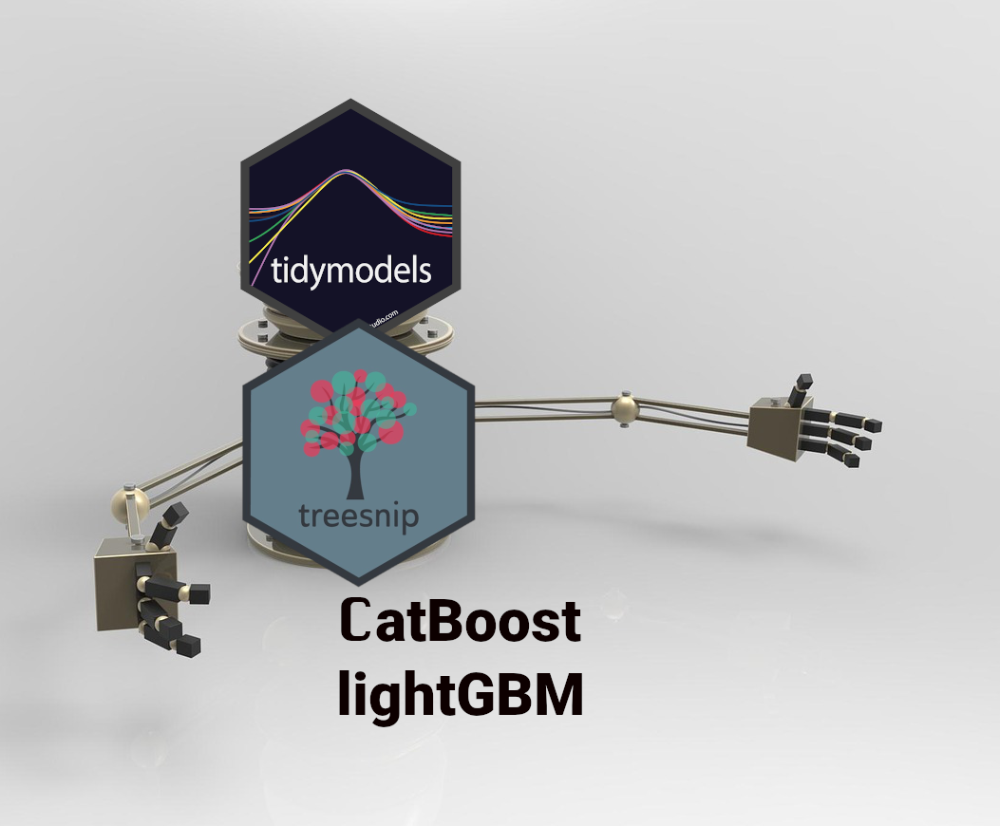

<!-- useful settings for rmarkdown-->

```{r setup, include=FALSE}
# Options to have images saved in the post folder
# And to disable symbols before output
knitr::opts_chunk$set(fig.path = "", comment = "")

# knitr hook to make images output use Hugo options
knitr::knit_hooks$set(
  plot = function(x, options) {
    hugoopts <- options$hugoopts
    paste0(
      "{{<figure src=",
      '"', x, '" ',
      if (!is.null(hugoopts)) {
        glue::glue_collapse(
          glue::glue('{names(hugoopts)}="{hugoopts}"'),
          sep = " "
        )
      },
      ">}}\n"
    )
  }
)

# knitr hook to use Hugo highlighting options
knitr::knit_hooks$set(
  source = function(x, options) {
  hlopts <- options$hlopts
    paste0(
      "```r ",
      if (!is.null(hlopts)) {
      paste0("{",
        glue::glue_collapse(
          glue::glue('{names(hlopts)}={hlopts}'),
          sep = ","
        ), "}"
        )
      },
      "\n", glue::glue_collapse(x, sep = "\n"), "\n```\n"
    )
  }
)
```

<!-- content  -->
So you want to compete in a kaggle competition with R and you want to use
[tidymodels](https://www.tidymodels.org/). In this howto I show how you can use CatBoost with tidymodels. I give very terse descriptions
of what the steps do, because I believe you read this post for implementation, not background on how the elements work. This tutorial is extremely similar to my previous post about using lightGBM with Tidymodels.

Why tidymodels? It is a unified machine learning framework that uses sane
defaults, keeps model definitions andimplementation separate and allows you
to easily swap models or change parts of the processing. 
*In this howto I signify r packages by using the {packagename} convention, f.e.: {ggplot2}* Tidymodels already works with XGBoost and many many other machine learning 
algorithms. However it doesn't yet work with the successors of XGBoost: lightgbm
and catboost. There is an experimental package called [{treesnip}](https://curso-r.github.io/treesnip/) that lets you use catboost and catboost with tidymodels. 
This is a howto based on a very sound example of tidymodels with xgboost by [Andy Merlino and Nick Merlino on tychobra.com](https://www.tychobra.com/posts/2020-05-19-xgboost-with-tidymodels/)
from may 2020. In their example and in this one we use the [AmesHousing](https://cran.r-project.org/package=AmesHousing) dataset
about house prices in Ames, Iowa, USA. The model will predict sale price. 
Andy and Nick give a great explanation for all the steps and what to think about.
I highly recommend their tuturial and all tutorials created by 
[Julia Silge](https://juliasilge.com/). 
**TL;DR: With treesnip you can just start using lightgbm and catboost in tidymodels without big changes to your workflow, it is awesome! It brings the state of the art models into the tidymodels framework.** 
The template I'm using can also be found on [this github project](https://github.com/RMHogervorst/templates_ml/blob/master/R/example_catboost.R)



Some basics before we go on:
Normally I would do an extensive exploration of the data to see how the variables
interact and influence the house price. In this example I want to focus on
how you can use CatBoost with tidymodels, so I skip this part and use Andy and 
Nick's feature engineering with a small change.

## Basic steps for machine learning projects
The steps in most machine learning projects are as follows:
- Loading necessary packages and data
- split data into train and test ({rsample})
- light preprocessing ({recipes})
- find the best hyperparameters by
  - creating crossvalidation folds ({rsample})
  - creating a model specification ({tune, parsnip, treesnip, dials})
  - creating a grid of values ({dials})
  - using a workflow to contain the model and formula ({workflows})
  - tune the model ({tune})
- find the best model from tuning
- retrain on entire test data
- evaluate on test data ({yardstick})
- check residuals and model diagnostics

## Loading necessary packages and data

```{r message=FALSE}
# data
library(AmesHousing)

# data cleaning
library(janitor)

# data prep
library(dplyr)

# visualisation
library(ggplot2)

# tidymodels
library(rsample)
library(recipes)
library(parsnip)
library(tune)
library(dials)
library(workflows)
library(yardstick)
library(treesnip)
```

Setting up some settings, this is optional but can help speed things 
up.
```{r, message=FALSE}
## 
# speed up computation with parallel processing
library(doParallel)
all_cores <- parallel::detectCores(logical = FALSE) 
registerDoParallel(cores = all_cores) 
```

And setting up data:

```{r}
# set the random seed so we can reproduce any simulated results.
set.seed(1234)

# load the housing data and clean names
ames_data <- make_ames() %>%
    janitor::clean_names()
```


## Split data into train and test
```{r}
ames_split <- rsample::initial_split(
    ames_data, 
    prop = 0.8, 
    strata = sale_price
)
```

## Some light preprocessing 
Many models require careful and extensive variable preprocessing to produce 
accurate predictions. 
Boosted tree models like XGBoost,lightgbm, and catboost are quite robust against 
highly skewed and/or correlated data, so the amount of preprocessing required 
is minimal. In contrast to XGBoost, both lightgbm and catboost are very capable
of handling categorical variables (factors) and so you don't need to turn 
variables into dummies (one hot encode), in fact you shouldn't do it, it makes
everything slower and might give you worse performance.

```{r}
preprocessing_recipe <- 
    recipes::recipe(sale_price ~ ., data = training(ames_split)) %>%
    # combine low frequency factor levels
    recipes::step_other(all_nominal(), threshold = 0.01) %>%
    # remove no variance predictors which provide no predictive information 
    recipes::step_nzv(all_nominal()) %>%
    # prep the recipe so it can be used on other data
    prep()
```


## Find the best hyperparameters
Create crossvalidation folds. This means the data is split into 5 chunks, the model trained on four of them and predicts on the fifth chunk. This
is done five times (predicting every time on a different chunk) and the
metrics will be averaged over the chunks as a measure of out of sample performance.

```{r}
ames_cv_folds <- 
    recipes::bake(
        preprocessing_recipe, 
        new_data = training(ames_split)
    ) %>%  
    rsample::vfold_cv(v = 5)
```

Create a model specification for CatBoost 
The treesnip package makes sure that boost_tree understands what engine
CatBoost is, and how the parameters are translated internaly. 
We don't know yet what the ideal parameter values are for
this CatBoost model. So we have to tune the parameters.

```{r}
catboost_model<- 
    parsnip::boost_tree(
        mode = "regression",
        trees = 1000,
        min_n = tune(),
        learn_rate = tune(),
        tree_depth = tune()
    ) %>%
    set_engine("catboost", loss_function = "squarederror")

```

Grid specification by dials package to fill in the model above.
This specification automates the min and max values of these
parameters. 

According to the [Catboost parameter tuning guide](https://catboost.ai/docs/concepts/parameter-tuning.html)
the hyperparameters `number of trees`, `learning rate`, `tree depth` are the most important features. 
Currently implemented for CatBoost in [(treesnip)](https://github.com/curso-r/treesnip) are:

- rsm (mtry)
- iterations (trees)
- min_data_in_leaf (min_n)
- depth (tree_depth)
- learning_rate (learn_rate)
- subsample (sample_size)

```{r}
CatBoost_params <- 
    dials::parameters(
        min_n(), # min data in leaf
        tree_depth(range = c(4,10)), # depth
        # In most cases, the optimal depth ranges from 4 to 10. 
        # Values in the range from 6 to 10 are recommended. 
        learn_rate() # learning rate
    )
```

And finally construct a grid with actual values to search for. 

```{r}
cbst_grid <- 
    dials::grid_max_entropy(
        CatBoost_params, 
        size = 20 # set this to a higher number to get better results
        # I don't want to run this all night, so I set it to 30
    )
head(cbst_grid)
```

To tune our model, we perform grid search over our CatBoost_grid’s grid space
to identify the hyperparameter values that have the lowest prediction error.

Actual workflow object
```{r}
cbst_wf <- 
    workflows::workflow() %>%
    add_model(catboost_model
             ) %>% 
    add_formula(sale_price ~ .)
```

**so far little to no computation has been performed except for preprocessing calculations**
But the machine will start to run hot in the next step, where we call tune_grid.
If you look at the process for xgboost and in the next tutorial for catboost
the steps remain the same, with a few details different but mostly the same!

We call tune_grid with: 
- “object”: cbst_wf which is a workflow that we defined by the parsnip and
 workflows packages
- “resamples”: ames_cv_folds as defined by rsample and
 recipes packages
- “grid”: cbst_grid our grid space as defined by the dials
 package
 - “metric”: the yardstick package defines the metric set used to
 evaluate model performance


```{r, cache=TRUE}
cbst_tuned <- tune::tune_grid(
    object = cbst_wf,
    resamples = ames_cv_folds,
    grid = cbst_grid,
    metrics = yardstick::metric_set(rmse, rsq, mae),
    control = tune::control_grid(verbose = FALSE) # set this to TRUE to see
    # in what step of the process you are. But that doesn't look that well in
    # a blog.
)
```


## Find the best model from tuning results
hyperparameter values which performed best at minimizing RMSE.

```{r}
cbst_tuned %>%
    tune::show_best(metric = "rmse",n = 5) 
```

plot the performance per parameter. 

```{r}
cbst_tuned %>%  
  tune::show_best(metric = "rmse",n = 10) %>% 
  tidyr::pivot_longer(min_n:learn_rate, names_to="variable",values_to="value" ) %>% 
  ggplot(aes(value,mean)) + 
  geom_line(alpha=1/2)+ 
  geom_point()+ 
  facet_wrap(~variable,scales = "free")+
  ggtitle("Best parameters for RMSE")
```
Since we asked for multiple metrics we can see the best performance for different
metrics too.

```{r}
cbst_tuned %>%  
  tune::show_best(metric = "mae",n = 10) %>% 
  tidyr::pivot_longer(min_n:learn_rate, names_to="variable",values_to="value" ) %>% 
  ggplot(aes(value,mean)) + 
  geom_line(alpha=1/2)+ 
  geom_point()+ 
  facet_wrap(~variable,scales = "free")+
  ggtitle("Best parameters for MAE")
```

Than we can select the best parameter combination for a metric, or do it manually. 

```{r}
cbst_best_params <- 
  cbst_tuned %>%
    tune::select_best("rmse")
```

Finalize the CatBoost model to use the best tuning parameters.
```{r}
cbst_model_final <- 
  catboost_model%>% 
  finalize_model(cbst_best_params)
```

The finalized model is filled in:

```{r}
# empty
catboost_model
```


```{r}
# filled in
cbst_model_final
```

## Retrain on entire training data 


```{r }
# create train set
train_processed <- bake(preprocessing_recipe,  new_data = training(ames_split))
# fit model on entire trainset
trained_model_all_data <- cbst_model_final %>%
    # fit the model on all the training data
    fit(
        formula = sale_price ~ ., 
        data    = train_processed
    )
train_prediction <- 
    trained_model_all_data %>% 
    predict(new_data = train_processed) %>%
    bind_cols(training(ames_split))
```


## And evaluate on test data (yardstick)

```{r}
test_processed  <- bake(preprocessing_recipe, new_data = testing(ames_split))
test_prediction <- 
    trained_model_all_data %>% 
    # use the training model fit to predict the test data
    predict(new_data = test_processed) %>%
    bind_cols(testing(ames_split))
```

measure the accuracy of our model on training set (overestimation)
```{r}
train_prediction %>%
    yardstick::metrics(sale_price, .pred) %>% 
  mutate(.estimate = format(round(.estimate, 2), big.mark = ",")) %>% 
  knitr::kable()
```

measure the accuracy of our model on data it hasn't seen before (testset)

```{r}
test_prediction %>%
    yardstick::metrics(sale_price, .pred) %>% 
  mutate(.estimate = format(round(.estimate, 2), big.mark = ",")) %>% 
  knitr::kable()
```

Not a bad score.

## look at residuals

```{r}
house_prediction_residual <- test_prediction %>%
    arrange(.pred) %>%
    mutate(residual_pct = (sale_price - .pred) / .pred) %>%
    select(.pred, residual_pct)
  
```

```{r}
ggplot(house_prediction_residual, aes(x = .pred, y = residual_pct)) +
    geom_point() +
    xlab("Predicted Sale Price") +
    ylab("Residual (%)") +
    scale_x_continuous(labels = scales::dollar_format()) +
    scale_y_continuous(labels = scales::percent)
```


So that works quite well, there are some outliers in low price. And we can probably discover what cases are doing badly and maybe add more information to the model to discover and distinguish.

# Other stuff

Installing CatBoost can be done following the [official R installation instructions](https://catboost.ai/docs/installation/r-installation-binary-installation.html#r-installation-binary-installation) or see this post
on my [other blog for macos specific instructions](https://notes.rmhogervorst.nl/post/2020/07/17/installing-catboost-on-macos-catalina/)

Find the original tutorial for tidymodels with xgboost [here](https://www.tychobra.com/posts/2020-05-19-xgboost-with-tidymodels/).


### Reproducibility

<details>
  <summary> At the moment of creation (when I knitted this document ) this was the state of my machine: <b> click to expand</b> </summary>
  
  
```{r}
sessioninfo::session_info()
```

</details>


