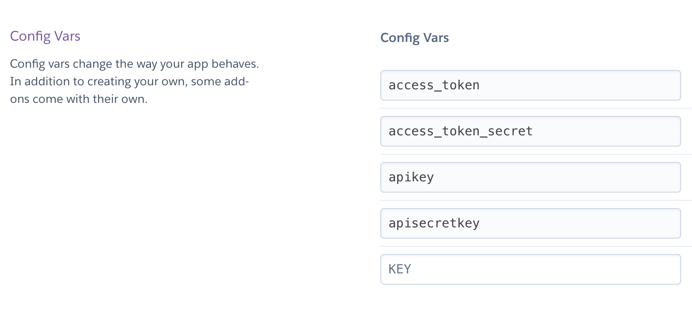
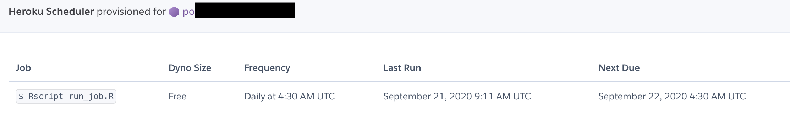

<!-- useful settings for rmarkdown-->


<!-- content -->

In this tutorial I have an R script that runs every day on heroku. It creates a curve in ggplot2 and posts that picture to twitter. 


**The use case is this: You have a script and it needs to run on a schedule (for instance every day).**


In 2018 I wrote a small post how to run [an R script on heroku](https://blog.rmhogervorst.nl/blog/2018/12/06/running-an-r-script-on-heroku/ "old blogpost").
The amazing thing is that the bot I created back then is still running! But I recently got a question about the scheduling,  and because I did not really document it that well I will do a small update here. 

### Other ways to schedule a script
*I will create a new post for many of the other ways on which you can run an R script on schedule. But in this case I will run the script on heroku. Heroku is useful if you have one script you want to run, and not too often (every hour/ every day). If you have many scripts, long running scripts or you want more precise time control, heroku is not the best solution. Also there are quite some manual steps, this is not really suited for a complete automatic setup. Find all posts about scheduling an R script [here](https://blog.rmhogervorst.nl/tags/scheduling/)*

## Heroku details
Heroku does not have dedicated R runners but you can install an R runtime created by other people. In heroku they are called buildpacks. I'm using this one: <https://github.com/virtualstaticvoid/heroku-buildpack-r>

On a high level this is what is going to happen:


```
(We want the code to run on computer in the cloud)
You save your script locally in a git repository
You push everything to heroku (a cloud provider, think a laptop in the sky)
# installation
heroku installs R and the relevant packages and the script
heroku saves this state and stops
# running something
you can give heroku a command and it will start up and run the script
this starting up can be done on a timer
```

I first explain what you need, what my rscript does, and how to deal with credentials. If you are not interested go immediately to [steps](#steps).

# What you need:
- no fear for using the command line (know where it is and how to navigate is enough)
- an heroku account (you will need a creditcard, *but once a day running is probably free*)
- install the [heroku CLI (command line interface)](https://devcenter.heroku.com/articles/heroku-cli "link to heroku-cli docs and installer")
- authenticate your CLI by running heroku login
- a folder with a script that does what you want to do
- (not necessary, but very useful) renv set up for this project

## Example of a script

I have an [R script](https://github.com/RMHogervorst/invertedushape/blob/main/run_job.R) that:

- creates a u-shape curve dataset 
- adds random names to the x and y axes
- creates ggplot2 image
- posts the tweet as a [twitter account](https://twitter.com/invertedushape1)

With this as result:


Of course you could create something that is actually useful, like downloading data, cleaning it and pushing it into a database. But this example is relatively small and you can actually see the results online.

### Small diversion: credentials/ secrets

For many applications you need credentials and you don't want to put the
credentials in the script, if you share the script with someone, they also have the credentials. If you put it on github, the world has your secrets (I just did this). 

So how can you do it? R can read environmental variables
and in heroku you can input the environmental variables that will
be passed to the runner when it runs (there are better, more professional tools to do the same thing but this is good enough for me). So you create an environmental variable called `apikey` with a value like `aVerY5eCretKEy`. In your script you use `Sys.getenv("apikey")` and the script will retrieve the apikey: `aVerY5eCretKEy` and use that.

How do you add them to your local environment?

- Create a .Renviron file in your local project
- add a new line to your .gitignore file: .Renviron
- Now this file with secrets will be ignored by git and you 
can never accidentally add it to a repo.
- the .Renviron file is a simple text file where you can add 'secrets' like: `apikey="aVerY5eCretKEy"` on a new line.

How do you add them to heroku?
I went into the heroku website of my project and manually
set the [config vars (heroku's name for environmental variables)](https://devcenter.heroku.com/articles/config-vars) but it is also possible to set them using `heroku config:set GITHUB_USERNAME=joesmith` in your project folder.



Check if the env vars are correctly set by running `heroku config`

# Steps

So what do you need to make this work?

## Steps in order
```
Check if your script runs on your computer
(Set up renv)
on the cmdline setup an heroku project
add buildpack
git commit all the files you need
push to heroku
testrun script on heroku
add a scheduler
```


## Steps with explanation

- run your R script locally to make sure it works `source("script.R")`
- (optional, but recommended) check if you have set up renv for this project. `renv::status()`. When you are satisfied with the script, use `renv::snapshot()` to fix the versions of your required packages. This creates an 'renv.lock' file that contains the package versions you used.
- go to the project folder on your command line 
- Setup a heroku project: Do either:
`heroku create --buildpack https://github.com/virtualstaticvoid/heroku-buildpack-r.git` in the folder (this creates a new project and adds the buildpack) 

or do `heroku create` first and add the buildpack with:
`heroku buildpacks:set https://github.com/virtualstaticvoid/heroku-buildpack-r.git`

In this previous step you get a name for your project for instance `powerful-dusk-49558`

- make sure you connect your repo to heroku (this didn't happen automatically for me)
`heroku git:remote -a powerful-dusk-49558`

you now have a remote called 'heroku' (`git remote -v` shows this)

- commit all the necessary things:

```
renv/activate.R
renv.lock
script.R
```

You need the `renv/activate.R` script from renv so that the buildpack recognizes this as a renv-equiped R-project. The buildpack also works with a [init.R file if you don't want to use renv and manually write out which packages to install](https://github.com/virtualstaticvoid/heroku-buildpack-r "see more information on their page").


- push to heroku `git push heroku master`

The terminal shows all the installs of the buildback
```
remote: -----> R (renv) app detected
remote: -----> Installing R
remote:        Version 4.0.0 will be installed.
remote: -----> Downloading buildpack archives from AWS S3
..etc...
```
This will take a while because it needs to install R and all the packages. Subsequent pushes are faster because of caching but will still take several minutes.

- After this is finished, test if it works on heroku with `heroku run Rscript script.R`

If it was successful you can add a scheduler

`heroku addons:create scheduler:standard`

Setting up this scheduler is still manual work.

Go to your heroku project in the browser to set the scheduler or use
`heroku addons:open scheduler` to let your browser move to the correct window.

I first set the frequency to hourly to see if the tweet bot works hourly. 

I set the job to `Rscript script.R` 

There are no logs so you better make sure it works when you run `heroku run Rscript script.R` 

If it works via run, it should also work via the scheduler.

I set the schedule to once a day. 



# Conclusion

And now it runs every day. However, there is in this free plan no
logs and no fine grained control. So if it fails, you wouldn't know.


### References
- Find more tutorials by me in [this tutorial overview page](https://blog.rmhogervorst.nl/tags/tutorial/)
- Find all posts about scheduling an R script [here](https://blog.rmhogervorst.nl/tags/scheduling/)
- [previous post by me about heroku](https://blog.rmhogervorst.nl/tags/heroku/)
- [heroku CLI docs](https://devcenter.heroku.com/articles/heroku-cli)
- [my current R script](https://github.com/RMHogervorst/invertedushape/blob/main/run_job.R)
- [heroku config vars docs (environmental variables)](https://devcenter.heroku.com/articles/config-vars)
- [Custom R buildpack for heroku by virtualstaticvoid](https://github.com/virtualstaticvoid/heroku-buildpack-r)

### Reproducibility
<details>
<summary> At the moment of creation (when I knitted this document ) this was the state of my machine: **click here to expand** </summary>

```r 
sessioninfo::session_info()
```

```
─ Session info ───────────────────────────────────────────────────────────────
 setting  value                       
 version  R version 4.0.2 (2020-06-22)
 os       macOS Catalina 10.15.6      
 system   x86_64, darwin17.0          
 ui       X11                         
 language (EN)                        
 collate  en_US.UTF-8                 
 ctype    en_US.UTF-8                 
 tz       Europe/Amsterdam            
 date     2020-09-24                  

─ Packages ───────────────────────────────────────────────────────────────────
 package     * version date       lib source        
 assertthat    0.2.1   2019-03-21 [1] CRAN (R 4.0.0)
 cli           2.0.2   2020-02-28 [1] CRAN (R 4.0.0)
 crayon        1.3.4   2017-09-16 [1] CRAN (R 4.0.0)
 digest        0.6.25  2020-02-23 [1] CRAN (R 4.0.0)
 evaluate      0.14    2019-05-28 [1] CRAN (R 4.0.0)
 fansi         0.4.1   2020-01-08 [1] CRAN (R 4.0.0)
 glue          1.4.1   2020-05-13 [1] CRAN (R 4.0.1)
 htmltools     0.5.0   2020-06-16 [1] CRAN (R 4.0.1)
 knitr         1.29    2020-06-23 [1] CRAN (R 4.0.1)
 magrittr      1.5     2014-11-22 [1] CRAN (R 4.0.0)
 rlang         0.4.7   2020-07-09 [1] CRAN (R 4.0.2)
 rmarkdown     2.3     2020-06-18 [1] CRAN (R 4.0.1)
 sessioninfo   1.1.1   2018-11-05 [1] CRAN (R 4.0.1)
 stringi       1.4.6   2020-02-17 [1] CRAN (R 4.0.0)
 stringr       1.4.0   2019-02-10 [1] CRAN (R 4.0.0)
 withr         2.2.0   2020-04-20 [1] CRAN (R 4.0.2)
 xfun          0.15    2020-06-21 [1] CRAN (R 4.0.2)
 yaml          2.2.1   2020-02-01 [1] CRAN (R 4.0.0)

[1] /Library/Frameworks/R.framework/Versions/4.0/Resources/library
```

</details>
