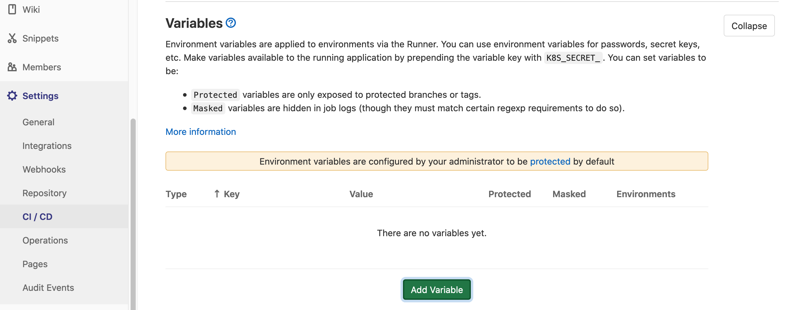
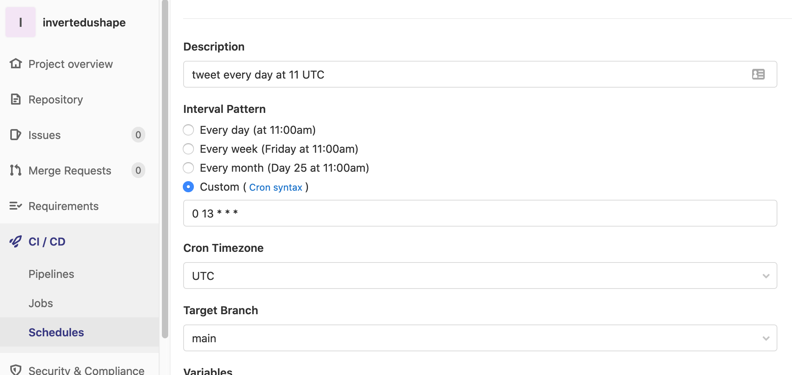

<!-- tags  at least beginner, tutorial, and all packages used.  -->
<!-- categories: R and blog. Blog is general, R means rweekly and r-bloggers -->
<!-- share img is either a complete url or build on top of the base url (https://blog.rmhogervorst.nl) so do not use the same relative image link. But make it more complete post/slug/image.png -->

<!-- useful settings for rmarkdown-->

```{r setup, include=FALSE}
# Options to have images saved in the post folder
# And to disable symbols before output
knitr::opts_chunk$set(fig.path = "", comment = "")

# knitr hook to make images output use Hugo options
knitr::knit_hooks$set(
  plot = function(x, options) {
    hugoopts <- options$hugoopts
    paste0(
      "{{<figure src=",
      '"', x, '" ',
      if (!is.null(hugoopts)) {
        glue::glue_collapse(
          glue::glue('{names(hugoopts)}="{hugoopts}"'),
          sep = " "
        )
      },
      ">}}\n"
    )
  }
)

# knitr hook to use Hugo highlighting options
knitr::knit_hooks$set(
  source = function(x, options) {
  hlopts <- options$hlopts
    paste0(
      "```r ",
      if (!is.null(hlopts)) {
      paste0("{",
        glue::glue_collapse(
          glue::glue('{names(hlopts)}={hlopts}'),
          sep = ","
        ), "}"
        )
      },
      "\n", glue::glue_collapse(x, sep = "\n"), "\n```\n"
    )
  }
)
```
<!-- content -->

In this tutorial I have an R script that creates a plot and tweets it, it runs
every day on gitlab runners. 

**The use case is this: You have a script and it needs to run on a schedule (for instance every day).**

### Other ways to schedule a script
*I will create a new post for many of the other ways on which you can run an R script on schedule. But in this case I will run the script on gitlab. Find all posts about scheduling an R script [here](https://blog.rmhogervorst.nl/tags/scheduling/)* 

## Gitlab details
Gitlab is a complete version control system. I'm using the free version on gitlab.com but
you can self-host gitlab too. And many companies do. That way it remains entirely
under your control. For our purposes though, gitlab is exactly like github but
with more private repos. 

For gitlab you also have to specify configuration in a yaml file. The syntax is 
slightly different from github and you put it into a file called `.gitlab-ci.yml`.
I found this slightly easier to setup, and easier to debug because you specify
which docker container the runner should use. 

My version can be found on [github here](https://github.com/RMHogervorst/invertedushape/blob/main/.gitlab-ci.yml) and
[gitlab here](https://gitlab.com/rmhogervorst/invertedushape/-/blob/main/.gitlab-ci.yml)
The two repos (on github and gitlab) are identical because I have one repo on my computer that is connected to both of them. 

On a high level this is what is going to happen:

On a high level this is what is going to happen:


```
(We want the code to run on computer in the cloud)
You save your script locally in a git repository
You push everything to gitlab
# installation
the gitlab runner 
- uses a docker container which has R installed
- installs the system dependencies
- and installs the correct packages
# running something
gitlab runner runs the script
we can schedule this action
```

I first explain what you need, what my rscript does, and how to deal with credentials. If you are not interested go immediately to [steps](#steps).

# What you need:

- have a gitlab account
- a folder with a script that does what you want to do
- renv set up for this project

## Example of a script

I have an [R script](https://github.com/RMHogervorst/invertedushape/blob/main/run_job.R) that:

- creates a u-shape curve dataset 
- adds random names to the x and y axes
- creates ggplot2 image
- posts the tweet as a [twitter account](https://twitter.com/invertedushape1)

Of course you could create something that is actually useful, like downloading data, cleaning it and pushing it into a database. But this example is relatively small and you can actually see the results online.

### Small diversion: credentials/ secrets
For many applications you need credentials and you don't want to put the
credentials in the script, if you share the script with someone, they also have the credentials. If you put it on an open gitlab repo, the world has your secrets. 

So how can you do it? R can read environmental variables
and in github you can input the environmental variables that will
be passed to the runner when it runs (there are better, more professional tools to do the same thing but this is good enough for me). So you create an environmental variable called `apikey` with a value like `aVerY5eCretKEy`. In your script you use `Sys.getenv("apikey")` and the script will retrieve the apikey: `aVerY5eCretKEy` and use that.

How do you add them to your local environment?

- Create a .Renviron file in your local project
- add a new line to your .gitignore file: .Renviron
- Now this file with secrets will be ignored by git and you 
can never accidentally add it to a repo.
- the .Renviron file is a simple text file where you can add 'secrets' like: `apikey="aVerY5eCretKEy"` on a new line.

How do you add them to gitlab?

- go to settings/CI/CD and scroll to variables and add them



You don't need to do anything else, if you name the vars just as you did in your
.Renviron file it just works.

# Steps

So what do you need to make this work?

## Steps in order

```
Check if your script runs on your computer
Set up renv and snapshot
(optional) try a cache of your renv libraries for faster 
install the correct packages on the runner
execute the script
set up a schedule
```

## Steps with explanation

- run your R script locally to make sure it works `source("script.R")`
- check if you have set up renv for this project. `renv::status()`. When you are satisfied with the script, use `renv::snapshot()` to fix the versions of your required packages. This creates an 'renv.lock' file that contains the package versions you used.
- Gitlab uses special named actions like 'before_script' I have copied and modified the 
example script from [this blogpost](https://blog.methodsconsultants.com/posts/developing-r-packages-with-usethis-and-gitlab-ci-part-ii/) but it is quite doable:

The entire script contains 4 parts

- variables
- cache
- before_script
- run

The cache is optional and I don't think it works as intented yet. 
Variables are used further in the process and the before_script
runs before the script action in run. Wait that doesnt' make it very
clear... 

The process starts with reading in the variables. It then starts the docker 
container `rocker/r-ver:4.0.2` and copies the files from your repo to the container.
The next step is executing the `before_script` 
which installs some systems libraries and sets some options. It then
installs renv and it also creates a directory that renv expects. 
Finally it 'restores' the library based on the renv.lock file (So it installs 
all the packages you need to run a script!).

And then it executes the script part (which is the script I wanted to run in 
the first part).

#### Some details about the process:
I'm using 
```
run:
  tags:
      - docker
  image: rocker/r-ver:4.0.2
```
So I'm telling gitlab it should look into the docker hub containers (`-docker`), 
and tell it to use the `r-ver` container from the `rocker` organization. You could
use `:latest`, and I would recommend that for building packages, because than it
would take the latest version of the rocker r-ver container. But I want this to
run every time and so I fix it with a version number `4.0.2` (which is at the moment
of writing identical to latest). 

The step `apt-get install -y --no-install-recommends ${APT_PKGS}` makes use of the 
variable at the top of the script. It installs all systems libraries you define
there. 

And finally it executes the script (making use of the variables I defined in 
settings, and this exact same script works on my local computer too).


### Scheduling
you can schedule a gitlab runner very easily by going to
'CI/CD'/schedules:



You could even make it depend on your timezone!

# Conclusion

So to run this script on gitlab we have to give instructions to the 
infrastructure, we tell it what docker container to use, what things to install
and what commands to run, until, finally, we can run our script.

And now it runs every day.


The building of the container takes long here, just as on github actions ( so 
any speedup tips you have, I would really appreciate! ). To debug you can run
the docker container locally but you have to execute the before_script steps
manually.


### References
- Find more tutorials by me in [this tutorial overview page](https://blog.rmhogervorst.nl//tags/tutorial/)
- Find all posts about scheduling an R script [here](https://blog.rmhogervorst.nl/tags/scheduling/)
- [renv on gitlab](https://rstudio.github.io/renv/articles/ci.html#gitlab-ci-1)


### Reproducibility
<details>
<summary> At the moment of creation (when I knitted this document ) this was the state of my machine: **click here to expand** </summary>

```{r}
sessioninfo::session_info()
```

</details>
