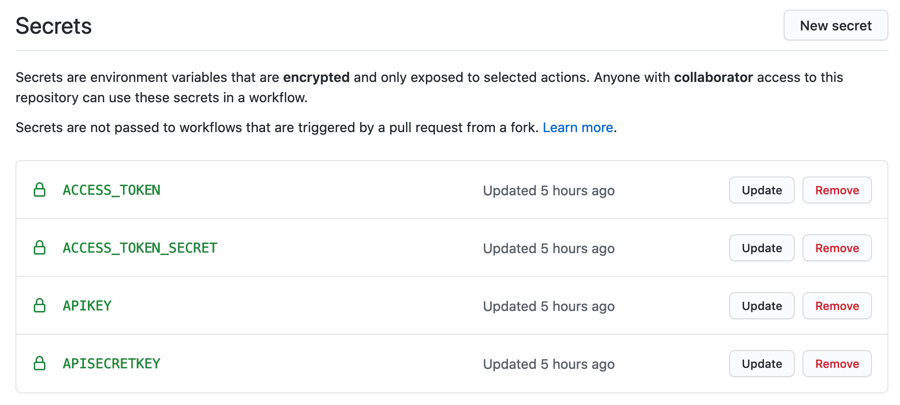

<!-- tags choose:
beginner, intermediate or advanced
*beginner:*
*for, loops, brackets, vectors, data structures, subsetting, functions, qplot, ggplot2, dplyr, spps-to-r, haven, tidyr, tidyverse*

*intermediate:* 
*tools, building packages, testing, slides in markdown, apply, package, advanced ggplot2, environments, animation, test, workflow, reproducability, version control, git, tidyeval*

*advanced:*
*S4 classes, extensions , shiny, Object Oriented Programming, Non standard Evaluation, code performance, profiling, Rcpp, optimize-your-code*
-->
<!-- categories: R and blog. Blog is general, R means rweekly and r-bloggers -->

<!-- useful settings for rmarkdown-->


<!-- content  -->

In this tutorial I have an R script that runs every day on github actions. It creates a curve in ggplot2 and posts that picture to twitter. 


**The use case is this: You have a script and it needs to run on a schedule (for instance every day).**

### Other ways to schedule a script
*I will create a new post for many of the other ways on which you can run an R script on schedule. But in this case I will run the script on github actions. Github actions is completely scriptable and works quite well. I found it quite difficult to make it work in one go.* 


## Github actions details
Github actions is a new product from github, you get 2000 minutes per account/month.
You create github actions by writing down the steps in a yaml file in a specific
place in your repo: `.github/workflows/*`. Yaml files are sensitive to indentation
so try a yaml validator before you push the data to github. 

So what are we going to do?

- pass secrets safely
- tell github to take our last version of the repo
- use r-lib/actions/setup-r (a functioning ubuntu container with R installed)
- install some c/c++ dependencies
- install all packages I need
- run Rscript


```
(We want the code to run on computer in the cloud)
You save your script locally in a git repository
You push everything to github
# installation
the github action 
- has R installed
- installs the system dependencies
- and installs the correct packages
# running something
github actions runs the script
we can schedule this action
```

I first explain what you need, what my rscript does, and how to deal with credentials. If you are not interested go immediately to [steps](#steps).

# What you need:

- have a github account
- a folder with a script that does what you want to do
- renv set up for this project

## Example of a script

I have an [R script](https://github.com/RMHogervorst/invertedushape/blob/main/run_job.R) that:

- creates a u-shape curve dataset 
- adds random names to the x and y axes
- creates ggplot2 image
- posts the tweet as a [twitter account](https://twitter.com/invertedushape1)

With this as result:


Of course you could create something that is actually useful, like downloading data, cleaning it and pushing it into a database. But this example is relatively small and you can actually see the results online.

### Small diversion: credentials/ secrets

For many applications you need credentials and you don't want to put the
credentials in the script, if you share the script with someone, they also have the credentials. If you put it on github, the world has your secrets (I just did this). 

So how can you do it? R can read environmental variables
and in github you can input the environmental variables that will
be passed to the runner when it runs (there are better, more professional tools to do the same thing but this is good enough for me). So you create an environmental variable called `apikey` with a value like `aVerY5eCretKEy`. In your script you use `Sys.getenv("apikey")` and the script will retrieve the apikey: `aVerY5eCretKEy` and use that.

How do you add them to your local environment?

- Create a .Renviron file in your local project
- add a new line to your .gitignore file: .Renviron
- Now this file with secrets will be ignored by git and you 
can never accidentely add it to a repo.
- the .Renviron file is a simple text file where you can add 'secrets' like: `apikey="aVerY5eCretKEy"` on a new line.

How do you add them to github?

- go to settings/secret in your repo and add them



they will be retrieved from the stores with something like `${{ secrets.APIKEY}}`

# Steps

So what do you need to make this work?

## Steps in order

```
Check if your script runs on your computer
Set up renv and snapshot
(optional) try a cache of your renv libraries for faster 
install the correct packages on the runner
execute the script
```

## Steps with explanation

- run your R script locally to make sure it works `source("script.R")`
- check if you have set up renv for this project. `renv::status()`. When you are satisfied with the script, use `renv::snapshot()` to fix the versions of your required packages. This creates an 'renv.lock' file that contains the package versions you used.
- copy and modify the actions from [r-lib](https://github.com/r-lib/actions/tree/master/setup-r)
- (optional) use a cache step from the [renv vignette about CI](https://rstudio.github.io/renv/articles/ci.html#github-actions-1)

```
env:
  RENV_PATHS_ROOT: ~/.local/share/renv

steps:

- name: Cache packages
  uses: actions/cache@v1
  with:
    path: ${{ env.RENV_PATHS_ROOT }}
    key: ${{ runner.os }}-renv-${{ hashFiles('**/renv.lock') }}
    restore-keys: |
      ${{ runner.os }}-renv-

- name: Restore packages
  shell: Rscript {0}
  run: |
    if (!requireNamespace("renv", quietly = TRUE)) install.packages("renv")
    renv::restore()
```

- use renv::restore() to install the correct packages based on the renv.lock file

`- run: R -e 'renv::restore()'`

- run the script

`- run: Rscript run_job.R`

# Conclusion
And now it runs every day.

### References
- Find more tutorials by me in [this tutorial overview page](https://blog.rmhogervorst.nl/tags/tutorial/)
- the [github workflow file](https://github.com/RMHogervorst/invertedushape/blob/main/.github/workflows/main.yml)
- [examples of R-specific github actions can be found here](https://github.com/r-lib/actions)
- there is a [book](https://ropenscilabs.github.io/actions_sandbox/) of github actions for R online.

### Reproducibility
<details>
<summary> At the moment of creation (when I knitted this document ) this was the state of my machine: **click here to expand** </summary>

```r 
sessioninfo::session_info()
```

```
─ Session info ───────────────────────────────────────────────────────────────
 setting  value                       
 version  R version 4.0.2 (2020-06-22)
 os       macOS Catalina 10.15.6      
 system   x86_64, darwin17.0          
 ui       X11                         
 language (EN)                        
 collate  en_US.UTF-8                 
 ctype    en_US.UTF-8                 
 tz       Europe/Amsterdam            
 date     2020-09-24                  

─ Packages ───────────────────────────────────────────────────────────────────
 package     * version date       lib source        
 assertthat    0.2.1   2019-03-21 [1] CRAN (R 4.0.0)
 cli           2.0.2   2020-02-28 [1] CRAN (R 4.0.0)
 crayon        1.3.4   2017-09-16 [1] CRAN (R 4.0.0)
 digest        0.6.25  2020-02-23 [1] CRAN (R 4.0.0)
 evaluate      0.14    2019-05-28 [1] CRAN (R 4.0.0)
 fansi         0.4.1   2020-01-08 [1] CRAN (R 4.0.0)
 glue          1.4.1   2020-05-13 [1] CRAN (R 4.0.1)
 htmltools     0.5.0   2020-06-16 [1] CRAN (R 4.0.1)
 knitr         1.29    2020-06-23 [1] CRAN (R 4.0.1)
 magrittr      1.5     2014-11-22 [1] CRAN (R 4.0.0)
 rlang         0.4.7   2020-07-09 [1] CRAN (R 4.0.2)
 rmarkdown     2.3     2020-06-18 [1] CRAN (R 4.0.1)
 sessioninfo   1.1.1   2018-11-05 [1] CRAN (R 4.0.1)
 stringi       1.4.6   2020-02-17 [1] CRAN (R 4.0.0)
 stringr       1.4.0   2019-02-10 [1] CRAN (R 4.0.0)
 withr         2.2.0   2020-04-20 [1] CRAN (R 4.0.2)
 xfun          0.15    2020-06-21 [1] CRAN (R 4.0.2)
 yaml          2.2.1   2020-02-01 [1] CRAN (R 4.0.0)

[1] /Library/Frameworks/R.framework/Versions/4.0/Resources/library
```

</details>


