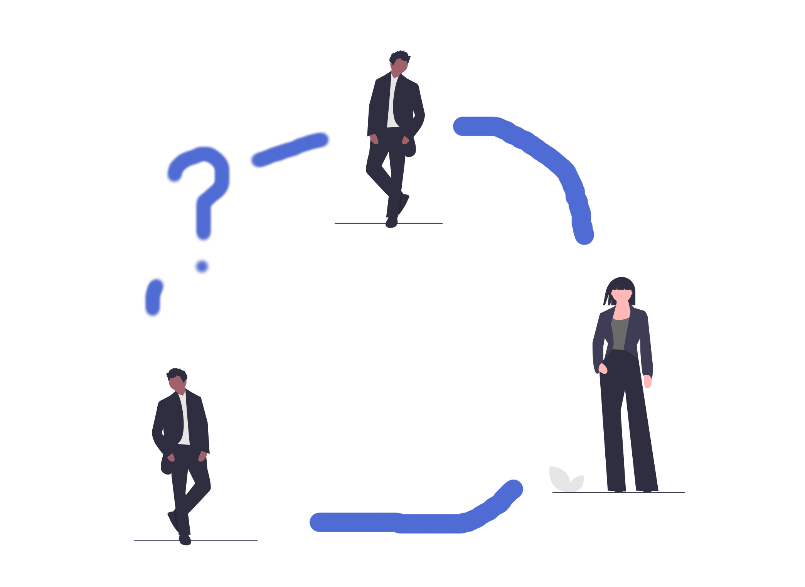
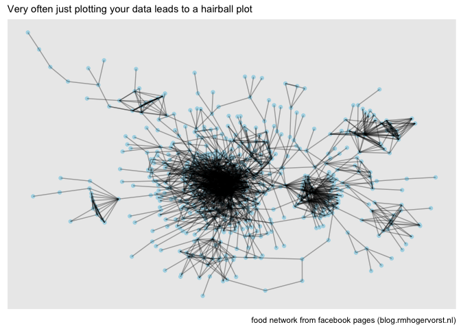
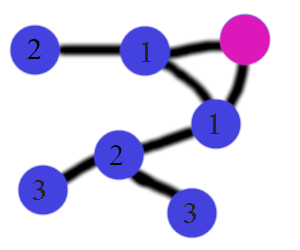

<!-- tags  at least beginner, tutorial, and all packages used.  -->
<!-- categories: R and blog. Blog is general, R means rweekly and r-bloggers -->
<!-- share img is either a complete url or build on top of the base url (https://blog.rmhogervorst.nl) so do not use the same relative image link. But make it more complete post/slug/image.png -->

<!-- useful settings for rmarkdown-->

```{r setup, include=FALSE}
# Options to have images saved in the post folder
# And to disable symbols before output
knitr::opts_chunk$set(fig.path = "", comment = "")

# knitr hook to make images output use Hugo options
knitr::knit_hooks$set(
  plot = function(x, options) {
    hugoopts <- options$hugoopts
    paste0(
      "{{<figure src=",
      '"', x, '" ',
      if (!is.null(hugoopts)) {
        glue::glue_collapse(
          glue::glue('{names(hugoopts)}="{hugoopts}"'),
          sep = " "
        )
      },
      ">}}\n"
    )
  }
)

# knitr hook to use Hugo highlighting options
knitr::knit_hooks$set(
  source = function(x, options) {
  hlopts <- options$hlopts
    paste0(
      "```r ",
      if (!is.null(hlopts)) {
      paste0("{",
        glue::glue_collapse(
          glue::glue('{names(hlopts)}={hlopts}'),
          sep = ","
        ), "}"
        )
      },
      "\n", glue::glue_collapse(x, sep = "\n"), "\n```\n"
    )
  }
)
```
<!-- content -->

In this tutorial I will show you how we go from network data to a
rectangular format that is suited for machine learning.

Many things in the world are graphs (networks). For instance: real-life friendships, business interactions, links between websites and (digital) social networks. I find graphs (the formal name for networks) fascinating, and because I am also interested in machine learning and 
data engineering, the question naturally becomes:

> How do I get (social) network data into a rectangular structure for ML?


### Predicting connections
In this tutorial I'm taking data from a network and modify it so
we can use it later on to answer the following question:

> Can we predict if two nodes in the graph are connected or not?

But let's make it very practical:

Let's say you work in a social media company and your boss asks you to create
a model to predict who will be friends, so you can feed those recommendations 
back to the website and serve those to users. 

You are tasked to create a model that predicts, once a day for all users, who is likely to connect to whom. 

I will show you how I would do it with the following steps:

* [load a flat file into R and turning it into a graph format](#LoadingGraph)
* [finding connections between 'users' to predict for (positive examples)](#FindingConnections)
* finding non-connections between 'users' to predict for (negative examples)
* [creating features to use in machine learning](#CreateFeatures)
* creating a dataset with positive examples, negative examples and features

*I leave the actual predicting for another post, this post is about making the data suitable for ML.*


### A small detour into networks
[_(You can skip to =>>file loading if you are familiar with this)_](#LoadingGraph)

Networks consist of *nodes* (also called vertices or individuals) and connections between nodes, called *edges* (or links).



For example: You *(a node)* and I *(also a node)* are friends *(edge)*. You have another friend *(edge)*, let's call him Barry *(node)*. Maybe, if we learn about me and Barry, we can predict if Barry and I will be friends too! That will be the prediction that the next post will be about.


## <a id="LoadingGraph"></a> Loading data into a graph

The problem is that most machine learning assumes a rectangular structure,
a 'tidy' structure: with one case per row and different metrics for that case
in a column each:

```
id | measure 1 | measure 2 | outcome
123| 2         |  2        | 1
124| 3         |  2        | 0
```

But network data is graph data and graph data is usually not saved in that 
format. 

### Input data
There are many ways to store network data, but I've seen a lot of datasets where
the data is split into a file with connections (edgelist) and a file with information about the nodes. 
In this case we start with 

* an **edgelist** (connecting id to id; there are no headings in this file) 

```
1,    611
2,    265
2,    182
```

* and a **node information file** (nothing more than name and id here; there are headings in this file)

```
id,               name,                           new_id
402449106435352,  Josh Marks,                     386
368969274888,     Blue Ribbon Restaurants,        473
765596333518863,  Pat Neely,                      1
```

We first have to assemble these two sources of information into a graph 
and than flatten it into edge-information only.[^credes]

### Data source
The data is from a very successful clone of myspace, with a focus on seeing each other's faces, lets call it SpaceBook. I downloaded the data from [networkrepository.com]( http://networkrepository.com/fb-pages-food.php#) and I do not know exactly how they got the data.[^nwrc] I unzipped the folder into a folder called 'data/' on my computer.

### Packages and loading data
```{r message=FALSE}
library(readr)      # for faster reading in (not necessary, but oh so nice)
library(dplyr)      # lovely data manipulation
library(tidygraph)  # for graph manipulation # this also loads igraph
library(ggraph)     # for graph visualisation # this also loads ggplot2
```

Load the data:

```{r message=FALSE}
# This assumes you saved your data in a folder 'data' relative to this script.
nodes <- readr::read_csv("data/fb-pages-food.nodes")
edges <- readr::read_csv("data/fb-pages-food.edges",col_names = c("from","to"))
```


### Data cleaning
First some checks on the data.

```{r,eval=FALSE}
range(nodes$new_id) # 0-619
range(edges$from) # 0-618
range(edges$to) # 15-619
```


```{r}
nodes %>% 
  count(name, sort = TRUE) %>% 
  head(8)
```

There are several problems with this data that I figured out over time. 

* ids start with 0 _and igraph cannot handle 0 as index_, so we have to add 1 to all ids. 
* 'id' in the nodes dataset is an ID that refers to a bigger data set so what we really want from this file is the 'new_id.' 
* the names are not unique, for instance  there are 59 nodes with the name McDonald's and 10 with the name Jumia Food. Let's make the node names unique by concatenating the id
to the name.

```{r Prep data into graph, cache=TRUE}
nodes_ <- nodes %>% 
  # rename and select in one go
  select(id = new_id, name) %>% 
  mutate(
    id = id +1,
    name=paste0(name," (",id,")")
    )
edges_ <- edges %>% 
  mutate(
    from= from+1, 
    to=to+1
    )
g <-
  tidygraph::tbl_graph(
    edges=edges_,
    nodes = nodes_,
    directed = FALSE,
    node_key = "id" # tbl_graph chooses the first column in the nodes data.frame 
    # by default, so it should work, but let's be extremely clear here.
    )
g
```

I'm using tidygraph to work with the data. [{tidygraph}](https://cran.r-project.org/package=tidygraph "tidygraph version 1.2.0") displays the graph structure as 2 tibbles (data.frames), as you can see; one for the
edges, and one for the nodes. This allows for a workflow where you can trigger 
the edges data.frame or nodes data.frame. So you choose to work with one and manipulate
that with the [{dplyr}](https://cran.r-project.org/package=dplyr "dplyr version 1.0.2") and [{purrr}](https://cran.r-project.org/package=purrr "purrr version 0.3.4") verbs.[^tidyverbs]

So if you are familiar with working with pipes and dplyr you can work with 
graphs too!

### A quick peek into the graph for now

If we now look at the graph as it is, the result is ... not super useful.

```{r eval=FALSE}
ggraph(g)+
  geom_node_point(color = "lightblue")+
  geom_edge_link(alpha = 1/3)+
  labs(
    subtitle = "Very often just plotting your data leads to a hairball plot",
    caption="food network from facebook pages (blog.rmhogervorst.nl)"
    )

```




## <a id="FindingConnections"></a> Finding connections
When we have a rectangular dataset that does not contain time effects we can can randomly split the dataset into pieces, train on a bit, and test on another bit. But with networks that is problematic. Many properties of nodes in the network depend on the 
entire network. If we cut the network in pieces the metrics will change drastically. In reality, if we are working for a social network company we can take snapshots over time and predict the 'future' that we already know. 


But in this case we only have this moment in time. So let's pretend this is the end state and create a state in the past that was still connected but with less connections. 

### Positive examples
As positive examples we take edges that can be taken away without breaking the
network into pieces. 

I 'simulate' a network growing over time like this.

I created a custom function that 
goes edge by edge through all the edges in the edge file, removes one, checks if the network is still connected and continues, if breaking that connection breaks the network into two unconnected pieces we take the previous version of the network and continue.


_If you run this interactively, I would advise to add the progress bar, by uncommenting selected lines._

```{r}
find_possible_edges <- function(g, edges, seed=12445){
  ## for interactive use, uncomment progressbar lines.(one #)
  #library(progress)
  #pb <- progress_bar$new(total = nrow(edges))
  
  ## We gradually cut more edges in the graph, so it matters where your start
  ## but the loop goes from top to bottom, and therefore I randomize the order,
  ## a different seed will lead to slightly different results.
  set.seed(seed)
  idx <- sample(1:nrow(edges),size = nrow(edges),replace = FALSE)
  edges <- edges[idx,]
  ## Preallocate result (because growing a vector is slower)
  pos_examples_idx <- rep(FALSE, nrow(edges))
  g_temp <- g
  ## Go through edges one by one
  for (row in seq_len(nrow(edges))) {
    #pb$tick()
    
    ## remove one edge from the graph
    g_temp1 <- g_temp %>% 
      activate(edges) %>% 
      anti_join(edges[row,], by=c("from","to"))
    
    ## check if graph is still connected
    verdict <- with_graph(g_temp1, graph_is_connected())
    pos_examples_idx[row] <- verdict
    ## if positive, we continue with this graph in the next loop
    if(verdict){g_temp <- g_temp1}  
  }
  message(paste0("Found ",sum(pos_examples_idx), " possible links"))
  ## Return positive examples only
  edges[pos_examples_idx,] 
}

```


Run the function on the edges.

```{r, cache=TRUE}
system.time(
  # just to show you how slow this process is.
  {pos_examples <- find_possible_edges(g, edges_)}
)

```


### Negative examples
We want our model to predict possible links between edges. So what are possible, reasonable
edges? If you and me are friends and Barry is a friend of yours but not of me
it is probable that Barry and me can become a friend. But it is less likely that
a friend of Barry or a friend further away becomes friends with me. Not impossible
but unlikely. 

So what do I select as negative examples? What are possible candidate 
connections? I use nodes that are at distance 2 from each other.

In the (ugly) picture below, I count the number of steps from the pink node
to other nodes. I select all nodes at distance 2 as negative examples. Distance
2 also excludes all direct connections (because they are at distance 1).



_I think there are probably better ways to do this, maybe there are tidygraph verbs that I'm not utilizing here, but I'm falling back on [{igraph}](https://CRAN.R-project.org/package=igraph "version 1.2.6") here. All tidygraph objects are also fully qualified igraph objects so all igraph methods work on tidygraph objects._

How do we find the distance of every node to every other node? We create a 
distance matrix. 

```{r}
dist_g <- igraph::distances(g)
```

For reasons I do not yet know this matrix has the names of the vertices and not the ids. 
The top corner of this matrix looks like this:

```{r}
dist_g[1:3, 1:3]
```

I could create a function that finds for every name in the matrix the row and
column name. But I'm going to cram the matrix into a data.frame and re-attach
the node ids back from the nodes_ data.frame. 
Next I select only rows where the distance equals exactly 2.

```{r}
distances <- 
  reshape2::melt(dist_g, value.name = "distance") %>% 
  left_join(nodes_, by=c("Var1"="name")) %>% 
  rename(to=id) %>% 
  left_join(nodes_, by=c("Var2"="name")) %>% 
  rename(from=id) 

neg_examples <- 
  distances %>% 
  filter(distance ==2)
head(neg_examples, 4)
```

### Combining the positive and negative examples
Combine the positive and negative examples into 1 data.frame and label the 
examples too.
```{r}
# We should probably remove some duplicates here. because the graph is undirected a link between A-B and B-A is identical. and we can remove one of those. 
trainingset <- 
  bind_rows(
    pos_examples %>% 
      filter(from != to) %>% 
      mutate(target=1),
    neg_examples[,c("from","to")] %>%
      filter(from != to) %>% 
      mutate(target=0)
)
trainingset %>% count(target)
```

This leads to many more negative than positive examples, something we have to take into account when we start to do some machine learning on this problem.
Note though, that it is not super strange to get so many more negative than positive examples: there are many possible people around you with whom you can connect, but you only connect with a few of them.


## <a id="CreateFeatures"></a> Creating Features
I want to classify the potential edges into link or not a link and so we need
features to do that. I'm going to retrieve information about every node 
in the network, features that tell us something about the position that a node
takes into a network. 
To calculate node features, we shouldn't calculate them on the graph
where the positive examples are already connected. That leads to information leakage (where the test set data are used (directly or indirectly) during the training process). We would make overly optimistic estimations that would not generalize
to new cases. And we want to predict for new cases!

So we should create features on the graph without the positive edges.

```{r}
emptier_graph <- g %>% 
  activate(edges) %>% 
  anti_join(pos_examples, by = c("from", "to"))
# make sure we didn't do something stupid
stopifnot(with_graph(emptier_graph, graph_is_connected()))
#readr::write_rds(emptier_graph,file = "data/emptier_graph.Rds")
```


### Create features for all the vertices
Calculate some features about every node in the graph.
[{Tidygraph}](https://CRAN.R-project.org/package=tidygraph) has many, many functions that can give us information about nodes. I'm selecting the node information here (and it pretends to be a data.frame so we can 'just' use dplyr verbs) and adding features to it.

My experience with networks, and my domain knowledge
about this dataset are not super high. I'm taking some
measures that, to me, seem to measure slightly different things about the nodes.

* degree: the number of direct connections
* betweenness: Something like: How many shortest paths go through this node
* pagerank: Something like: How many links pointed to me come from lot of pointed-to-nodes
* eigen centrality: something like the page rank but slightly different (`?igraph::eigen_centrality`)
* closeness: something like: how central is this node to the rest of the network (`?NetSwan::swan_closeness`)
* bridge score: the average decrease in cohesiveness if each of its edges were removed from the graph (`?influenceR::bridging`)
* coreness: K-core decomposition (`igraph::coreness`)

```{r}
node_features <- 
  emptier_graph %>% 
  activate(nodes) %>% 
  mutate(
    degree= centrality_degree(normalized=FALSE),
    betweenness = centrality_betweenness(cutoff = 5,normalized = TRUE),#
    pg_rank = centrality_pagerank(),
    eigen = centrality_eigen(),
    closeness= centrality_closeness_generalised(0.5),
    br_score= node_bridging_score(), # takes quite long,
    coreness = node_coreness()
    ) %>% 
  as_tibble() %>% 
  select(-name)

head(node_features, 3)
```

So now we have information about every node, let's merge it back into the trainingset.
Right now there will be columns for the left side of the edge and for the 
right side of the edge. More advanced feature combinations can be made later.

```{r}
enriched_trainingset <-
  trainingset %>% 
  left_join(node_features, by=c("from"="id")) %>% 
  left_join(node_features, by=c("to"="id"), suffix=c("","_to"))
#readr::write_rds(enriched_trainingset, file="data/enriched_trainingset.Rds")
```


# Conclusion
So that is how I would create a 'rectangular' dataset, that can be used for machine learning, from graph data.

## How would I use this in a production setting?

* First use an approach like this (take a subset of your graph and do these kinds of things) on your data and see if the features are good enough for prediction. (What is good enough? What are you doing now? How does that compare to current approach? Are these features even correlated with links?)
* Add checks on input data pipeline so you can be sure your data set over time remains good. (test your assumptions, like uniqueness of names, distance between nodes, etc)
* check performance in real world, how well do you predict real cases? Do you need to change some steps (probably yes).
* set up a pipeline where you ingest data, train model, validate, predict on new data, and where your predictions are picked up by the front of the website to recommend to actual users.
* than try to improve the process.


### Reproducibility
<details>
<summary> At the moment of creation (when I knitted this document ) this was the state of my machine: **click here to expand** </summary>

```{r}
sessioninfo::session_info()
```

</details>

### Notes
* I created the ugly 'people connected together' picture by using icons from [undraw](https://undraw.co/)
* This post was inspired by a nice python post about networks from [analyticsvidhya.com here](https://www.analyticsvidhya.com/blog/2020/01/link-prediction-how-to-predict-your-future-connections-on-facebook/), that post used the same data and positive and negative examples but threw a deeplearning method against it immedately..
* According to the data description: "Data collected about Facebook pages (November 2017). These datasets represent blue verified Facebook page networks of different categories. Nodes represent the pages and edges are mutual likes among them." Ah, 2017, when I did not realize how awful the company facebook was. Blessed time...

### References
- Find more tutorials by me in [this tutorial overview page](https://blog.rmhogervorst.nl//tags/tutorial/)

- Find post by me on [beginner level](https://blog.rmhogervorst.nl/tags/beginner/)
- Find an Rmarkdown only version on my [github](https://github.com/RMHogervorst/link_prediction)

[^credes]: Creative destruction, if you will
[^nwrc]: They really want attribution for [networkrepository.com](http://networkrepository.com) so I'll give them that, but there is no further information except for: scraped in 2015, no who, no criteria, so assume nothing about this data
[^tidyverbs]: This is a nice result of the power of tidy-flavor-packages in the last 6 years, I wrote about it [here](https://notes.rmhogervorst.nl/post/2020/11/16/good-software-design-constrains-users-but-can-give-freedom-too/)