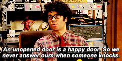

<!-- content  -->

I think a lot about moving single R scripts from someone's computer
to the cloud (another computer). One of the major questions you need to answer is: 

> Can I give my solution to someone else in a way that it 'just' works?

R is an high level language. This allows you to write out the steps you 
want to take and that the actual implementation is hidden _(can you imagine writing all the steps your computer needs to take? allocate this amount of memory; write this piece of data to that specific memory slot; increment that counter.)_. Not only that, 
but there many layers underneath. 

let's take an example: 
Let's say you are a journalist and you have a piece on your organization's website that constantly updates the COVID19 stats in your city.
_You have created a script script that calls an API, retrieves some data and does some calculations on top of that._ 

For that to happen your code: 

- loads the required packages
- reaches out to the national database api to retrieve data
- does some manipulations on that data
- creates a few images and text 
- writes resources to your newspaper publishing API (I have no idea if that is how things work in the newspaper business)

It works on your computer. 
But is this code from your laptop portable? Can someone else run it?

If I share the script, or run it on a (cloud) laptop, that system needs:

- to have R installed (correct version too)
- to have the required packages installed (same or later version)
- to have the system libraries installed

If any of these things is not correct, the project fails.

Giving us this feeling:

## Just don't change
Programmers love to fixate the world. If nothing changes, your code runs always
the same. A thought I can appreciate, but it is not very realistic view of the world.[^1]

### So what can change?

From close to far:

- The API can change or go down[^2] 
- R packages can change
- The R version can change in minor ways (from R 4.0.1 to R 4.0.2)
- The R version can change in major ways (from R 3.6 to R 4.0)
- You are often using system libraries underneath R, for instance C libraries, those can be changed, improved or removed
- You are running on top of an operating system like Windows, mac, linux, freebsd, solaris?
- The physical machine you are running on can have different types of hardware (intel, ARM, AMD)

### Reasons things change
So why does everything keep changing? I can think of several reasons.
**Bugs and security flaws** force people to upgrade; because
you don't want someone to encrypt all your data for ransom. 
This is why the operating system changes, and many of the system libraries 
change. But changes don't necessarily mean that your code doesn't work anymore,
a lot of effort goes into making sure the code interacts the same even though the internal logic is different. There are also **new insights or innovation**; after many years of use, it becomes clear that a certain approach is no longer the best approach.[^3] Finally there is less understandable reason, plain
**greed**; you need to buy a new version for no other reason than money.
Remember when HP printers suddenly decided that you could not use external
refill of your printer ink.

Still, you don't need to use the bleeding edge new software. It can be very advantageous to lag a bit behind. So what can we do to make things more stable?

## How can we make things stable?
**Accept you can't fixate your code and never change it again**. Never changing code is a fiction. Although I find software engineering a beautiful and creative pursuit and I love creating new things, you cannot really stop changes in the world. There is a lot of value in maintenance!

### Changes in code & changes in the world
* when someone supplies a versioned API use that.
* Make sure your code is not too clever, because you will forget why it was so clever. 
* Make sure your code is easy to change
* Add tests so you know the functionality of the code is still intact

If the code is easy to change, you can move easily with the changes in the outside world; changes you do not control. 

### Changes in R packages
* use [{renv}](https://rstudio.github.io/renv/) to record and fix a working version of the packages. 

The package versions are written down in a json file that is
used by {renv} to re install them on a new computer. You can also keep different
versions of packages in different R projects! This makes your projects way more
portable! If you download my code, and the renv.lock file you can run it exactly [^4] like me!

### Changes in R
Dealing with changes in R versions are honestly quite hard to resist.
It is possible to install a specific version of R, but by default you download
the latest version from the R website.
Minor upgrades (e.g. from 4.0.1 to 4.0.2) do not 
matter that much. In most cases they will not break your code. 
However large upgrades, from 3.6.x to 3.8.x  can be problematic (and from 3.8 to 4.x is even worse) and if you go
a major number up, you need to carefully check everything works, and almost always re-install your packages.

### Changes in operating systems 
That is super hard, but there are some things you can do, such as using virtual 
machines with specific operating systems or bringing a part of the operating
system with you:

### Bringing a part of the operating system with you 
Docker containers are super useful for both changes in R and changes in operating system. The [rocker project](https://github.com/rocker-org/rocker) creates docker images that
contain the debian or ubuntu operating system and fixed R versions.

They even fix the available packages by using the MRAN time machine.
Rocker images you build today, will work almost forever!

If you combine docker images with renv you can ship complete working
code that works exactly on your machine as it does on any computer that runs
docker. The downside is that the other computer has to build up the container 
from the instructions and the resulting image is quite a lot bigger than a 
single R script.

## Conclusion
> The world is changed. I feel it in the water. I feel it in the earth. I smell it in the air. Much that once was is lost, for none now live who remember it. --galadriel in Lord of the Rings

Keeping your (R) projects running requires maintenance work. It always will. 
But you can make it manageable by fixing (or pinning as it is sometimes called) package versions and R versions with {renv}. And by fixing the system with for instance docker containers. You can try out new versions with newer rocker images or trying out new versions of packages. That way, you are the one in
control of the upgrade process. 

## Notes

[^1]: Or is that the reason some people still use python 2?
[^2]: See the amount of trouble the ROpensci team has to go through to keep retrieving full text academic articles! 
[^3]: Look at the thoughtful way the tidyverse depreciated [tidyr::gather()](https://www.tidyverse.org/blog/2019/09/tidyr-1-0-0/), you can still use those interfaces but you get warnings. 
[^4]: Exactly is doing a lot of work here, you will get closer to a situation I was in when I recorded the package version.