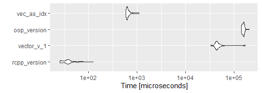

<!-- content  -->

I spend a lot of time yesterday on day 15 of advent of code (I'm three days behind I think). 
Advent of code is a nice way to practice your programming skills, and even
though I think of myself as an advanced R programmer I learned something yesterday! 

The challenge is this: 

```
While you wait for your flight, you decide to check in with the Elves 
back at the North Pole. 
They're playing a memory game and are ever so excited to explain the rules!

In this game, the players take turns saying numbers. They begin by taking turns
reading from a list of starting numbers (your puzzle input). Then, 
each turn consists of considering the most recently spoken number:

    If that was the first time the number has been spoken, the current player says 0.
    Otherwise, the number had been spoken before; the current player announces how many turns apart the number is from when it was previously spoken.

So, after the starting numbers, each turn results in that player speaking aloud either 0 (if the last number is new) or an age (if the last number is a repeat).
```

The first challenge was fine, find the 2020th number.
But the second part (find the 30000000th number) was just not doable,
my solution was too slow! 


### Why is it not fast?


Now I know some things are slow in R: growing a vector is the biggest nono.

So making a vector and increasing the size every step is slow (
because on every step R has to ask the computer for a chunk of memory of size 1 slightly larger than the original, copy the old data and new information into
the memory chunk and remove the old data). This is why I always make sure
to create a data.frame of final length and fill it later on. 
And so my first solution to the challenge pre-allocated a vector
and only searched through a subset of the data.

```r 
speak_number <- function(history){
    l_his <- length(history)
    last_spoken <- history[l_his]
    repeats <- which(history == last_spoken)
    if(length(repeats) ==1){
        age <- 0
    }else{
       age <-repeats[length(repeats)] - repeats[(length(repeats) -1)]
    }
    age
}
speak_number(c(0,3,6))==0
```

```
[1] TRUE
```

```r 
calc_all_numbers <- function(input, to){
    all_numbers <- rep(NA_integer_, to)
    all_numbers[1:length(input)] <- as.integer(input)
    
    for(int in (length(input)):(to-1)){
        all_numbers[int+1] <-speak_number(all_numbers[1L:int])
    }
    all_numbers[to]
}
calc_all_numbers(c(1,3,2),2020) == 1
```

```
[1] TRUE
```

I thought I was smart by creating the vector first and only filling in
values. But when I get to larger numbers the program has to search through
larger and larger vectors (in itself fast, but cumulatively slow).

So my second attempt was to only track when a number was last called.
So now you have to keep track of the unique numbers already called,
the round when a number was called, 
calculate the difference between now and then.

I thought: keeping state, that sounds like an Object-Oriented-Programming solution. And so I used an R6 class to keep the state.

```r 
library(R6) ### yes, yes, it is nicer if you put this at the top of the page.
Recitation <- R6Class(classname = "Recitation",
                      public= list(
                          initialize = function(vec){
                              self$round = length(vec)
                              for (idx in 1:(length(vec)-1)) {
                                  private$recent[[paste0('n',vec[idx])]] <- idx
                              }
                              self$unique_numbers <- unique(vec[1:(length(vec)-1)])
                              self$latest <- vec[length(vec)]
                              },
                          print = function(){
                              cat("current round: ", self$round,"\n")
                              cat("unique_numbers: ", length(self$unique_numbers),"\n" )
                              cat("last seen number:", self$latest, "\n")
                              cat("first 10:", self$unique_numbers[1:10], "\n")
                          },
                          unique_numbers = c(),
                          round = 0,
                          latest = NA_integer_,
                          progress_one_step = function(debug=FALSE){
                              # check latest against recent
                              last_spoken <- private$number_last_spoken(debug=debug)
                              
                              if(last_spoken ==0){
                                  res <- 0
                              }else{
                                  res <- self$round-last_spoken
                              }
                              if(debug){
                                  cat("latest number", self$latest, "\n")
                                  cat("[rnd",self$round+1, "] new number", res, "\n")
                              }
                              private$add_latest_to_recent(res)
                              private$increment()
                          }
                          #, # count total function
                          # next_round
                          #
                      ),
                      private = list(
                          recent = list(),
                          increment = function(){
                              self$round <- self$round +1
                          },
                          number_last_spoken = function(debug=FALSE){
                              if(self$latest %in% self$unique_numbers){
                                  if(debug){cat("number seen before\n")}
                                  private$recent[[paste0('n',self$latest)]]
                              }else{
                                  if(debug){cat("number NOT seen before\n")}
                                  0
                              }
                          },
                          add_latest_to_recent = function(new_latest){
                              latest <- self$latest
                              private$recent[[paste0('n',latest)]] <- self$round
                              self$unique_numbers <- unique(c(self$unique_numbers, latest))
                              self$latest <- new_latest
                          }
                      ) 
                      )
## use the object to keep track of state, use a while loop to keep
## incrementing the round.
run_sequence_for_n_steps <- function(seq, steps){
    elfs_game <- Recitation$new(seq)
    while (elfs_game$round < steps) {
        #if(elfs_game$round %in% round(steps * c(0.25, 0.5,0.75))){
            # cat("round:", elfs_game$round, "\n")
            # }
        elfs_game$progress_one_step()
    }
    #cat(elfs_game$latest,"\n")
    elfs_game
}
```

it also looks really nice (not the code, but the print method is pretty!)

```r 
test2 <- Recitation$new(c(0,3,6))
test2$progress_one_step(debug=TRUE)
```

```
number NOT seen before
latest number 6 
[rnd 4 ] new number 0 
```

```r 
test2
```

```
current round:  4 
unique_numbers:  3 
last seen number: 0 
first 10: 0 3 6 NA NA NA NA NA NA NA 
```

But is is faster?

```r 
library(microbenchmark)
library(ggplot2)
res <- 
  microbenchmark(
    pretty_R6 = run_sequence_for_n_steps(c(1,3,2),3000),
    vector_v1 =calc_all_numbers(c(1,3,2),3000)
)
autoplot(res)
```

```
Coordinate system already present. Adding new coordinate system, which will replace the existing one.
```




**Lesson 1: Benchmark your solutions before you make them pretty**

But maybe on larger numbers it does make a difference? 

I did some manual tests by increasing the number with 10x:

```
size    |    new solution (R6)    |    old solution
------------------------------------------------------
10^3    |      0.21               |      0.05
10^4    |      5.33               |      3.72
10^5    |    454.58               |    351.63
```

This does not look good. Every increase by 10, leads to a hunderfold
increase in time. In [big O notation:](https://en.wikipedia.org/wiki/Big_O_notation) 
 $T=O (n^2)$  This does not bode well for an even bigger size.

The wanted size is 10^7 (30,000,000). so it will take something 
like 455,000,000 seconds (/3600) ~ 126389 hours?

There must be a smarter way but I couldn't find it myself.
In the end I tried to work on an Rcpp version, thinking: *C++: do the same stupid things, but faster!*. 

But I haven't done a lot of C++ programming and my work
requires more than advent of code solutions, unfortunately. So I didn't get to
finish it. 


In the evening I did find a [blogpost by David Selby ](https://selbydavid.com/2020/12/06/advent-2020/#day15) and he has a beautiful
pure R implementation that works superfast. and I think it works in $t(n)=O(n^1)$!


### Why was my solution not fast enough?
My R6 solution wasn't that bad actually, but I created a list to hold
the numbers. I created a list because I thought I couldn't know what numbers we end up with. And I need to know the number we are looking for and the round in which we saw it last. But we do know the maximum! and so instead of a list I could create a vector and use the vector indices as the number (like David)!

* My first solution takes longer every run because it has to do a search through progressively longer vectors. Comparisons against vectors is fast, but takes longer every run.
* My second solution is also an increasingly longer search, because R has to find the element in the list that matches my key. I think a python dictionary would be way faster in this case.
* Finally the solution by David search by indexing. And R knows exactly where
all the pieces of the vector are and so it is lightning fast! There is no need to compare all elements. You know exactly where to find the the piece of information (this is, I believe, also the magic of indexes in databases).

**Lesson 2: Indexing and subset operations on vectors are fast!**

And so I need to update my mental model of why things are slow in R. This
is very exciting! I learned a new thing yesterday!

### notes
<span>Photo by <a href="https://unsplash.com/@pascalvendel?utm_source=unsplash&amp;utm_medium=referral&amp;utm_content=creditCopyText">Pascal van de Vendel</a> on <a href="https://unsplash.com/?utm_source=unsplash&amp;utm_medium=referral&amp;utm_content=creditCopyText">Unsplash</a></span>

In the end I implemented a similar c++ version as David. Here are the
timings of all my solutions:

* rcpp speaks for itself
* vec_as_idx is using the vector index as reference point
* vector v1 is the first version of the code with incrementally larger search space
* and oop version is using R6, it is not the R6 that is making this slow, rather the if else parts, and linearly searching a list and vector. 



### Reproducibility
<details>
<summary> At the moment of creation (when I knitted this document ) this was the state of my machine: **click here to expand** </summary>

```r 
sessioninfo::session_info()
```

```
─ Session info ─────────────────────────────────────────────────────────────
 setting  value                       
 version  R version 4.0.2 (2020-06-22)
 os       macOS Catalina 10.15.7      
 system   x86_64, darwin17.0          
 ui       RStudio                     
 language (EN)                        
 collate  en_US.UTF-8                 
 ctype    en_US.UTF-8                 
 tz       Europe/Amsterdam            
 date     2020-12-17                  

─ Packages ─────────────────────────────────────────────────────────────────
 package        * version date       lib source        
 assertthat       0.2.1   2019-03-21 [1] CRAN (R 4.0.2)
 blogdown         0.21    2020-10-11 [1] CRAN (R 4.0.2)
 bookdown         0.21    2020-10-13 [1] CRAN (R 4.0.2)
 cli              2.2.0   2020-11-20 [1] CRAN (R 4.0.2)
 colorspace       2.0-0   2020-11-11 [1] CRAN (R 4.0.2)
 crayon           1.3.4   2017-09-16 [1] CRAN (R 4.0.2)
 digest           0.6.27  2020-10-24 [1] CRAN (R 4.0.2)
 dplyr            1.0.2   2020-08-18 [1] CRAN (R 4.0.2)
 ellipsis         0.3.1   2020-05-15 [1] CRAN (R 4.0.2)
 evaluate         0.14    2019-05-28 [1] CRAN (R 4.0.1)
 fansi            0.4.1   2020-01-08 [1] CRAN (R 4.0.2)
 farver           2.0.3   2020-01-16 [1] CRAN (R 4.0.2)
 fastmap          1.0.1   2019-10-08 [1] CRAN (R 4.0.2)
 generics         0.1.0   2020-10-31 [1] CRAN (R 4.0.2)
 ggplot2        * 3.3.2   2020-06-19 [1] CRAN (R 4.0.2)
 glue             1.4.2   2020-08-27 [1] CRAN (R 4.0.2)
 gtable           0.3.0   2019-03-25 [1] CRAN (R 4.0.2)
 htmltools        0.5.0   2020-06-16 [1] CRAN (R 4.0.2)
 httpuv           1.5.4   2020-06-06 [1] CRAN (R 4.0.2)
 jsonlite         1.7.1   2020-09-07 [1] CRAN (R 4.0.2)
 knitr            1.30    2020-09-22 [1] CRAN (R 4.0.2)
 later            1.1.0.1 2020-06-05 [1] CRAN (R 4.0.2)
 lifecycle        0.2.0   2020-03-06 [1] CRAN (R 4.0.2)
 magrittr         2.0.1   2020-11-17 [1] CRAN (R 4.0.2)
 microbenchmark * 1.4-7   2019-09-24 [1] CRAN (R 4.0.2)
 mime             0.9     2020-02-04 [1] CRAN (R 4.0.2)
 miniUI           0.1.1.1 2018-05-18 [1] CRAN (R 4.0.2)
 munsell          0.5.0   2018-06-12 [1] CRAN (R 4.0.2)
 pillar           1.4.7   2020-11-20 [1] CRAN (R 4.0.2)
 pkgconfig        2.0.3   2019-09-22 [1] CRAN (R 4.0.2)
 processx         3.4.4   2020-09-03 [1] CRAN (R 4.0.2)
 promises         1.1.1   2020-06-09 [1] CRAN (R 4.0.2)
 ps               1.4.0   2020-10-07 [1] CRAN (R 4.0.2)
 purrr            0.3.4   2020-04-17 [1] CRAN (R 4.0.2)
 R6             * 2.5.0   2020-10-28 [1] CRAN (R 4.0.2)
 Rcpp             1.0.5   2020-07-06 [1] CRAN (R 4.0.2)
 rlang            0.4.9   2020-11-26 [1] CRAN (R 4.0.2)
 rmarkdown        2.5     2020-10-21 [1] CRAN (R 4.0.2)
 rstudioapi       0.13    2020-11-12 [1] CRAN (R 4.0.2)
 scales           1.1.1   2020-05-11 [1] CRAN (R 4.0.2)
 servr            0.20    2020-10-19 [1] CRAN (R 4.0.2)
 sessioninfo      1.1.1   2018-11-05 [1] CRAN (R 4.0.2)
 shiny          * 1.5.0   2020-06-23 [1] CRAN (R 4.0.2)
 stringi          1.5.3   2020-09-09 [1] CRAN (R 4.0.2)
 stringr          1.4.0   2019-02-10 [1] CRAN (R 4.0.2)
 tibble           3.0.4   2020-10-12 [1] CRAN (R 4.0.2)
 tidyselect       1.1.0   2020-05-11 [1] CRAN (R 4.0.2)
 vctrs            0.3.5   2020-11-17 [1] CRAN (R 4.0.2)
 withr            2.3.0   2020-09-22 [1] CRAN (R 4.0.2)
 xfun             0.19    2020-10-30 [1] CRAN (R 4.0.2)
 xtable           1.8-4   2019-04-21 [1] CRAN (R 4.0.2)
 yaml             2.2.1   2020-02-01 [1] CRAN (R 4.0.2)

[1] /Library/Frameworks/R.framework/Versions/4.0/Resources/library
```

</details>


