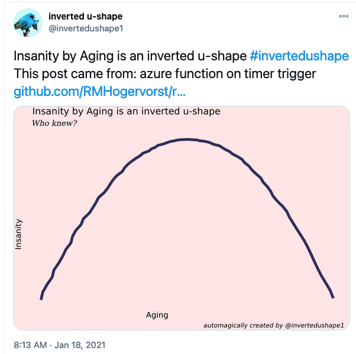
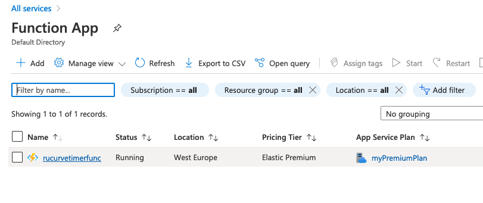
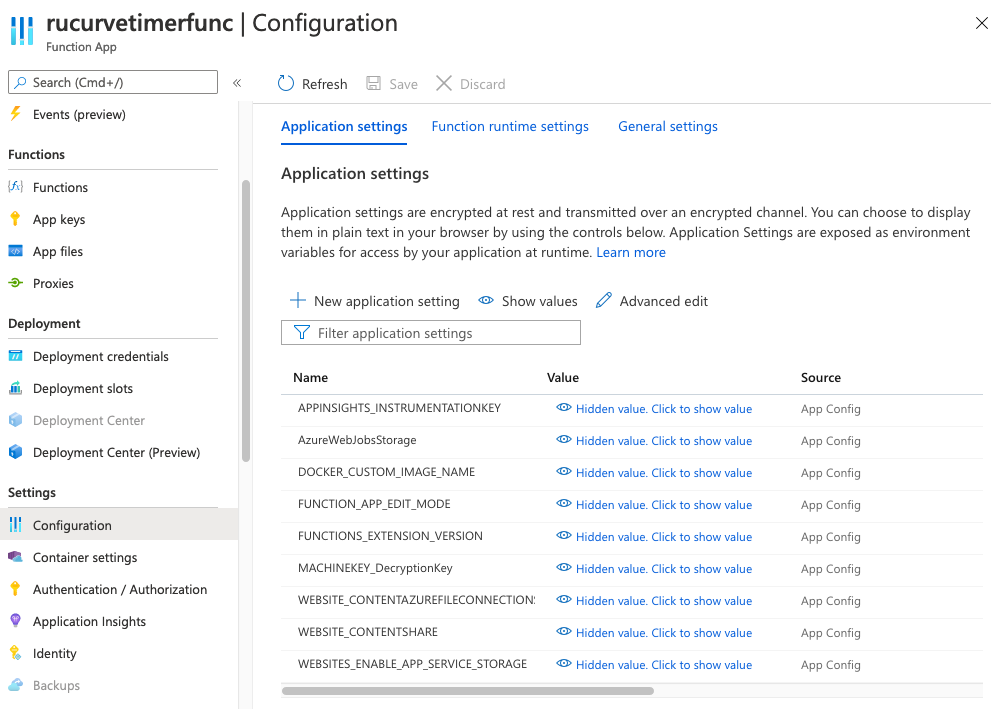

<!-- content -->
In this post I will show how I run an R script on a schedule, by making use of 'serverless' computing service on the Microsoft Cloud called Azure Functions. 

In short I will use a custom docker container, install required software, install required r-packages using [{renv}](https://CRAN.R-project.org/package=renv) and deploy it in the Azure cloud. I program the process in azure such that the it runs once a day without any supervision.

This is not truely a tutorial, I cannot say this it the best approach, but I hope you can base your work on this post after you followed the excellent walkthrough by [David Smith]( https://twitter.com/revodavid "@RevoDavid"): ["Azure Functions with R and plumber"](https://blog.revolutionanalytics.com/2020/12/azure-functions-with-r.html) 


*This is part of a series of posts about running an R script on a schedule, for the blogpost overview page go to [overview page](https://blog.rmhogervorst.nl/blog/2020/09/26/running-an-r-script-on-a-schedule-overview/), for a document with all sorts of ways to run an R script on a schedule, and things I think YOU should think about, go to [this github page](https://github.com/RMHogervorst/scheduling_r_scripts).*

## What the app does
The R-script, in this post: generates random data, selects random phrases, creates an image and publishes that picture to twitter under the name [@invertedushape1](https://twitter.com/invertedushape1).



I chose this tweet-example because it is slightly [silly](https://blog.rmhogervorst.nl/blog/2018/08/31/make-more-useless-packages/ "I love silly examples!"), and this script:

- has visible output
- makes use of [{renv}](https://CRAN.R-project.org/package=renv) for consistent package-versions
- talks to an outside API on the internet
- deals with credentials that need to be kept safe
- logs what it does
- is entirely contained in a docker container

In my opinion that covers quite some relevant parts of modern cloud applications!

## When to use serverless
The idea of Serverless or 'Function as a Service' is that you only write the code that you want to execute and you only pay for execution of the function. You don't have to maintain servers or other infrastructure. Ideally you write the function, dump it into the serverless infrastructure of your choice: AWS has 'lambda', Azure has 'Azure Functions' and Google has 'GCP Cloud Functions'. 
So there ARE servers and underlying infrastructure, but YOU don't have to maintain the infrastructure nor think about infrastructure.

### triggers
Not only in Azure, but everywhere, your custom code runs when it is triggered. The cloud service sends the trigger, and including some data about the trigger, to your function and your function does something with that information. 

Azure gives the following image as an overview:


What is a bit misleading in this picture is that both the functions host and custom handler are implemented inside the same docker container. We create one container, based on the Microsoft docker-image, with a web server (in R) that responds to requests.


The easiest and most common trigger is a webrequest. For instance, a new user account is created, or a prediction is requested. But there are many more triggers for instance: database record update, new item in a cue, incoming webhook, new item in blob storage or new message in a kafka topic. In my case I'm using the most dumb trigger imaginable: a time trigger. My function should run, once a day. This is also known as a CRON job (CRON is the time-based scheduler in unix and so it is very widely known, and still used everywhere). *In a way I'm abusing the system because I just want a short script to run at set times, and this is a cheap way to do it. It is the ultimate pay-only-for-what-you-use offering in the cloud.*


### Machinelearning in serverless?
Training a machine learning model is absolutely **not** a good task for serverless. You are severely limited in CPU, memory and time. So you could train in a larger machine, save the model and serve predictions in a serverless way, in fact David Smith shows exactly that example in [his blogpost](https://blog.revolutionanalytics.com/2020/12/azure-functions-with-r.html "revolution analytics, azure functions with R, As linked above"). 


## Serverless R for Azure
To make a serverless application for R in Azure you need:

- a script that does your action
- resources in azure: storage, function itself, and a resourcegroup
- a docker container based on the Microsoft-supplied function-app docker image
- to respond to triggers (more about that later)
- to test if everything works locally


## Overview of the process
Again, if you want to create something like what I create in this post, I really advise you to read and 
follow the [tutorial by David Smith](https://github.com/revodavid/R-custom-handler) first and modify afterwards with some help from this post. 

Azure functions does not support R out of the box (but has an open system where you can run docker containers and so it supports all languages of the world). Most importantly, you need to create something that responds to API requests. David and I use {plumber}, but in theory you could build the same thing with any other framework (See below in references).

For this example I have 2 scripts:

* a script that defines the plumber server and responds to requests
* a script that defines the routes and executes something I actually care about

### steps to take
- setup
- Create some json files for configuration and Set the schedule
- test the function locally
- create a dockerfile 
- test the function in the docker container locally
- push everything into Azure
- Dealing with secrets
- auto deployment

### Setup

* Make sure you actually have an Azure account
* Make sure you have installed Azure functions core tools AND azure CLI AND docker [instructions here](https://docs.microsoft.com/en-us/azure/azure-functions/functions-create-function-linux-custom-image?pivots=programming-language-other&tabs=bash%2Cportal&WT.mc_id=javascript-10496-davidsmi#configure-your-local-environment)

Like David I'm going to use dockerhub, so make sure you have an account (dockerID) or use
a different registry where you can push to.

* log in azure tools `az login` (this opens a new browser window)
* If you enabled MFA in your azure account (Good job!) you also need to do an extra step once but you get suggestions in your command line.
* make sure docker is running
* log in to docker hub  `docker login` (or your other container registry of choice)


### Create configuration files
Now, in the terminal (commandline), I'm going to the folder where I have my R project. 

* Create a local custom functions project: `func init <NAME_YOU_WANT_TO_GIVE_THIS> --worker-runtime custom --docker`

This creates a .gitignore file, local.settings.json, .vscode/extensions.json. dockerfile. and docker ignore. Super useful, but not complete.
**If you use environmental variables** in this project to maintain your secrets (good job!) you probably saved them in an .Renviron file in this project. You don't want that file send to your public repository nor included in a public dockerfile. So let's add some lines to the files.

* In the .gitignore file, and .dockerignore file add:

```
## R files to ignore
.Renviron
.Rproj.user
.Rhistory
.RData
.Ruserdata
```

* Create the function configuration with a template `func new --name <NAME_THIS_TRIGGER_SOMETHING> --template "timer trigger"` (using the timer trigger template, *if you need something else, look it up through the links in the reference section at the bottom of this page*)

This creates a folder with the name you just gave and inside that folder you find a function.json that defines the 'bindings' in this case a timer trigger with a schedule. The schedule is defined like in CRON, for instance: 'once a day at 2300 hours' ("0 23 * * *")

* Find the name of your Rscript that creates the server (that responds to requests) or make a script and give it a name, I'm calling mine handler.R.


* I'm going to modify the host.json to call my Rscript when it is triggered.

Specifically this part in the json:


```json
"customHandler": {
    "description": {
      "defaultExecutablePath": "Rscript",
      "workingDirectory": "",
      "arguments": [
        "handler.R"
      ]
    }
  }
```

I'm telling it to call the executable Rscript, with the argument `handler.R`
So it is running the command `Rscript handler.R` . 


Your folder could then look something like mine:

```
├── .Renviron
├── .Rhistory
├── .Rprofile
├── .dockerignore
├── .gitignore
├── CRONtrigger
│   └── function.json
├── Dockerfile
├── README.md
├── handle-this.R
├── handler.R
├── host.json
├── local.settings.json
├── plumber_run_script.Rproj
├── renv
│   ├── activate.R
│   ├── library
│   ├── settings.dcf
│   └── staging
├── renv.lock
```

* .Renviron (for secrets)
* .Rprofile (for activating renv)
* .dockerignore and .gitignore to ignore secrets
* I'm calling my function 'CRONtrigger' and so there is a folder named CRONtrigger with a 'function.json' inside it
* I have 2 R scripts, handler.R which creates the server and 'handle-this.R' that is called by the server and does all the work
* there is also a host.json that contains settings, like logging levels. and what executible to call to run the custom-handler: Rscript in my case.
* the folder renv contains the library and is ignored by the docker files 
* the renv.lock file contains the curent exact versions of packages I'm using. It gets updated everytime you call `renv::snapshot()`


### Test the function locally
Make sure all required packages are installed in your local library. I'm using
[{renv}](https://CRAN.R-project.org/package=renv) for all my projects.
Check if everything works by running the script with source("handle-this.R") or outside Rstudio with the terminal: `Rscript handle-this.R` . 
Now I can test the functionality of the serverless framework with `func start`.

### create a dockerfile
Now the script works I continue with `renv::snapshot()` to make sure
the packages are up to date in the 'renv.lock' file. I cannot use a rocker container because we need a special azure-functions container that knows how to talk to the azure functions framework. 

The Dockerfile that [David created](https://github.com/revodavid/R-custom-handler/blob/master/Dockerfile) is really nice, but I modified it a bit to deal with renv. Crucially (and something I forgot the first time) the system only works if all the important files are placed in '/home/site/wwwroot' in the container. 

* I installed some system requirements I knew I needed from previous docker experiments with this app.
* I create a renv directory and install renv (as seen [on the renv website](https://rstudio.github.io/renv/articles/docker.html))
* I copy the 'renv.lock' file to the container
* I install all the required packages `renv::restore()`
* I copy all the setting jsons
* I copy the Rscript


Example Dockerfile [at github](https://github.com/RMHogervorst/rscript_serverless/blob/main/Azure/plumber_run_script/Dockerfile) or below:

```docker
FROM mcr.microsoft.com/azure-functions/dotnet:3.0
ENV AzureWebJobsScriptRoot=/home/site/wwwroot \
    AzureFunctionsJobHost__Logging__Console__IsEnabled=true

RUN apt update && \
    apt install -y r-base
RUN apt-get install -y --no-install-recommends \
    libcurl4-openssl-dev \
    libssl-dev libxt6 && \
    mkdir -p ~/.local/share/renv && \
    R -e "install.packages('renv', repos='http://cran.rstudio.com/')"
### splitted the copying into parts so the rebuiliding times are quicker
COPY renv.lock /home/site/wwwroot/renv.lock
WORKDIR /home/site/wwwroot
RUN R -e "renv::restore(prompt=FALSE)"
COPY TimerRtrigger/ /home/site/wwwroot/TimerRtrigger
COPY host.json /home/site/wwwroot/host.json
COPY run_job.R /home/site/wwwroot/run_job.R
```
*When you're done with developing it can be beneficial to combine multiple statements in the Dockerfile because this can reduce the size of the images.*

### Test the function in the docker container locally

* Build the container `docker build --tag <DOCKER_ID>/<SOME_NAME>:v1.0.0 .`
* Test the container, supplying the [.Renviron secrets](https://notes.rmhogervorst.nl/post/2020/09/23/passing-cmd-line-arguments-to-your-rocker-container/)  `docker run --env-file .Renviron  -p  8080:80 -it  <DOCKER_ID>/<SOME_NAME>:v1.0.0` 

<details> <summary> to see what the parts of the command mean, unhide this paragraph </summary>
This command need some explanation. Docker run <DOCKER_ID>/<SOME_NAME>:v1.0.0 runs the container, if you need to open some port on the container use `ip:hostPort:containerPort` For interactive processes (we want to see what is happening in this container now), you must use `-i` `-t` together in order to allocate a tty for the container process. `-i -t` is often written `-it`.
Because my secrets live in a .Renviron file I can pass that entire file to the docker container to supply to the process.
for more info see [the docker documentation](https://docs.docker.com/engine/reference/run/).
</details>

Because I'm using the timer trigger in Azure I need to tell the function where
to find storage. you can supply the actual credentials of azure or use docker-compose to spin up your container and the azure storage simulator (azurite). In my [previous post I explain how](https://blog.rmhogervorst.nl/blog/2021/01/18/testing-azure-functions-locally-with-azurite/ "Testing azure functoins locally with azurite").

### push everything to Azure

I'm going to push the docker image to docker hub and tell Azure functions
where to find the image.

* push docker image to docker hub `docker push <DOCKER_ID>/<SOME_NAME>:v1.0.0`
* find the name of a region that support azure functions premium plan linux `az account list-location -o table` (which is almost all of them)

I'm choosing one in my region, but it really doesn't matter that much for my 
particular usecase: I'm creating something in the runtime and pushing it to twitter. 
Twitter has worldwide coverage and so I think it doesn't really matter where my function lives. So maybe
I should choose a very cheap location? (I did a quick exploration and it seems it
costs the same everywhere €0.169 per million executions).

For any other usecase you want to be close to the place your pulling data from
or pushing data to so that latency is minimal (if you do database inserts from a function that runs in Germany to a database that lives in Australia, there will be some delay, and thus higher cost).

* Define a unique name for resource group, also choose a name for your function and a storage account to host assets (I copied this from David's tutorial, he defined first the variables and later calls the variables).

Defining variables:

```sh
FR_LOC="westeurope"
FR_RG="R-u-curve-timer"
FR_FUNCTION="rucurvetimerfunc"
FR_STORAGE="rucurvetimerstrg"
```
Creating resources:

```sh
az group create --name $FR_RG --location $FR_LOC
az storage account create --name $FR_STORAGE --location $FR_LOC --resource-group $FR_RG --sku Standard_LRS
az functionapp plan create --resource-group $FR_RG --name myPremiumPlan --location $FR_LOC --number-of-workers 1 --sku EP1 --is-linux

az functionapp create --functions-version 2 --name $FR_FUNCTION --storage-account $FR_STORAGE --resource-group $FR_RG --plan myPremiumPlan --runtime custom --deployment-container-image-name <DOCKER_ID>/<SOME_NAME>:v1.0.0

storageConnectionString=$(az storage account show-connection-string --resource-group $FR_RG --name $FR_STORAGE --query connectionString --output tsv)
az functionapp config appsettings set --name $FR_FUNCTION --resource-group $FR_RG --settings AzureWebJobsStorage=$storageConnectionString
```

These commands took some time for me to execute. Every command returns a json with status and information. 

If everything worked out, in your azure account you see the function we just created over the commandline.




### Dealing with Secrets
My app needs to talk to Twitter, so it needs some secrets to authenticate against Twitter. However you should never(!) hardcode these secrets in the script: if you share the script, place it in a public repository or if the secrets are changed you need to modify the script. In my script I call `Sys.getenv("VARNAME")`, so that the script looks around and searches for an environmental variable (with the name VARNAME) that is set. Locally I have an .Renviron file that is read by R during startup and reads in the secrets as env variables. But you can also set these variables in other ways, for docker I supply them through the commandline interface and in Azure we set them in the 'settings' tab of the Function App. As you can see in the image below several variables are already set, and I added new ones for my twitter keys.



### Auto deployment 
You can [set up a hook in dockerhub that sends a signal to Azure to rebuild the function ](https://docs.microsoft.com/en-us/azure/azure-functions/functions-create-function-linux-custom-image?pivots=programming-language-other&tabs=bash%2Cportal#enable-continuous-deployment-to-azure)

## Conclusion
I created another version of my Twitter bot that tweets every day.
This time I made use of the serverless (Function as a Service) framework from Microsoft called Azure Functions. This example shows how to use the timer trigger in Azure to run your custom R-code in the cloud. 

## References
- [Overview of my tries to run on several serverless services of the major cloud providers](https://gitlab.com/rmhogervorst/rscript_serverless)
- [same repo, specifically Azure](https://github.com/RMHogervorst/rscript_serverless/tree/main/Azure)
- As mentioned above I found this [great practical example of R on Azure Functions in a custom runtime by RevoDavid](https://blog.revolutionanalytics.com/2020/12/azure-functions-with-r.html) super useful! [(Repo here)](https://github.com/revodavid/R-custom-handler).
- [more bare bones version of R on azure functions (using {httpuv} only, not plumber)](https://docs.microsoft.com/en-us/azure/azure-functions/functions-create-function-linux-custom-image?pivots=programming-language-other&tabs=bash%2Cportal)
- A [plentitude of Azure trigger templates can be found here](https://github.com/Azure/azure-functions-templates/tree/dev/Functions.Templates/Templates)
- [Azure custom handler overview page, describes triggers, process and docker containers](https://docs.microsoft.com/en-us/azure/azure-functions/functions-custom-handlers#overview)
- Other webframeworks are {httpuv}, {fiery}, or the new {beakr} package. (see this [overview blogpost of webframeworks for R)](https://working-with-data.mazamascience.com/2020/11/11/web-frameworks-for-r-a-brief-overview/)
- [tips for using renv with docker vignette](https://rstudio.github.io/renv/articles/docker.html)
- Find more tutorials by me in [this tutorial overview page](https://blog.rmhogervorst.nl//tags/tutorial/)
- Find all posts about scheduling an R script [here](https://blog.rmhogervorst.nl/tags/scheduling/)