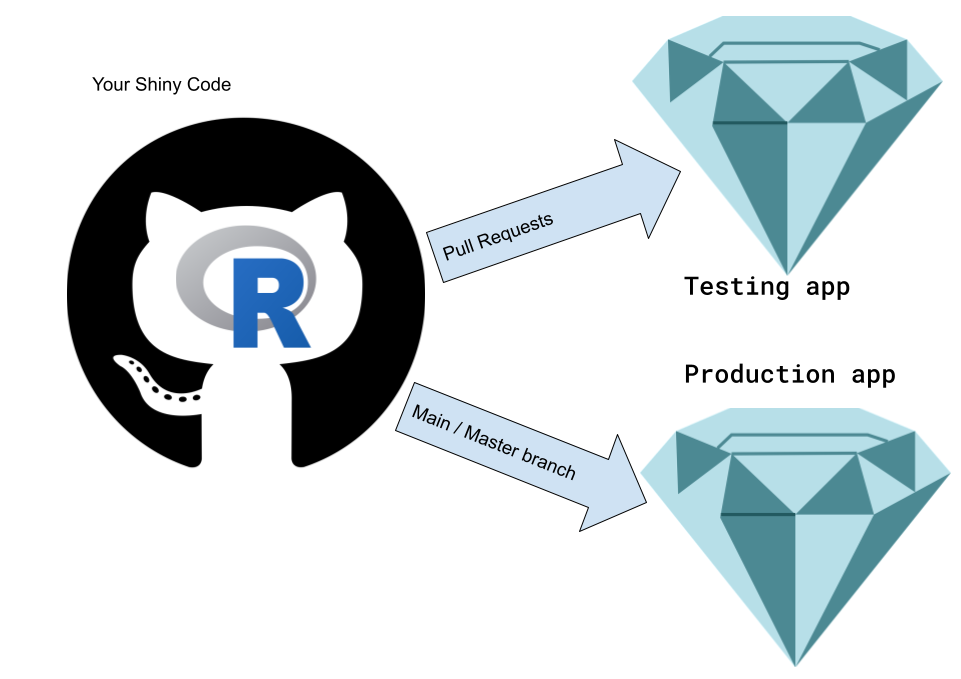
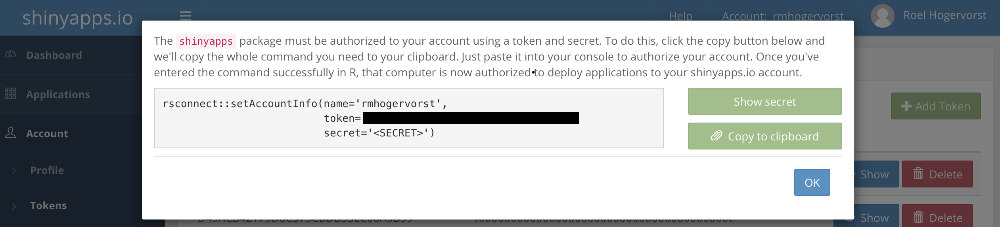
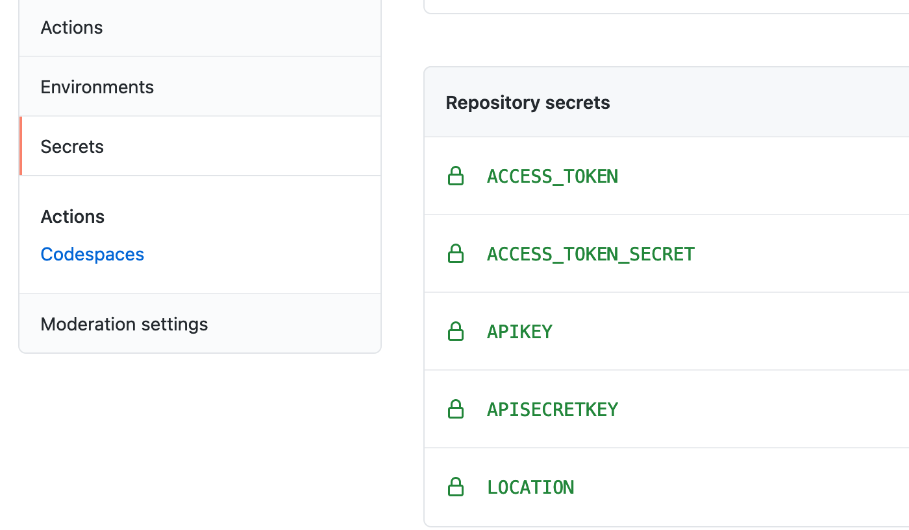

<!-- useful settings for rmarkdown-->


Last week I spend a few hours figuring out how to auto deploy a shiny app on 2 apps on shinyapps.io from github. 

You can see the result [on this github repository](https://github.com/RMHogervorst/testshiny). 
This github repository is connected to two shiny apps on shinyapps.io. 

Here is what I envisioned, 

* every new commit to the main branch will be published to the main app. We could then lock down the main branch so that no one can directly commit to main. (this is the production version). 
* Pull requests will be pushed to a testing version of the application. (on a different address). 



This way, you can try out if the changes you created are working for the application. If you like what you see, you can accept the changes in the pull request and they become part of the main branch and therefore the main application. 

I'll go step by step through what I did. 
I start with a new Rstudio project with the bare shiny app. (you can also start with a project that is already in a further ahead, as long as the shiny application is working.) 

Here is what I will do:

* Find out secrets for shinyapps.io and save them
* create an R script (deploy.R) to deploy the app to shinyapps.io
* (test the script locally)
* create a Dockerfile that deploys the app
* (test the Dockerfile )
* Bring secrets to github
* Create a github action that builds the Dockerfile, and executes the deploy.R file
* profit?


The [Github actions ](https://github.com/features/actions) I created does two things: it builds the container and it executes the deploy script. (There are probably more elegant solutions, where you keep the container somewhere without a need to rebuild it every time, but this worked good enough for me). 


Before I can dive into the deploy script, we need to talk about secrets. 

## Secrets
To deploy the application you need secrets from shinyapps.io, I recommend you create new secrets so you can revoke them when something goes wrong without hurting other deploy processes.

When logged in to shinyapps.io, go to account, to tokens, '+Add token'. This will open the secrets. 

Copy this to a temporary text file, we are going to need the components 'name', 'token' and 'secret' and we are placing those secrets locally in an .Renviron file. The script will then pick up the secrets from .Renviron and send those along. 

In your rstudio session create a new text file, save it as `.Renviron` in the document 

Create the secrets like this (without any '' marks, and no spaces, the names I use here SHINY_ACC_NAME, etc, don't really matter, you can change them, as long as you use the same names everywhere):

```
SHINY_ACC_NAME=youraccountname
TOKEN=atokenyougotfromshinyapps.io
SECRET=asecretyourecievedfromshinyapps.io
MASTERNAME=thiswillbethelastpartoftheurl
TESTNAME=thiswillbethelastpartoftheurl
```

fill SHINY_ACC_NAME with the 'name' on shinyapps.io (for me that is rmhogervorst)
TOKEN='token', and SECRET='secret'. 
I also created 2 other variables, MASTERNAME and TESTNAME. 
Normally rsconnect takes the name of your project as application name (and as last part of the URL), but you can override it, I override it because it allows us to create 2 apps in stead of one.

## Deployment script
Deploying to shinyapps.io is done with one command (or with a button in Rstudio) `deployApp()`.
before you can deploy, you need to authenticate once on your computer. Because we rebuild the docker image, we work on a 'fresh' computer every time. And so we need to authenticate every time. We authenticate with the secrets
you just retrieved from shinyapps.io. You placed the secrets into a .Renviron file and in this script you retrieve them again. To protect yourself from errors further on I created a small function that terminates the script whenever it cannot find the secret and it will complain clearly 

```r 
library(rsconnect)
# a function to stop the script when one of the variables cannot be found. and to strip quotation marks from the secrets when you supplied them. (maybe it is just easier to never use them)
error_on_missing_name <- function(name){
    var <- Sys.getenv(name, unset=NA)
    if(is.na(var)){
        stop(paste0("cannot find ",name, " !"),call. = FALSE)
    }
    gsub("\"", '',var)
}

# Authenticate
setAccountInfo(name   = error_on_missing_name("SHINY_ACC_NAME"),
               token  = error_on_missing_name("TOKEN"),
               secret = error_on_missing_name("SECRET"))

# Deploy the application.
deployApp(
    appFiles = c("app.R" #, you can specify which files to deploy, 
                 #or keep this NULL to deploy everything
                       ),
    appName = error_on_missing_name("MASTERNAME"),
    appTitle = "shinyapplication")
```

Restart your R session (so R can read the secrets in .Renviron) and run the script with `source(deploy.R)` or go to the terminal window and call `Rscript deploy.R`.
Fix errors if you find them and go on to the next step.

## Testing Dockerfile locally
To test the Dockerfile locally you need to have docker installed (you could test it directly on github too, but it will take a bit longer, this way at least you know it works on your computer it should also work on github). This is easy on most computers, and a bit of a hassle for windows computers (I'll leave that as and exercise for the reader). 

My Dockerfile is quite simple (I have the standard shiny app that only requires {shiny})

```
FROM rocker/shiny:4.0.4
RUN install2.r rsconnect
WORKDIR /home/shinyusr
COPY app.R app.R 
COPY deploy.R deploy.R
CMD Rscript deploy.R
```

* `FROM rocker/shiny:4.0.4`  I'm using the [shiny rocker image](https://github.com/rocker-org/rocker) because it 
has all the requirements for shiny already installed. I'm using the latest version that is available right now. I recommend you use the R version matching the one you have installed locally. 
* `RUN install2.r rsconnect` this is a special command to install r packages without going into an R session, you can add as many packages as you like, for example `RUN install2.r rsconnect dplyr ggplot2` would install also dplyr and ggplot
* `WORKDIR /home/shinyusr` setting this to a new directory will make sure you don't copy other stuff from the container into shinyapps.io
* `COPY app.R app.R ` this copies the file app.R from the current directory to the working directory in the container (Which we just set to /home/shinyusr). I also copy the deploy script. (you want to copy all the relevant files one by one or use a different command to copy everything from the folder to the container) LOOK THAT UP AND PUT IT HERE
* `CMD Rscript deploy.R` the final step in the container is executed when the docker container is started.

Make sure Docker is running. 
Go into a local terminal window and execute the following commands (where you replace the NAMETHISSOMGHING with a name you like)

```
IMAGENAME=<NAMETHISSOMETHING>
docker build -t $IMAGENAME . 
docker run --env-file .Renviron $IMAGENAME
```
* set a name
* You build the container
* and run the container while supplying necessary secrets.

This should also result in a successful deployment (literally the same shiny app in the exact same location).

## Creating a github action for the master/main branch
Now it is time to connect your local git repository to github.
Push all code to github. 
You can go to github.com/yourreponame and go to the tab 'Actions' to add a new file, or you can locally create a folder `.github/` with a folder `workflows/` inside that. 

Defining github actions goes through a yml file. 
I created this by modifying an example github actions file.
[LINK HERE]
The first part restricts this action to only the master or main branch
```
name: Run on push master, main

# Controls when the action will run. 
on:
  # Triggers the workflow on push or pull request events but only for the main branch
  push:
    branches: [ main, master ]
```

The second part checks out the repo, builds the image and runs it, supplying secrets from the secret store on github.

```
# A workflow run is made up of one or more jobs that can run sequentially or in parallel
jobs:
  # This workflow contains a single job called "build"
  build:
    # The type of runner that the job will run on
    runs-on: Ubuntu-20.04

    # Steps represent a sequence of tasks that will be executed as part of the job
    steps:
      # Checks-out your repository under $GITHUB_WORKSPACE, so your job can access it
      - uses: actions/checkout@v2

      # build the docker image and give it the name main
      - name: Build image
        run: docker build -t main . 
      # run the docker image supply the secrets from the github secrets store.  
      - name: execute
        run: >
          docker run 
          -e SHINY_ACC_NAME=${{ secrets.SHINY_ACC_NAME }} 
          -e TOKEN=${{secrets.TOKEN}} 
          -e SECRET=${{secrets.SECRET}} 
          -e MASTERNAME=${{secrets.MASTER_NAME}} 
          main
```

Now, this action will fail, because github doesn't have your secrets yet. 




## Creating a different github action for pull requests
(it is actually almost exactly the same but we supply a different name so the app ends up at a different place)

The first part is slightly different:
```
name: PR

# Run on all pull requests
on:
  pull_request: {}
```

The second part is the same except the secret at the end
```
      # Build image
      - name: Build image
        run: docker build -t pullrequestimage . 
      # run the image (but supply the TESTNAME in stead of MASTERNAME, so the 
      # app ends up in a different place.   
      - name: execute
        run: >
          docker run 
          -e SHINY_ACC_NAME=${{secrets.SHINY_ACC_NAME}} 
          -e TOKEN=${{secrets.TOKEN}} 
          -e SECRET=${{secrets.SECRET}} 
          -e MASTERNAME=${{secrets.TEST_NAME}} 
          pullrequestimage
```

Your master/main url will be `https://{SHINY_ACC_NAME}.shinyapps.io/{MASTERNAME}/`
and for PRs the URL will be `https://{SHINY_ACC_NAME}.shinyapps.io/{TESTNAME}/`

So now you have 2 apps, one for testing (for the Pull Requests) and one production. 

### References
- Find more tutorials by me in [this tutorial overview page](https://blog.rmhogervorst.nl/tags/tutorial/)
- [github repo with code for autodeployment](https://github.com/RMHogervorst/testshiny)
- link to rocker
### Reproducibility
<details>
<summary> At the moment of creation (when I knitted this document ) this was the state of my machine: **click here to expand** </summary>

```r 
sessioninfo::session_info()
```

```
─ Session info ───────────────────────────────────────────────────────────────────────
 setting  value                       
 version  R version 4.0.2 (2020-06-22)
 os       macOS  10.16                
 system   x86_64, darwin17.0          
 ui       RStudio                     
 language (EN)                        
 collate  en_US.UTF-8                 
 ctype    en_US.UTF-8                 
 tz       Europe/Amsterdam            
 date     2021-02-27                  

─ Packages ───────────────────────────────────────────────────────────────────────────
 package     * version date       lib source        
 assertthat    0.2.1   2019-03-21 [1] CRAN (R 4.0.2)
 blogdown      1.1     2021-01-19 [1] CRAN (R 4.0.2)
 bookdown      0.21    2020-10-13 [1] CRAN (R 4.0.2)
 bslib         0.2.4   2021-01-25 [1] CRAN (R 4.0.2)
 cachem        1.0.1   2021-01-21 [1] CRAN (R 4.0.2)
 cli           2.3.0   2021-01-31 [1] CRAN (R 4.0.2)
 digest        0.6.27  2020-10-24 [1] CRAN (R 4.0.2)
 ellipsis      0.3.1   2020-05-15 [1] CRAN (R 4.0.2)
 evaluate      0.14    2019-05-28 [1] CRAN (R 4.0.1)
 fastmap       1.1.0   2021-01-25 [1] CRAN (R 4.0.2)
 glue          1.4.2   2020-08-27 [1] CRAN (R 4.0.2)
 htmltools     0.5.1.1 2021-01-22 [1] CRAN (R 4.0.2)
 httpuv        1.5.5   2021-01-13 [1] CRAN (R 4.0.2)
 jquerylib     0.1.3   2020-12-17 [1] CRAN (R 4.0.2)
 jsonlite      1.7.2   2020-12-09 [1] CRAN (R 4.0.2)
 knitr         1.31    2021-01-27 [1] CRAN (R 4.0.2)
 later         1.1.0.1 2020-06-05 [1] CRAN (R 4.0.2)
 lifecycle     0.2.0   2020-03-06 [1] CRAN (R 4.0.2)
 magrittr      2.0.1   2020-11-17 [1] CRAN (R 4.0.2)
 mime          0.9     2020-02-04 [1] CRAN (R 4.0.2)
 miniUI        0.1.1.1 2018-05-18 [1] CRAN (R 4.0.2)
 processx      3.4.5   2020-11-30 [1] CRAN (R 4.0.2)
 promises      1.1.1   2020-06-09 [1] CRAN (R 4.0.2)
 ps            1.5.0   2020-12-05 [1] CRAN (R 4.0.2)
 R6            2.5.0   2020-10-28 [1] CRAN (R 4.0.2)
 Rcpp          1.0.6   2021-01-15 [1] CRAN (R 4.0.2)
 rlang         0.4.10  2020-12-30 [1] CRAN (R 4.0.2)
 rmarkdown     2.6     2020-12-14 [1] CRAN (R 4.0.2)
 rsconnect     0.8.16  2019-12-13 [1] CRAN (R 4.0.2)
 rstudioapi    0.13    2020-11-12 [1] CRAN (R 4.0.2)
 sass          0.3.1   2021-01-24 [1] CRAN (R 4.0.2)
 servr         0.21    2020-12-14 [1] CRAN (R 4.0.2)
 sessioninfo   1.1.1   2018-11-05 [1] CRAN (R 4.0.2)
 shiny       * 1.6.0   2021-01-25 [1] CRAN (R 4.0.2)
 stringi       1.5.3   2020-09-09 [1] CRAN (R 4.0.2)
 stringr       1.4.0   2019-02-10 [1] CRAN (R 4.0.2)
 withr         2.4.1   2021-01-26 [1] CRAN (R 4.0.2)
 xfun          0.20    2021-01-06 [1] CRAN (R 4.0.2)
 xtable        1.8-4   2019-04-21 [1] CRAN (R 4.0.2)
 yaml          2.2.1   2020-02-01 [1] CRAN (R 4.0.2)

[1] /Library/Frameworks/R.framework/Versions/4.0/Resources/library
```

</details>
