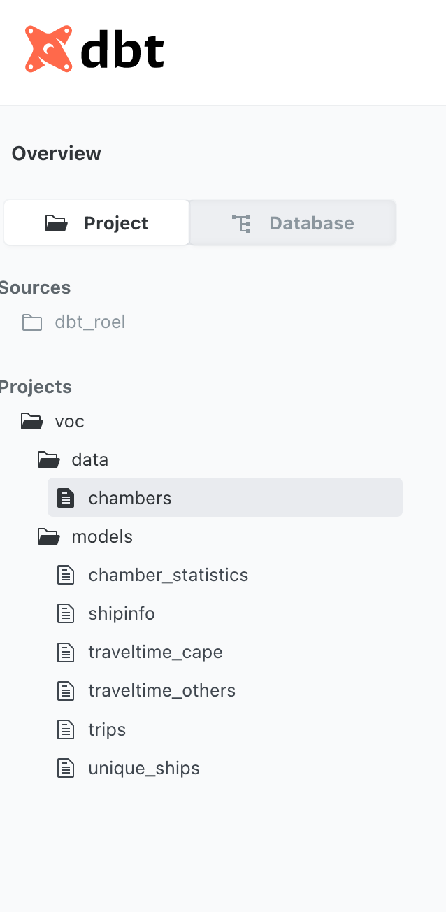
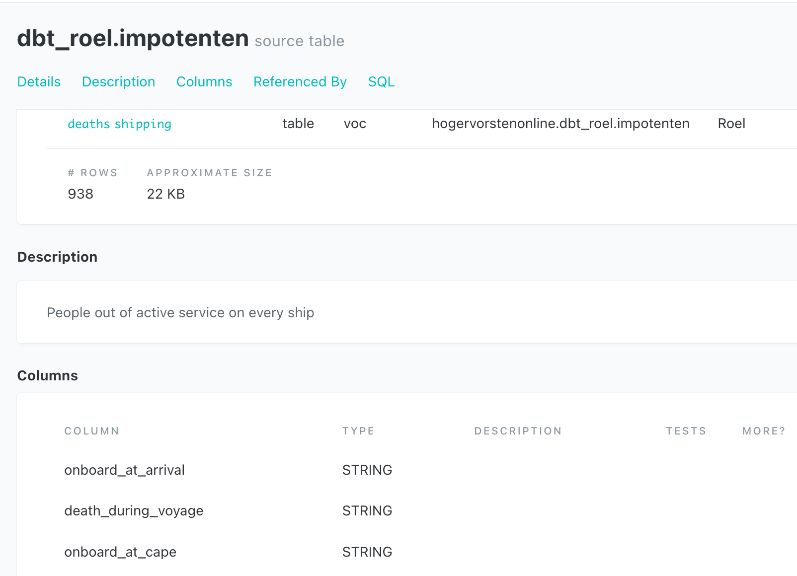
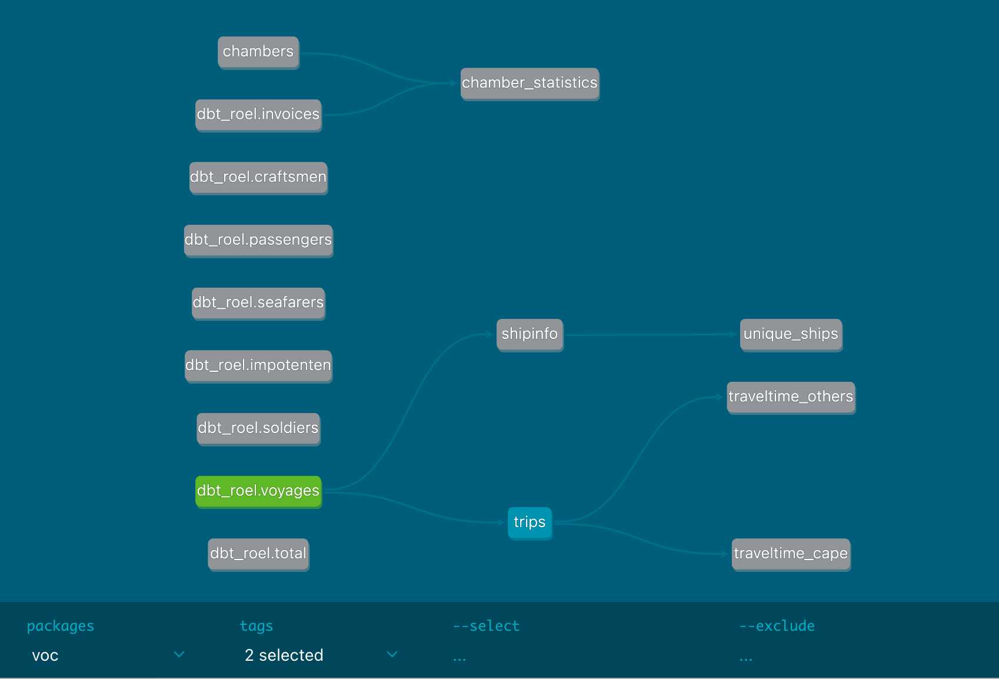
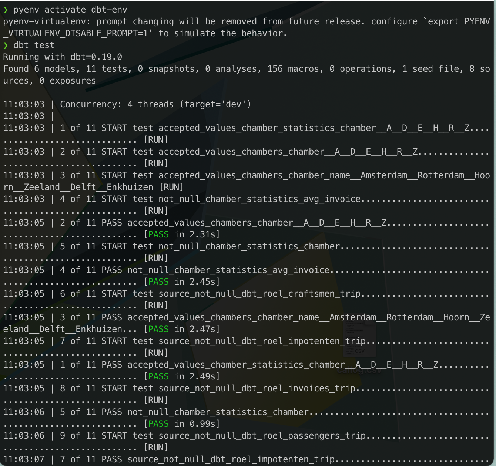

Over the last week I have experimented with dbt (data built tool), a cmdline tool
created by [Fishtown-analytics](https://docs.getdbt.com/). 
I'm hardly the first to write or talk about it (see 
all the references at the bottom of this piece). But I just want to record my
thoughts at this point in time. 

## What is it
Imagine the following situation: you have a data warehouse where all your data
lives. You as a data engineer support tens to hundreds of analysts who build 
dashboards and reports on top of that source data. You ingest your data
from many sources into that warehouse and need several transformations to 
make it usable for the analyst, because tools like tableau and looker need the 
data to be in specific wide format.

What you and the analysts end up with is a set of tables and views that depend on 
each other and need periodic refreshes. Which means you need to run sequental 
SQL jobs on a schedule (You use a tool like airflow for the ordering and 
scheduling). 

It also means, unfortunately, that you recreate a lot of logic many times,
calculating certain metrics, making sure certain columns are not NULL, etc.
Airflow has cool templating tools to make that easier, but it remains a 
pain to maintain.

dbt allows you to define dependencies between tables, tag columns, views, tables
and logic. define logic in one place and reimport it where necessary. Add
automatic tests for data.  It is not a magic tool, it is all SQL (and yaml, and 
a bit of jinja templating). dbt also allows you to document all your data, 
giving descriptions for the tables, columns and even the tests.

Best of all
your analysts can run this tool themselves, and you can add it to your CI/CD
pipeline so the analists can do most of the work themselves, freeing you up for
other data engineering work.

## What I Love about dbt
I just love the **docs**! They are generated and contain links
to downstream and upstream dependencies. The documentation ends up as static
pages so you can host them wherever you want. The dependencies and descriptions
of the data are also exported as a json so you could ingest that json into 
other tools too!

dbt also creates a **dependency graph** in visual form. 
 

This is not very different from
airflow DAGs (but these graphs also contains links to the data documentation 
which you don't have in airlflow).

I love that you have **tests** for your data that you can run yourself, 
but you can also run the tests in a 
CI/CD job for every PR.

Everything is SQL (with a bit of jinja magic) this is very understandable to 
analysts. They live and breath SQL! 

Finally I love the ability to keep logic in one place. You can create the logic,
document it, test it, and import where necessary. For example: recalculating cents
to dollars with arbitrary rounding, or the logic to perform a pivot (that is
tough SQL!). Or logic to deal with your changing set of stores (change it in
one place in stead of everywhere!).

There are also several dbt-airflow integrations. In airflow you have to set up
a DAG for every new process that you want, but in dbt you could tag your models
with the [frequency they need](https://docs.getdbt.com/reference/resource-configs/tags/#use-tags-to-run-parts-of-your-project): (hourly, daily, weekly, etc) and run only those 
models: `dbt run --model tag:daily` . Other things I've seen: testing frequency
based on value of the models, for instance testing finance models every day and
others weekly.

### Things I don't like or wish were included out of the box
**Setting up a dbt on your computer** is quite some work. Work your analysts need some help 
with. For example: you need a profile in your home directory that defines 
the warehouse, some schema stuff, timeouts etc. You want a setupscript for all 
employees that sets this up for them. 

Any **project setup** needs help too. I guess you could create a repo and 
the analysts could clone that repo and work from there, but if your analyst
adds a new view (model in dbt terms) it needs a corresponding project.yml entry
too (if you want to add tags). 

All the **yaml stuff**, seriously yaml indentation is the bane of my existence.
Not only the indentation, but what arguments are allowed and what not?
I would love a linter for dbt that tells me what possible values are allowed. 

**Columns** are treated differently, to tag a model you use the project.yml 
but you tag columns (and tests) in the model.yml file. These tags don't show
up in the docs page. What if you want to highlight the models with pii columns?
I would like it if downstream models that have identical column names automatically
have the same description, tags and tests. I have seen a talk where people 
automate that process, but I guess I have to make that myself.

## Conclusion
Overal I think dbt is great tool! I love the logic, the tests and the docs. 
I think using the cloud (SAAS) version is supernice, you have scheduling, 
docs page, and visual interface with compiled SQL all in one package.

For first time use the setup is not trivial, and for subsequent project setups
you need some experience too. 

dbt is a cmdline tool with all that that entails: easy integration, but it can be
difficult for people not used to cmdline tools (I don't know how easy this all
works on windows for example).

I think for data engineers that want to empower the analysts in your company dbt
is a very powerful tool. 
However just like airflow, you need to set up many guardrails and guidance. 
That means a lot of support. You want everyone using the tool to feel free
to experiment, knowing the tests and validation that dbt provide will make
sure their experiment is not going to break the company. You want small
successes from the start, that give everyone confidence. 

So, I'd say, try it out on one of your projects!

## references and more
- for data engineer questions like : why not run queries on airflow? or why would I learn a new tool? [(short article  about ) advantages of using dbt](https://www.startdataengineering.com/post/advantages-of-using-dbt-data-build-tool/)
- [major overview of dbt](https://www.getdbt.com/product/)
- [dbt and bigquery, nice intro](https://towardsdatascience.com/get-started-with-bigquery-and-dbt-the-easy-way-36b9d9735e35)
- [intro dbt video youtube](https://www.youtube.com/watch?v=M8oi7nSaWps)
