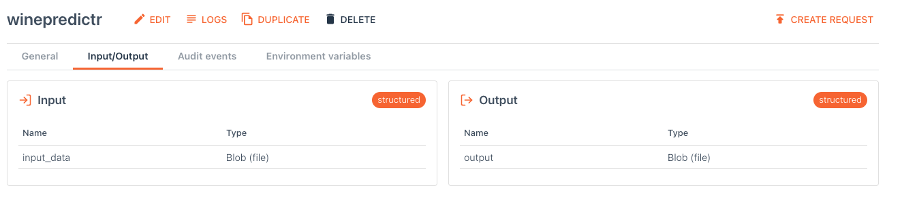

<!-- useful settings for rmarkdown-->

```{r setup, include=FALSE}
# Options to have images saved in the post folder
# And to disable symbols before output
knitr::opts_chunk$set(fig.path = "", comment = "")

# knitr hook to make images output use Hugo options
knitr::knit_hooks$set(
  plot = function(x, options) {
    hugoopts <- options$hugoopts
    paste0(
      "{{<figure src=",
      '"', x, '" ',
      if (!is.null(hugoopts)) {
        glue::glue_collapse(
          glue::glue('{names(hugoopts)}="{hugoopts}"'),
          sep = " "
        )
      },
      ">}}\n"
    )
  }
)

# knitr hook to use Hugo highlighting options
knitr::knit_hooks$set(
  source = function(x, options) {
  hlopts <- options$hlopts
    paste0(
      "```r ",
      if (!is.null(hlopts)) {
      paste0("{",
        glue::glue_collapse(
          glue::glue('{names(hlopts)}={hlopts}'),
          sep = ","
        ), "}"
        )
      },
      "\n", glue::glue_collapse(x, sep = "\n"), "\n```\n"
    )
  }
)
```


I've been working with UbiOps lately, a service that runs your data science
models as a service. They have recently started supporting R next to python! So let's see if we can deploy a tidymodels model to UbiOps! 
I am not going to tell you a lot about UbiOps, that is for another post. I presume you know what it is,
you know what tidymodels means for R and you want to combine these things.

The usecase is this: I've developed a tidymodels model that predicts red wine quality given its chemical properties. Now I want to put that model online so the business can send requests to an endpoint and receive quality estimations. The business knows how to talk to APIs, they shouldn't care about what language I'm using to make the predictions.

I'm going to use the UbiOps webinterface but there is also a CLI, a python library and
I believe an R client version is coming as well.

## About ubiops
Full disclosure, the company I work for (Ordina) has a partnership with UbiOps.
I'm not getting paid for this post, but obviously I hope they do well!
I think it can be a great product to reduce the time to production. 

In short UbiOps wraps your code inside a container and makes it an API endpoint,
all you have to do is supply the code, zip it up and drop it in the right place.

## Create a tidymodel-model
Train a model and write it away into an RDS file.

```{r, eval=FALSE}
library(recipes)
library(magrittr)
library(workflows)
library(rsample)
library(parsnip)
library(earth)
winequality <- read.csv("data/winequality-red.csv")
split <- initial_split(winequality, prop = 0.8,strata = "quality")
train <- training(split)
test <- testing(split)

## make recipe
rec_wine <-
    training(split) %>%
    recipe(quality~.) %>%
    step_corr(all_predictors()) %>%
    step_nzv(all_predictors()) %>%
    step_center(all_predictors(), -all_outcomes()) %>%
    step_scale(all_predictors(), -all_outcomes()) %>%
    prep()

## make model
marsmodel <- 
  mars(mode = "regression") %>%
  set_engine("earth")

# make workflow
mars_wf <-
    workflow() %>%
    add_recipe(rec_wine) %>%
    add_model(marsmodel)
## fit model
fit_mars <- mars_wf %>%
    fit(data = train)

# evaluate
fit_mars %>%
    predict(test) %>%
    bind_cols(test) %>%
    rmse(quality, .pred)
# 65%, pretty bad but it is a start

#save model
saveRDS(fit_mars,'ubiops_deployment/deployment_package/fit_mars.RDS')
```

Now we can wrap the saved model into a deployment package and drop that zip into UbiOps.


## deployment package
You have to create a deployment package^[it would be very cool if there was
a rstudio project template for that] (a zipfile) that contains an init and 
request method. For R deployments you need a deployment.R file.

The deployment_package.zip I created contains
```
deployment_package/renv.lock     # contains the packages needed
deployment_package/fit_mars.RDS  # my trained model 
deployment_package/deployment.R  # the code that runs
```

the deployment.R file looks like this (I just modified the UbiOps [deployment-template)](https://github.com/UbiOps/deployment-template/tree/master/r):

```{r, eval=FALSE}
# This file (containing the deployment code) is required to be called 'deployment.R' and should contain an 'init'
# and 'request' method.

#' @title Init
#' @description Initialisation method for the deployment.
#'     It can for example be used for loading modules that have to be kept in memory or setting up connections.
#' @param base_directory (str) absolute path to the directory where the deployment.R file is located
#' @param context (named list) details of the deployment that might be useful in your code
init <- function(base_directory, context) {
  ## Init runs only once during initialisation. 
    print("Initialising My Deployment")
    library(recipes)
    library(magrittr)
    library(workflows)
    library(rsample)
    library(parsnip)
    library(earth)
    modelloc = file.path(base_directory, 'fit_mars.RDS')
    print(paste0("loading model at ", modelloc))
    ## Assigns fit_mars to the global namespace so that the request function
    ## can make use of this model.
    fit_mars <<- readRDS(modelloc) 

}

#' @title Request
#' @description Method for deployment requests, called separately for each individual request.
#' @param input_data (str or named list) request input data
#'     - In case of structured input: a named list, with as keys the input fields as defined upon deployment creation
#'     - In case of plain input: a string
#' @param base_directory (str) absolute path to the directory where the deployment.R file is located
#' @param context (named list) details of the deployment that might be useful in your code
#' @return output data (str or named list) request result
#'     - In case of structured output: a named list, with as keys the output fields as defined upon deployment creation
#'     - In case of plain output: a string
request <- function(input_data, base_directory, context) {
    # read csv
    print('reading csv')
    winequality <- read.csv(file.path(input_data[["input_data"]]))
    # predict on results
    print("predicting")
    predictions <-
        fit_mars %>%
        predict(winequality) %>%
        bind_cols(winequality)

    predictions %>%
        write.csv("predictions.csv")
    # return the csv location
    list( output = 'predictions.csv')
}

```

In the deployment specification I set the input to be a file and the output
as well. I set the language to R4.0 and upload the zip.



There were few gotchas you should pay attention to:

The init() function is called during startup and the request() function at every API request to this service.
The request() function has no access to the inside of the init() function. So
if you want to initialize something (like loading a model) you should use the
superassignment operator `<<-` to put it into the global namespace. 
The first versions of the R support had an example using R6 classes, more (encapsulating) object
oriented programming (OOP). When you use R6, the init function and request function are 
related to the same object and so you don't have to superassign. I believe most
R programmers don't want to use all that boilerplate of R6 and this is good enough.

Furthermore I am super excited that ubiops decided to support renv, you can just 
pin your specific package versions and know for sure that those will be installed.
All you have to do to make that work is add an renv.lock file to the deployment-package

Finally installation of tidymodels takes a long time, UbiOps already installed
tidyverse so that helps a lot! but I recommend you don't set tidymodels as
dependency, but only the packages you use `{recipes},{parsnip},{workflows},etc`


## Notes and references
* [R deployment template](https://ubiops.com/docs/deployments/deployment-package/r-deployment-package/)
* [ubiops youtube video explaining R support (may 2021)](https://www.youtube.com/watch?v=ftcB76ae950)

### Reproducibility
<details>
<summary> At the moment of creation (when I knitted this document ) this was the state of my machine: **click here to expand** </summary>

```{r}
sessioninfo::session_info()
```

</details>


