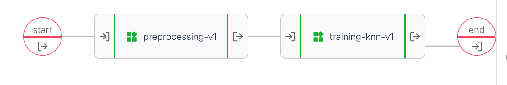

In this walkthrough I modified a tutorial from the UbiOps cookbook ['Python Scikit learn and UbiOps'](https://ubiops.com/docs/ubiops_cookbook/scikit-deployment/index.html),
but I replaced everything python with R. So in stead of scikitlearn I'm using [{tidymodels}](https://CRAN.R-project.org/package=tidymodels), and where python uses a requirement.txt, I will use [{renv}](https://CRAN.R-project.org/package=renv). 
So in a way I'm going from python cookbook to {recipes} in R!


### Components of the pipeline
The original cookbook (and my rewrite too) has three components: 

* a preprocess component
* a training model component
* a predict component

You can combine those parts into 

* a preprocess-training pipeline with a trained model as result
* a preprocess-predict pipeline to predict new result

The cool thing about UbiOps is that we don't care what language something is
in, we could do preprocessing in Python and predictions in R for example.
And we could use version "0.1.6" of [{parsnip}](https://CRAN.R-project.org/package=parsnip) in one component and version "0.1.3" of that same package in another component.
As long as you keep the interface the same ("output":integer, "score": double) or something.
we can just pass information along.


This was a lot of fun, but if you use this as your example for R projects, there is a catch, in keeping the R version as similar to python as possible I had to take some steps you might not take that are related to python or sklearn:

We pull apart the trainingset by cutting of the target values (y) from the predictor variables (X), 
that is not something we do with tidymodels, so to keep the tutorial equivalent, I splitted the 
values, and in the next component, combined them again.
Similarly inside sklearn there is a function split_train_test or something that
takes in an X and y dataset and returns train_X, test_x, train_y and test_y. 

with rsample you leave the dataset intact, create a split object (that only contains
the indices for test and train) and let the package handle the particulars.  
Returning multiple objects is a cool feature in python and there are packages 
in R that do it too, but in general I don't miss it.


# Overview
In these code examples I have removed all print statements and comments,
for the full code go to [gitlab](https://gitlab.com/rmhogervorst/ubiops_tidymodel_walkthrough) or [github](https://github.com/RMHogervorst/ubiops_tidymodels_walkthrough). 
Both python and R examples have an init() function that runs when the container is first started and
a request() function that runs when we send an actual request to the service. 
In these examples I only show the request part and not the init because the init is mostly 
empty for the python code and contain the library statements for the R code. 

Let's dive in.
For every component I show the python code first and my R version after. 

## pre-process
The pre-process component does feature engineering on the dataset, which I don't think is necessary for a KNN model, but that doesn't matter for the example.

* read in data
* replace 0s in Glucose, Bloodpressure, SkinThickness, Insulin and BMI columns with NA 
* impute the NAs with mean for Glucose and Bloodpressure columns
* impute the NAs with median for ScinThickness, Insulin and BMI columns
* when 'training' input is set to TRUE: remove the Outcome column and save dataset as X and return the Outcome column as a seperate dataset y. if 'training' is FALSE return the entire set as X and a single value 1 as y.
* normalize/standardize the dataset so every column has mean=0 and sd=1.
* create csv files for X and y 
* return resulting files


### Pre-process - python 
The init function doesn't do anything here but the file starts with imports 
that you need. imported are pandas, numpy and from sklearn import the StandardScaler

The request function:
```{python, eval=FALSE}
class Deployment:
  # init function
    def request(self, data):
        diabetes_data = pd.read_csv(data["data"])
        diabetes_data[['Glucose','BloodPressure','SkinThickness','Insulin','BMI']] = diabetes_data[['Glucose','BloodPressure','SkinThickness','Insulin','BMI']].replace(0,np.NaN)
        diabetes_data['Glucose'].fillna(diabetes_data['Glucose'].mean(), inplace = True)
        diabetes_data['BloodPressure'].fillna(diabetes_data['BloodPressure'].mean(), inplace = True)
        diabetes_data['SkinThickness'].fillna(diabetes_data['SkinThickness'].median(), inplace = True)
        diabetes_data['Insulin'].fillna(diabetes_data['Insulin'].median(), inplace = True)
        diabetes_data['BMI'].fillna(diabetes_data['BMI'].median(), inplace = True)

        if data["training"] == True:
            X = diabetes_data.drop(["Outcome"], axis = 1) 
            y = diabetes_data.Outcome
        else:
            X = diabetes_data
            y = pd.DataFrame([1])
            
        sc_X = StandardScaler()
        X =  pd.DataFrame(sc_X.fit_transform(X,),
                columns=['Pregnancies', 'Glucose', 'BloodPressure', 'SkinThickness', 'Insulin',
               'BMI', 'DiabetesPedigreeFunction', 'Age'])
        
        X.to_csv('X.csv', index = False)
        y.to_csv('y.csv', index = False, header = False)

        return {
            "cleaned_data": 'X.csv', "target_data": 'y.csv'
        }
```


### Pre-process - r
I could have done the same thing as within python, setting the library() calls
at the top of the file. But in this case I set them up in the init(). I load {readr} and {recipes}
{readr} adds some dependencies, but I feel they largely overlap with {recipes} and so it's a nice
addition because it is faster and more consistent then standard read.csv().

```{r, eval=FALSE}
request <- function(input_data, base_directory, context) {
  diabetes_data <- read_csv(input_data[['data']])
  diabetes_recipe <- 
    recipe(diabetes_data, Outcome~.) %>%  
    step_mutate(
      Glucose = ifelse(Glucose ==0 , NA_real_, Glucose), 
      BloodPressure = ifelse(BloodPressure ==0 , NA_real_, BloodPressure),
      SkinThickness = ifelse(SkinThickness ==0 , NA_real_, SkinThickness),
      Insulin = ifelse(Insulin ==0 , NA_real_, Insulin),
      BMI = ifelse(BMI ==0 , NA_real_, BMI)
    ) %>% 
    step_impute_mean(Glucose, BloodPressure) %>% 
    step_impute_median(SkinThickness, Insulin, BMI) %>% 
    step_normalize(all_predictors()) %>% 
    prep()  

  diabetes_preprocessed <- 
    diabetes_recipe %>% 
    bake(diabetes_data) 
  if(input_data[["training"]]){
    Y <- diabetes_preprocessed %>% select(Outcome)
    X <- diabetes_preprocessed %>% select(-Outcome)
  }else{
    X <- diabetes_data
    Y <- tibble(1)
  }
  write_csv(X, file = 'x.csv')
  write_csv(Y, file = "y.csv", col_names = FALSE)
  list(
    "cleaned_data"= 'x.csv', 
    "target_data"= 'y.csv'
  )
}

```

### Pre-process differences and similarities
I chose to move the selection based on 'training'==TRUE to the end and so
when you call training==FALSE in the python version, the Outcome column is also 
standardized while in the R version it will never be standardized.
In the R version I first only create the recipe and run it in the next step,
you could chain the `bake()` step directly to the previous steps, so it behaves
like the `fit_transform()` method from sklearn. 


## train knn model
This component has the following steps:

* Read in the X (called cleaned_data) and y (called target_data), 
* split data into training (60%) and test (40%) set.
* fit a 7 nearest neighbors model on the trainingset
* score the test set on accuracy
* create an overview of performance which includes precision, recall, and f1 measure.
* return the trained model and accuracy

### train knn model python
The python version initializes with pandas, numpy, and imports train_test_split, KNeighborsClassifier and classification_report. 

```{python, eval=FALSE}
class Deployment:
  # init function
    def request(self, data):        
        X = pd.read_csv(data["cleaned_data"])
        y = pd.read_csv(data["target_data"], header = None)
        X_train,X_test,y_train,y_test = train_test_split(X,y,test_size=0.4,random_state=42, stratify=y)

        knn = KNeighborsClassifier(n_neighbors=7) 
        knn.fit(X_train,y_train)
        score = knn.score(X_test,y_test)
        y_pred = knn.predict(X_test)
        print(classification_report(y_test,y_pred))
        
        with open('knn.joblib', 'wb') as f:
           dump(knn, 'knn.joblib')
        return {
            "trained_model": 'knn.joblib', "model_score": score
        }
```


### train knn model R
library calls: {readr},{kknn},{magrittr},{rsample},{parsnip},{yardstick}

```{r, eval=FALSE}
request <- function(input_data, base_directory, context){
 
  X <- read_csv(input_data[["cleaned_data"]])
  y <- read_csv(input_data[["target_data"]],col_names = "Outcome")

  input_dataset <- X %>% 
    dplyr::bind_cols(y)
  input_dataset$Outcome <- as.factor(input_dataset$Outcome)
  set.seed(42)
  split_object <- initial_split(input_dataset, prop = 0.6,strata = Outcome)
  library("kknn")  # bug? it works without this call on my machine, but not on ubiops.
  modelspec <- 
    nearest_neighbor(mode = "classification",neighbors = 7) %>% 
    set_engine("kknn")

  trained_model <- modelspec %>% fit(Outcome~., data=training(split_object))

  test_results <- 
    testing(split_object) %>% 
    dplyr::bind_cols(
      trained_model %>% predict(testing(split_object))
      )

  acc <- test_results %>% accuracy(truth=Outcome, estimate = .pred_class) %>% dplyr::pull(.estimate)

  classification_report <- metric_set(precision, recall, f_meas)
  class_results <- 
    test_results %>% 
    classification_report(truth=Outcome, estimate = .pred_class)
  print(glue::glue_data(class_results,"{.metric}: {round(.estimate,4)}"))
  modelname <- 'knnmodel.RDS'
  write_rds(trained_model, modelname)
  
  list(trained_model = modelname, model_score=acc)  
}
```

### Training differences and similarities
In R I don't need to supply the seed to the split function because it picks up the 
generic set.seed. There is not a classification_report function in the packages I use, but looking at the [sklearn documentation this classification_report](https://scikit-learn.org/stable/modules/generated/sklearn.metrics.classification_report.html) contains the precision, recall and f1-measure. So I used the metric_set function from yardstick to create a similar thing. 


## predict

* read the data in
* use the trained model to predict on the new data
* count the number of cases (diabetes = 1)
* create a csv of predictions including an index

### predict python
The init function loads the model from disk. 

```{python, eval=FALSE}
class Deployment:
  # init function
    def request(self, data):
        input_data = pd.read_csv(data['data'])
        prediction = self.model.predict(input_data)
        diabetes_instances = sum(prediction)
        pd.DataFrame(prediction).to_csv('prediction.csv', header = ['diabetes_prediction'], index_label= 'index')
        
        return {
            "prediction": 'prediction.csv', "predicted_diabetes_instances": diabetes_instances
        }

```


### predict R
The init function loads the model from disk. 

```{r, eval=FALSE}
request <- function(input_data, base_directory, context){
  input_data = read_csv(input_data[['data']])
  
  predictions <- 
    model %>% 
    predict(input_data)
  diabetes_instances = sum(predictions$.pred_class == 1)
  predictions %>% 
    mutate(index=row_number()) %>% 
    select(index, diabetes_prediction = .pred_class) %>% 
    write_csv(file="prediction.csv")
  
  list(prediction="prediction.csv",predicted_diabetes_instances=diabetes_instances)
}
```

### predict differences and similarities
The index doesn't make sense to me, but i added it anyways.

## Connecting the pipeline

Training pipeline inputs

* data: blob(file)
* training: boolean

Training pipeline outputs:
* trained_model: blob(file)
* model_score: double (accuracy score)




Production pipeline inputs:
* data: blob(file)
* training: boolean

production pipeline outputs:
* prediction: blob(file)
* predicted_diabetes_instances: integer


## lessons learned
While building these three components in R, I've found that creating a separate rstudio project for every component makes your work really easy. The {renv} package works really well with Rstudio projects too. Finally I now created a new folder deployment and copied the relevant files to it before zipping it, so the zipfile works nicely with UbiOps.

Tidymodels and sklearn have many similarities and it is relatively easy to write
components from one language to another (though the whole point of UbiOps is that you don't need to!). sklearn is an enormous python package that contains everything you ever could need, while the R philosophy is creating wrappers around existing packages to make sure everything works together nicely. 


## Improvements
Now all we need is a way to move the trained model from the training pipeline to
the production pipeline.

I think a supersimple project starter for Rstudio could be very useful, something
like https://rstudio.github.io/rstudio-extensions/rstudio_project_templates.html
where you define a deployment.R file with init() and request() and a test_request.R
file that contains basics for testing the deployment file and the basics for
turning it into a deployment.zip. 

Later, I think a small addin for rstudio that talks to the API would be awesome!

I haven't used the API here, I developed locally and defined everything through the webinterface. 


### references
* image by [Alex Loup](https://unsplash.com/@alexloup) from [unsplash](https://unsplash.com/photos/On2VseHUDXw)