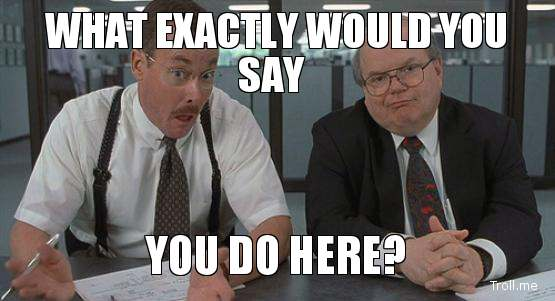

<!-- content  -->
I call myself data engineer, data scientist, or machine learning engineer. But never 
an analist. To me these job-titles all have a certain meaning, but how would a recruiter
know what these things mean? My understanding of the roles can also be different from
someone else in the field. Some people (they are dicks) would like to keep everyone
who is not building neural nets out of the title of data scientist. It seems there
is prestige connected to job-titles too. All in all, it is pretty confusing. 

Let's not play this guessing game, let's talk about responsibilities and the kind
of activities I would like to do and consider part of my job. 

I'm a tool maker, I enjoy the following things:

* making it easier for my coworkers to change their data science solution. (Enabling tests, helping them write better code that is easier refactored, changed)
* automating tedious steps. (building pipelines that creating artefacts: packages, docker containers, deployments).
* unifying architecture. (Reducing duplication when  projects use the same steps by building packages.)
* enabling integration with existing systems. (Fitting ML solutions in the same architecture be it APIs, data warehouse, scheduler. Writing logs to correct place. Sending to monitor systems) 

Many of these activities would fall under the umbrella of Software engineering, people
who do these things are called SRE, ML engineer, sometimes data engineer, and sometimes just plain old data analyst. My work often has a focus on reliability, reproducibility, automation and agility.
