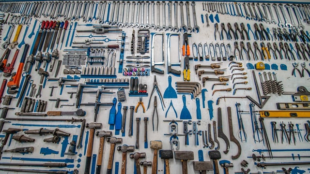

<!-- content -->
This is a post for people who only work alone or wonder why on earth you would
use all those fancy tools like linting, unit-tests, and fancy editors.
I hear you, why would I use all those extra steps? That sounds like busywork
you do instead of actual work! 

I think you just don't haven't experienced development work like I have, and I would
like to share how my work feels and looked like in the past few years. Maybe you 
still don't want to use the tools, that is fine! I'm not trying to convince anyone
of the merits of my setup. This is a post that tells you how I would use the tools.

# What I do
I work in python, R, SQL and sometimes a bit of javascript, and I build data products, or
I do data engineering work. So I don't make websites, but I will integrate my ML model that feeds a website and I don't build transactional systems but I will create the data flow from your operation to a data warehouse. 

# How I get my tasks
I'm part of team, together with the product manager and potential users of our
'solutions'  we 
sketch out the general directions of our solution (solutions can be a single SQL query to CLI program or even a user interface). Once the generic sketch is worked out, 
me and the rest of the team use that sketch to write out out generic tasks. 

## Working on a task
I pick one of the tasks that my team has defined. 
(if we use a board to track progress I move the task to 'doing' or 'in progress' and 
add my name to it, so others know I work on it.)

### Prep
I open up my IDE. I open the correct project. 
I make sure I get the latest version of the project from the centralized code repository: `git checkout main && git pull`. 
Now that I'm up to date, I branch off the main trunk with a new branch for the new work I'm doing `git checkout -b feat/featurenameorticketnumber`. This starts a new branch and makes sure my changes are added to that branch.

### Actual work
I start the actual work. I work in very small increments, I create a function
and add a test for that function (to make sure it does what it should do, in a way, a test is a contract between me and the team that the function does something specific.) 
I also make sure the test fails when my new function does something wrong _(in the Test Driven Development (TDD) world you'd use green-red-green, you would first run all the tests and see if everything works (Green), than write a test for the functionality that you want, run the test to make it fail (Red) and write the code that makes the test work again)_.

Once test and function are ready I commit `git commit` and write the commit message.
I continue to work in small increments until the task we setup before feels ready. 
I look back at my commits (`git reflog`) to see if steps make sense. If not, and I 
need to combine some steps or reorder them I do an interactive rebase `git rebase -i HEAD@NR`. (don't worry I have to lookup the commands almost every day)

I run all the tests again to make sure I broke nothing and create a Merge request (or Pull request, it has different names in gitlab/github/bitbucket/codeberg, etc). In this next step I will ask
feedback from my team on the work. 

But first:
I haven't talked about styling, typehints, linting etc. Most of that work happens
automatically. I'm a great believer in linting to make every part of the codebase
look similar. I'm not a great believer in manually correcting everything. In fact
I hate that. So I use styling tools that correct my work for me whenever possible.
Life is too short for me to manually style stuff.
I also don't want to think about these things. So whenever possible I use something
like the [pre-commit](https://pre-commit.com/) framework. That runs all the stuff
you want, before you commit. So when when I run `git commit`, the line-endings are fixed,
extra spaces removed, yaml is checked, SQL is fixed, python is fixed with isort and black,
R code is improved with styler, mypy checks the input and output types of functions
in python code. And then the commit starts. That is right, I don't have to do anything else.

### Team feedback
After I opened the Merge request, the central version control system runs some
checks to make sure my R, python and SQL code is correctly formatted (linting), and
runs all the tests to make sure my work doesn't break anything.
And I ask for feedback from a person from my team. 
We add some checkboxes to the MR template so that when I open this request I'm 
reminded of the things I should have done before the MR. If I forgot something
I can still do that before asking for review. 

My reviewer looks at my code, checks if it makes sense, if there is no better way
and often asks for some improvements. 
I apply the improvements and ask for feedback again. 
The team member approves the changes and the code is merged into the main trunk. 

Then I pick up a new task and start again. 

### Deployment
But wait, you might ask, how does it get deployed?
That depends on the project, but I often strive to deploy every single commit
in the main branch to production. You have to trust your automated systems, if the build breaks, your tests weren't good enough. _If you don't trust the tests, why did you write them?_ 

Whenever possible, after merging in main, an automated process creates a new deployed version of the code. So an R package
is build and pushed to a repository, or a python package is build and pushed to a repository
or a sql statement is deployed in the main repository
_(if you want to test a version against the current production version, there are ways you can do green-blue deployments or experiments, but that is too much to go into here)_.

The goal is quick iteration, and gradual improvements.

## Concluding
In a healthy development team you automate many processes to create your best work.
Automated guardrails (linting, styling, testing) make sure you can experiment freely and
keep the code readable. By reviewing the work of each other you create a team effort, maybe something better than you could have made on your own. I always feel pride for the entire project no matter how much I individually contributed to it.

## Notes
Imagecredit: Photo by <a href="https://unsplash.com/@carlevarino?utm_source=unsplash&utm_medium=referral&utm_content=creditCopyText">Cesar Carlevarino Aragon</a> on <a href="https://unsplash.com/s/photos/tools?utm_source=unsplash&utm_medium=referral&utm_content=creditCopyText">Unsplash</a>

What tools do I use:
* generic: the [pre-commit](https://pre-commit.com/) framework
* SQL: [SQLFluff](https://docs.sqlfluff.com/en/stable/) for both linting and styling
* R: [`{lintr}`](https://cran.r-project.org/package=lintr) & [`{styler}`](https://cran.r-project.org/package=styler)
* python: [flake8](https://flake8.pycqa.org/en/latest/) & [mypy](http://www.mypy-lang.org/ "why on earth they don't use https is beyond me") for linting and catching errors. [black](https://black.readthedocs.io/en/stable/) and [isort](https://pycqa.github.io/isort/) for styling. 
  