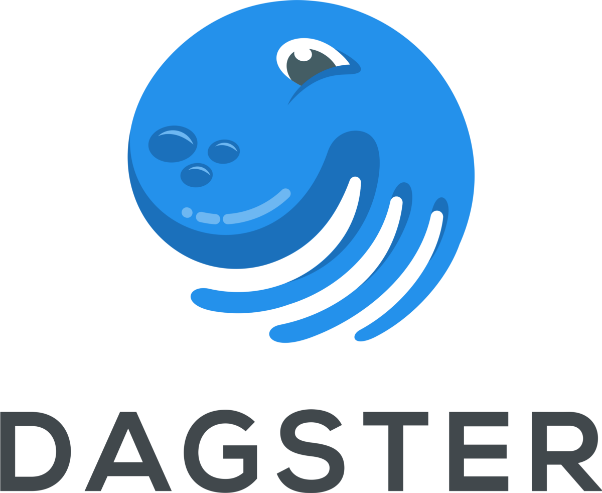

<!-- content  -->
In the past few months I setup a dagster deployment within a kubernetes cluster.
This was a lot of fun because I learned a lot, but I'd like to document some of the things we did so I'll remember them later. 

Dagster is a scheduler/ orchestrator or workflow manager (I've seen all those words
but I'm not sure what the differences are). When you need to get data from one
place to another, do complex data operations that need to happen in a certain
order or you have many many tasks to run, you might want to use such a thing.

In this scheduler world there are 3 big names (airflow, dagster, prefect) and they are all python based. 
Which makes sense because many people know the language and it is an awesome
glue-language. Dagster is a relative new player but I like it a lot because 1
it is open source, and 2 it is super easy to debug and run locally.

If you search for 'dagster vs [airflow/prefect/etc]' you can find all the hot
takes that are out there. I'm not qualified to pick, nor interested in finding, the 'best'
scheduler. After some consideration we picked this one. 

## Principles

* Once setup, **maintaining and improving the system should be simple**.
It should be as simple as possible for my coworkers to maintain the system and build it up.

* **Fail fast, fail early**
You should feel comfortable about the system, ideally if it works on your system
it should work on the production cluster. Realistically, if it fails on the production cluster it should fail on your local system. So the system should fail 
as early as possible. If you run the tests locally they should protect you against 
dumb things. The tests will also run once you commited your code. 

* **Remove all footguns**
I don't know anything about guns, but what I mean is: make sure it is very hard to shoot yourself in your foot accidentally. 
Don't give the cluster, or user credentials or access to production databases is it is not necessary, give the cluster and user credentials for an acceptance or testing database that 
looks and behaves similar to production. 

What I hope to achieve is an environment where you feel free modify the code 
however you want. The freedom to experiment, with the certainty that you will never break anything important. You have guardrails that protect the systems against you. 
What helps a lot is that the usercode can be run locally, and that failure on the 
usercode server does not break down the main systems. The dagit UI will complain
but never break down. You could give a user code repository responsibility to a 
team and with these guardrails in place they can keep their system up.

## End product
There is one repository with code that runs the the dagster main components:
* the database
* the deamon (that keeps track of schedules and sensors)
* the dagit GUI that users can use to trigger manual runs and check progress
* configuration for all

There are multiple repositories for usercode. 
The usercode servers talk to the dagster main components and execute the usercode.

Dagster keeps the main components and user code separate so you can independently 
upgrade the dagster versions in your user code and main components. That means,
for instance, that you can keep all spark specific code in a user code repository with
the relevant python packages. If you have a different process that requires 
python 3.10.1 with a very specific numpy version you can use a completely independent 
usercode server for that. 

### User code setup
We set up the usercode repositories like this:
You check out the user code repository locally. You write your code steps,
add some tests and run the process locally with dagit. (This starts up the dagit server on your machine and you can see everything works). If it works locally, it should work on the server and so you commit the code.
Every commit runs through a linting (SQL, python and yaml) and testing step (python only). 
After manual code review the commits are merged into the main branch.
From the main branch in the git repository we automatically build a docker image, that image is scanned and pushed to an image repository. Finally a deployment is made to the acceptance kubernetes cluster. When everything seems to work, we push to production. 

The main components have similar steps. 

It is important to work with your team on this, the linting and testing steps should be seen
as helpful guardrails. If tests and linting are seen as obstacles it becomes a battle.
And that is super wasteful. Provide the minimal guardrails and assist your team with
further quality improvements. If something fails, add unittests that prevent this from happening again. 

### It is always infrastructure
Now I could never have done this without all of the infrastructure support at this large company: there are people who maintain the central version control system, people who keep the kubernetes cluster up and patched, people who keep the image repository up and patched and people who created templates for testing, linting and deployment steps. Only after all their work could I create this. If I had to set this all up myself I would still be busy with no value for the customer at all.
Another thing that helps is the helm charts that dagster provides, you have to configure
some parts, but most of the work is already done for you. 
