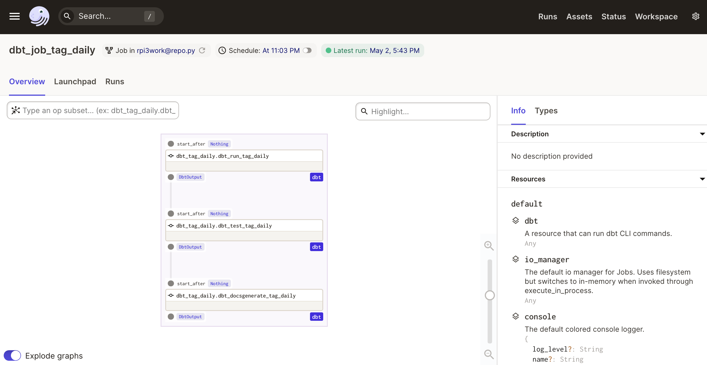

<!-- content  -->
The Small, Minimal, Open, Low effort, Low power (SMOLL) datastack[^1], is a pun with ambitions to grow into something larger, and more educational. I wanted a cheap platform to work on improving my data engineering skills and so I re-purposed some hardware for this project. A raspberry pi 3 with ubuntu & a NAS that I've installed a postgres database into.


What people call the 'modern data stack' is usually [1] a cloud data warehouse such as Snowflake, Bigquery or Redshift[^2] (In my opinion a data warehouse is something that holds all the data in table like format and your transformations are done with SQL).
[2] Transformations (in SQL are managed and tested with dbt). 
[3] and many companies use external managed connectors to ingest the data (fivetran for example)

I want to practice my skills without paying too much and so I've recreated the 'modern data stack' with small tools at home. This does mean I am constrained in other ways,
I wanted to use parquet files and arrow, but there are no pre-packaged arrow binaries for my architecture and compiling it crashes the device so no arrow for me.

## Goals of the 'smoll' data stack
- it should work similarly to the modern data stack
- it should be useful to me

## Overview
I'm going to do all batch work. No streaming analytics. So usually we go with
ELT (Extract, Load, Transform) in these cases. 

For **extraction** I will not use external tools, I will use dagster to write data
to a postgres database. 

For **load** I will make use of staging tables where I don't do too much transformation.
Postgres will handle a lot of data and I'm not going to megascale so it will work just fine. 

For **transformation** I will also use dbt, just like the rest of the world, I love the lineage information, re-usability of queries and testing possibilities.


Summarizing:
I will use dagster to extract data from several sources, push that data into a datawarehouse (postgres database) into a raw_* table and dbt will build models[^3] _(which I will call dbt-models from now on)_ on top of that.

- I don't have a BI layer yet, I might make some reports later but I think most tools are too heavy on the rpi3.

```
                          (extract  & load )
(the outside world) ---> [dagster] --> [data warehouse (postgresql)]

                (transform)
[dagster] ---> /run the dbt project / ---> [data warehouse (postgresql)]

```


### Modern data stack vs SMOLL data stack
- much better name 'Modern data stack' --> 'SMOLL data stack'
- cloud data warehouse (Bigquery, Snowflake) --> A postgres database on a NAS
- orchestration with airflow, prefect, dagster or argo --> dagster on rpi
- kubernetes deployment --> installation on a single raspberry pi
- dbt for transformations --> dbt for transformations
- looker / other BI tool --> 'nothing yet'

So it's very much the same except for the database, and I don't have a BI layer.

## project organization
```
dagster_home/ (1)
├── work/
|   ├── jobs/
|   ├── ops/
|   ├── resources/
|   ├── sql/
|   ├── repo.py
├── work_dbt/
|   ├── analyses/
|   ├── macros/
|   ├── models/
|   ├── seeds/
|   ├── snapshots/
|   ├── tests/
|   ├── dbt_project.yml
|   ├── profiles.yml
|   ├── packages.yml
├── work_tests/
services/ (2)
├── dagit.service
├── dagsterdeamon.service
```

1. The contents of the folder [dagster_home](dagster_home/) are copied to the pi in /home/dagster/dagster_project/dagster_home.

The folder `work_dbt/` has the entire dbt project. One of the jobs in dagster executes the dbt project (dbt run, dbt test, dbt docs generate).

2. the services are installed on the rpi. see the readme of that folder for more info.

This is what the job looks like in the gui:



### Some details that different from 'real world' deployments
Normally on a production deployment you would split apart the 4 components of dagster:

1. user deployments (code that you actually care about, the code that does the actual work)
2. dagit (the gui that shows you how things are going)
3. dagster deamon (an application that keeps track of schedules and sensors)
4. a database that keeps track of runs, jobs, metrics, assets etc.

I'm running all dagster components on the same small computer, with the default database [4] (sqlite), and systemctl service for dagit and a service for the the deamon.
So all the critical components live on the same machine [^4].

I'm using nginx to serve the dbt docs on my raspberry pi. 

I haven't setup a CI/CD pipeline yet, so I have to manually copy everything and hope it works. I wrote some tests, but I have to manually kick off the tests. 


## Notes

- [github repo](https://github.com/RMHogervorst/dagster_rpi3)
- picture of cute mouse by <a href="https://unsplash.com/@jannerboy62?utm_source=unsplash&utm_medium=referral&utm_content=creditCopyText">Nick Fewings</a> on <a href="https://unsplash.com/s/photos/small-animal?utm_source=unsplash&utm_medium=referral&utm_content=creditCopyText">Unsplash</a>

[^1]: Smoll, as in small, but wrongly spelled, and so adorable. "I'm a smoll boy" says the puppy.
[^2]: I'm sorry Azure, but Synapse Analytics is NOT a datawarehouse, and a hundredthousands spark clusters do not make a data warehouse Databricks.
[^3]: I love everything about dbt, except their use of the word 'model', this becomes very confusing very fast when you are also doing machine learning with 'models'.
[^4]: What could possibly go wrong?