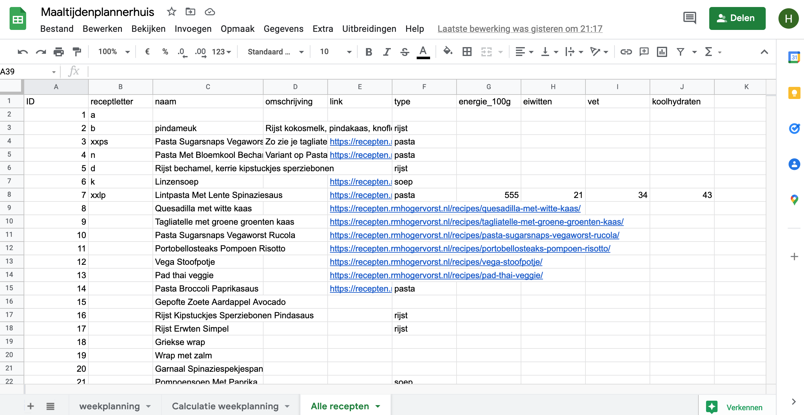
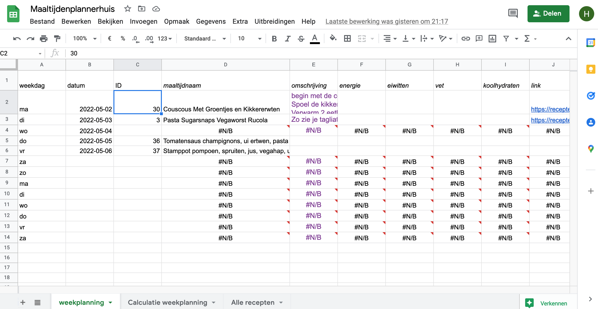
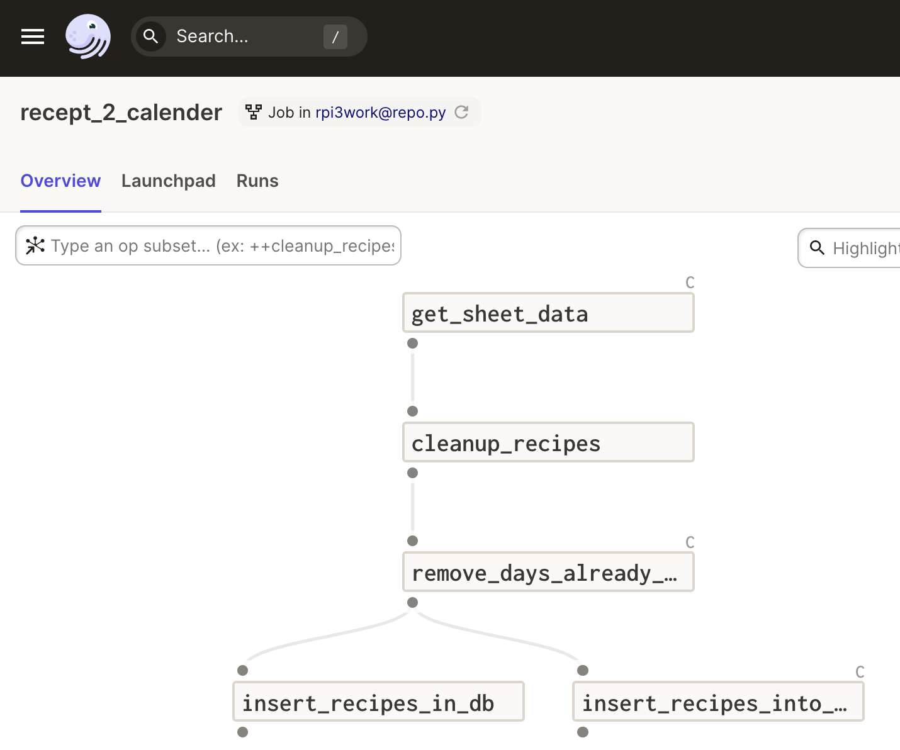

<!-- tags choose:
beginner, intermediate or advanced
*beginner:*
*for, loops, brackets, vectors, data structures, subsetting, functions, qplot, ggplot2, dplyr, spps-to-r, haven, tidyr, tidyverse*

*intermediate:* 
*tools, building packages, testing, slides in markdown, apply, package, advanced ggplot2, environments, animation, test, workflow, reproducability, version control, git, tidyeval*

*advanced:*
*S4 classes, extensions , shiny, Object Oriented Programming, Non standard Evaluation, code performance, profiling, Rcpp, optimize-your-code*
-->
<!-- categories: R and blog. Blog is general, R means rweekly and r-bloggers -->

<!-- share img is either a complete url or build on top of the base url (https://blog.rmhogervorst.nl) so do not use the same relative image link. But make it more complete post/slug/image.png -->

<!-- content  -->

Cooking, for some a chore, for some absolute joy. I'm somewhere in the middle. But over the years I've learned that if I need to plan my meals. If I plan a week of meals in advance we can do groceries for the entire week in one go and by thinking about your meals in advance you can vary your meals for nutritional value. I used to have a very strict diet to prevent stomach aches, and planning and cooking those meals was annoying, but eating the same things is very boring. So we came up with a plan: we create a master-list of recipes and pick from that master-list every week. And sometimes vary ingredients or try new stuff. 

Anyways we used to use list apps on our phones for our weekly mealplanning session. That works, but is a bit clunky.  I thought it would be high time to create an over-engineered technical solution for a household 'problem'.

### The plan
(my partner cannot program in R, nor python, but she is extremely talented in spreadsheets.
so google sheets can be a useful interface to make our meal planning easier, and can be easily shared)


Here is the plan:
* Create a google sheet
* In that google sheet create a worksheet (I think that is what they call these tabs) that contains all of the recipes (the master-list)
* Create a worksheet that will be the week-plan in which we will refer to the master-list
* create a process that picks up the week-plan, validates it and writes it to the correct dates in my personal calender.

I'm going to use dagster because that is what I want to work with. And I've just installed it on a spare raspberry pi I had lying around and I have a database living on my NAS (network attached storage). This combination I call the 'Smoll data stack' (it's a pun, based on 'The Modern Data Stack' which is a cloud database, dbt and modern connectors).

### The details
My masterlist has an ID column, a name, a small description, a link to a place online where the recipe is described, and possibly information about energy protein, and carbs if I have that.



My week-planning worksheet has a column for the **day of the week** (because I'm horrible with dates without any context), a **date** column and an **ID** column. 
There are also columns for name, description, link etc from the master-list, but those are pointing back to the master-list. 




### Idealized design
So in practice the user-story is this:

> As a ___ , I want to ____ by ___ so that

As a _technically inclined data engineer with too much time on my hands_, I want to _optimize my mealplanning strategy_ by _picking meals from a masterlist and adding those IDs to a column_ so that _meals appear in my household calender_.


I thought it would be easy if I use a date ID combination to plan the meals.

Perfect is the enemy of good, and so let me sketch out a minimal viable product (MVP), further improvements, and an advanced version. This is important, because getting the minimal thing working already saves me time and gives me joy. At my $work I focus on business value for an MVP, on things like: 'it saves us money', 'it saves us time', 'it does things we couldn't do before'.


**Minimal Viable Product**: I fill in the dates and IDs :
date: 2022-04-27, ID: 32
(let's say 32 refers to meal: [pannenkoeken)](https://en.wikipedia.org/wiki/Pannenkoek)

A separate google calender 'meals' would have a new event at 1830 on 2022-04-27 with the name 'pannenkoeken'
In this minimal viable product the job would run every day and does no checks.


**A more robust product**:
would check every day if the worksheet was modified
would check the dates, compare against current date and only do modification on dates from today on, and possibly only 2 weeks in advance.
Guard against IDs that refer to non existing recipes.
Checks if dates actually refer to the days of the weeks I put to the left of it.


**An even more advanced version**
Sums up weekly nutritional values (But I need to fill in all the values for that).
Compares weekly nutritional values against goals.
Could do suggestions of meals.
Maye another job to update the master-list?

### Actual design

* A daily dagster job that picks up the values from the sheet
* A google calendar (separate calendar so I can't nuke my other calendars)
* A google sheet

This is how I use it in a job.
```
([0] sensor for changes in sheet?) => [1] download planningsheet values, turn into dataframe 
[1] => [2] check values and cleanup

[2] => [3] write individual events to calendar
[2] => [4] write to table in database 
```

- [0] is optional, would be nice in the future, so the job only triggers when necessary in stead of every day and working around that
- [1] connect to google sheets API and retrieve all values of the weekly planning sheet, turn into dataframe
- [2] check values in dataframe, cleanup stuff
- [3] write to calendar
- [4] write to database (optional)

#### Design considerations
I have a love-hate relationship with google sheets or excel files, they are extremely flexible but also give you many footguns. But I do foresee me making more use of google sheets. So it can be beneficial to make a more generic operator for google sheets and do specific tasks with the resulting dataframe.

Also about sheets, because of their flexibility you really really should validate the data before you do something with this data! The Pandera integration in dagster is really nice for this validation (but I can't get it to work on this machine).

I also foresee me making use of google calendar more so more generic operators are a good idea here too.

Things that are specific for the task of moving recipe data to calendar should live in the job file. Things that are more generic should be imported and done with configuration.

#### Actual job

_progression of job in git snapshots_:
* [link to job file at moment of creation](https://github.com/RMHogervorst/dagster_rpi3/blob/62c6531dd3408a5153bc2ce5423c38aad59c94a7/dagster_home/work/jobs/recepten.py)
* [link to file with pandera validation and working google calendar writing ](https://github.com/RMHogervorst/dagster_rpi3/blob/1cd5e023a6e473b58f04a579d8e04320d53083ae/dagster_home/work/jobs/recepten.py)

```python
# import dagster stuff
# import operator for reading sheets
# import functions for writing to gcalender

# operator that cleans dataframe of sheetdata
# operator that can write events to gcalendar
# jobconfig for operators
# actual job
```

I did not take a screenshot when my job was in this state but here is a further evolution of the job visible in the gui: 



<details>
<summary>actual code (folded away, click to see)</summary>

```python
import pandas as pd
from dagster import op, job, Out
from ops.gsheets import get_sheet_data
from ops.gcalendar import insert_event, create_event_dict

import zoneinfo

import datetime

@op
def cleanup_recipes(df: pd.DataFrame) -> pd.DataFrame:
    """A helper operator to clean up this sheet.
    The get_sheet_data operator is generic and doesn't care
    about what it gets. But I know the design of this sheet and so
    I can do some cleaning.
    Because google sheets can change I think it is wise to check
    the schema after modification."""
    # first row in this case is names.
    df.columns = df.iloc[0]
    # drop the first row (is already the header).
    df = df.iloc[1:, :]
    # drop rows without a date filled in (it is not NA (missing) but empty)
    df = df[df.datum != ""]
    # drop rows without ID
    df = df[df.ID != ""]
    # set the datum row to dates -type?
    # TODO: guard against changes in the past
    # TODO: guard against changes more than 14 days in the future
    return df

@op(config_schema={"calendar_id":str})
def insert_recipes_into_gcal(context,df:pd.DataFrame) -> None:
    """Parse dataframe and send every recipe as event to google calendar"""
    # take 'datum' and make that into start and end datetime
    # fix time at 18:30-19:30
    tz=zoneinfo.ZoneInfo('Europe/Amsterdam')
    #
    for row in df.itertuples(index=False):
        context.log.info(f"writing {row.datum}")
        date_ = datetime.date.fromisoformat(row.datum)
        startdatetime=datetime.datetime.combine(
        date_, datetime.time(18,30,tzinfo=tz),
        )
        enddatetime=datetime.datetime.combine(
        date_, datetime.time(19,30,tzinfo=tz),
        )
        dict = create_event_dict(
            startdatetime=startdatetime,
            enddatetime=enddatetime,
            title=row.maaltijdnaam,
            description=f"{row.omschrijving}, type: {row.type}, link {row.link} ",
        )
        insert_event(calendar_id=context.op_config["calendar_id"],event_dict=dict)

@job(
    config={
        "ops": {
            "get_sheet_data": {
                "config": {
                    "sheetid": "1bTFbQTY6869y52kyr48DlcHsN7FnUWyxBfuL5XLVRWI",
                    "sheetnumber": 0,
                }
            },
            "insert_recipes_into_gcal":{
                "config":{
                "calendar_id" : "447883an888q1ldagsqe9pj7ts@group.calendar.google.com"
                }
            }
        }
    }
)
def recept_2_calender():
    """Read recepten from google sheet and write to calender"""
    future_recipes_df = get_sheet_data()
    cleaned_recipes = cleanup_recipes(future_recipes_df)
    insert_recipes_into_gcal(cleaned_recipes)
```
</details>

# Conclusion
And there you have it, an overly complicated, over-engineered technical MVP to solve a household chore. 

### Notes and gotchas

* service accounts and calendars in google are all dedicated email addresses.

#### the google calendar functionality
Figuring out how to write an event to a calender took quite some time.
There are some guides, but as always with google docs, it's never quite where you look for it.

Gotchas
* you need to enable google calendar in console.google.com
* The logic for authenticating with a service account is not shown in the quickstart.
* you need to enable calendar access in console
* You need to invite the service account to your google calendar (otherwise the account will not see any calendars)

#### Google sheets
Gotchas
* you need to enable google sheets in console.google.com
* you need to share the sheet with the service account
* values in sheets can have extra spaces before and after, so be sure to trim them before further processing

