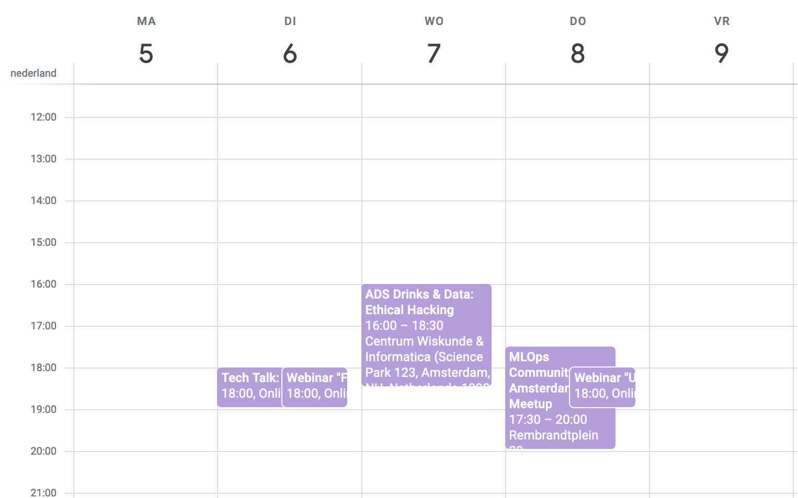

<!-- content -->

I enjoy learning new things about machine learning, and I enjoy meeting like minded people too. That is why I go to meetups and conferences.
But not everyone I meet becomes a member of every group. So I keep sending my coworkers new events that I hear about here in the Netherlands. And it is easy to overlook a new event that comes in over email. Me individually cannot scale. So in this post I will walk you through an 
 over engineered solution to make myself unnecessary. 


I found out that meetup.com creates an ical and rss feed for every meetup. I love it when companies adhere to open standards!


So could we combine the calendar feeds of all the groups into one big calendar for the Netherlands?

Inspired by [Simon Willison](https://simonwillison.net/2020/Oct/9/git-scraping/) I knew I could use github actions to run a periodic scrape through all calendars. 

So here is my idea:
- make a simple script that takes in all the calendar feeds (ical) of local groups
- combine those events into 1 ical feed
- commit that file to the public repository
- Add that url that points to github  to our to our internal company website so that all the events are visible
- Run the system everyday automatically
- make it easy to add or remove organizers (meetups) with a simple config file

So here is the end result [DS calendar](https://github.com/RMHogervorst/ds_calendar "my github project").




I could have easily done this project in python, but for this example I chose R, because I love that language. 

## Deeper dive
So here is the entire github actions configuration:

```yaml
name: Scrape latest events of Dutch Data Science events

on:
  push:
    paths:
    - 'calendars.csv'
  workflow_dispatch:
  schedule:
    - cron:  '12 12 * * *'

jobs:
  scheduled:
    runs-on: ubuntu-latest
    steps:
    - name: Check out this repo
      uses: actions/checkout@v2
    - uses: r-lib/actions/setup-r@v2
      with:
        use-public-rspm: true
    - uses: r-lib/actions/setup-renv@v2
    - name: run scrape
      run: Rscript aggregate.R
    - name: Commit and push if it changed
      run: |-
        git config user.name "Automated"
        git config user.email "actions@users.noreply.github.com"
        git add -A
        timestamp=$(date -u)
        git commit -m "Latest data: ${timestamp}" || exit 0
        git push

```


First the top of the file

```yaml
on:       # what makes it trigger ?
					# - on push events
  push:   
    paths: # but only where specifically this file changed
    - 'calendars.csv'
  workflow_dispatch: 
  			# - on a schedule
  schedule:
    - cron:  '12 12 * * *'
```

Then the steps

* Check out this repo
* set up R to use on this ubuntu machine (with the fast precompiled packages )   
* setup renv (to set specific packages)
* run the Rscript aggregate.R 
* Commit and push if it changed


### Concluding
So with this example you could create your own selection of calendars
and combine them together into one feed for your group. 

with this example in hand you could create your python version too. 
here is [a python package to parse ical files](https://github.com/ics-py/ics-py)


### References
- Find more walkthroughs by me in [this tutorial overview page](https://blog.rmhogervorst.nl/post-type/walkthrough/)

- [glass ball source](https://unsplash.com/photos/gEN5Btvf2Eg)
