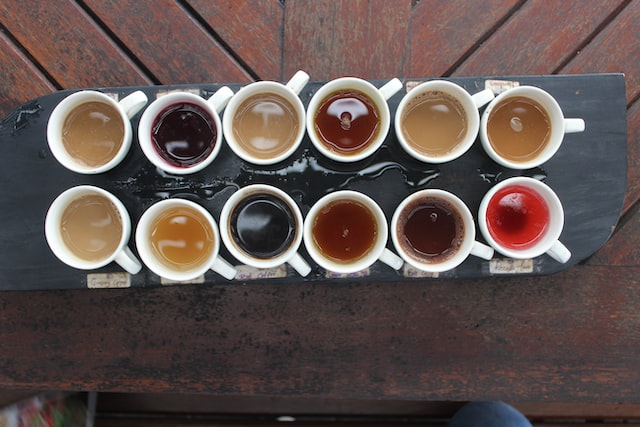

I recently read ["High Variance Management" by Sebas Bensu](https://blog.sbensu.com/posts/2023-01-18-high-variance-management/) and this
made me think about datascience work.

First some examples from the post:

Some work needs to be consistent, not extraordinary but always very nearly the same.
Theatre actors performing multiple shows per week need to deliver their acting in the same way every day.
Their work is low variance. 

Some work needs superb results, results you don't know if you can reach it but you try it many times and between all of the failures, you might find gold. Film actors need to try many different approaches for scenes, their best take will be put into the movie and the other takes end up in the trash.

## What does this mean for data science work? 

Some parts of data science projects need to be high variance, you want to run as many different experiments as you can, in the hope you find a great solution:
experiment with different models, different hyperparameter values, hell even try to figure out if the problem description can be interpreted differently. This is high-variance work.

Other parts need to be low variance: 
the way you setup your code, the code style, how you retrieve data from a backend, how you deploy your model to production. 

As an MLOps person I want to make some things so boring, so easy, so effortless and so consistently low variance, that you as a data scientist can do all the high variance work that delivers value. 

