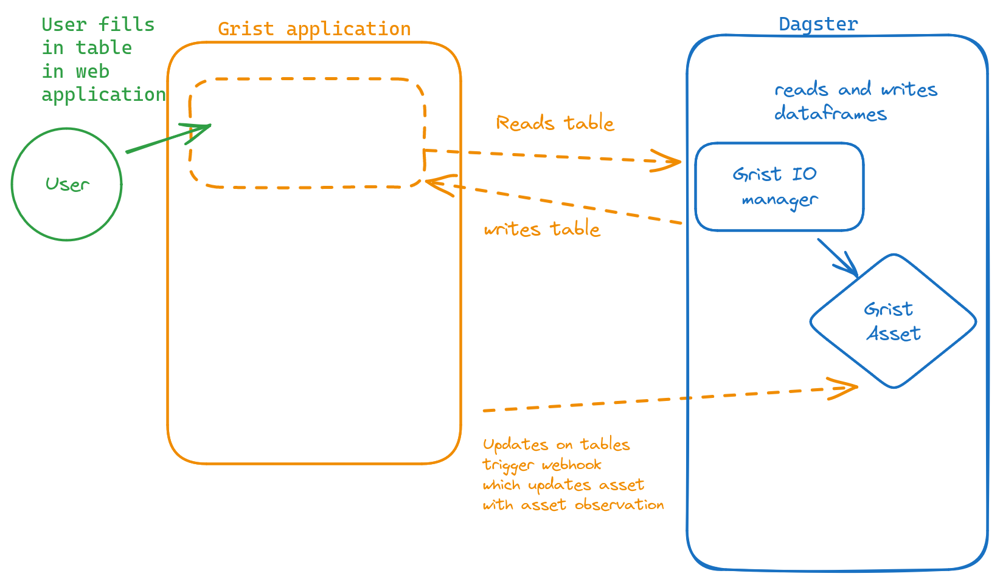
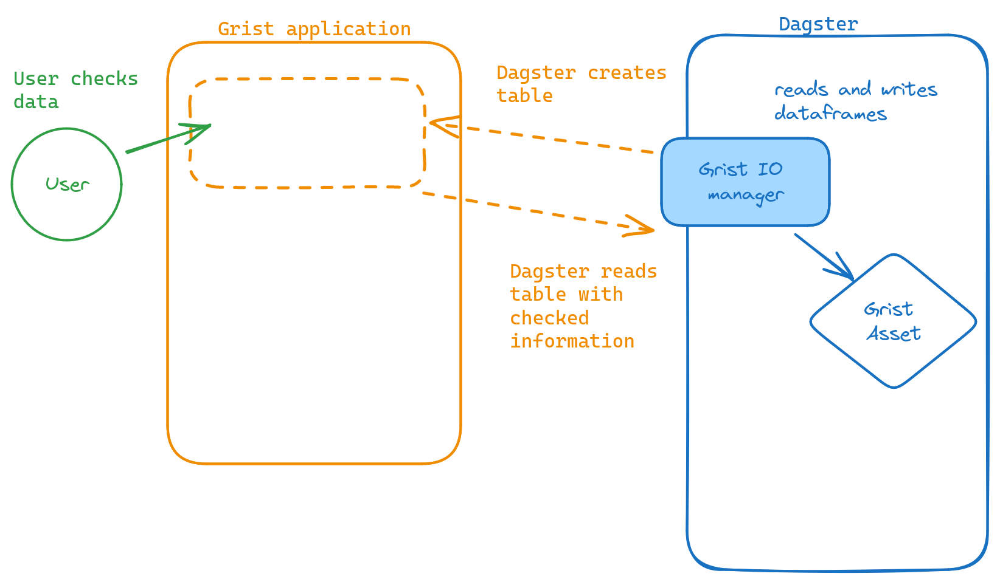

<!-- content  -->

I haven't tested this yet, but I see a very powerful combination with Dagster assets and grist. First something about spreadsheets

## Dagster en grist?
Grist is something like google sheets, but more powerful, opensource and self-hostable.
Dagster is an orchestrator for data, if you are familiar with airflow it is like that, but in my opinion way better for most of my work. If you don't know airflow, or Dagster, this post is not very relevant for you. 

Anyways, before I move into Dagster + grist first a diversion into spreadsheets.

## Spreadsheets, love and hate
Spreadsheets have many uses, Excel is used everywhere, because so many people have it on their work computer. Many companies run entirely on excel. Scientific studies are done with the tool, It clearly is useful! But how is it used?

Excel is used as a presentation tool, calculator and for its graphing capabilities. There are way too many dashboards build on excel. But what it really boils down to is this:
The tool is used to (1) hold data, and (2) to perform calculations on data.  

What bothers me, and other data scientist and engineers, is the combination of data holding, and calculations in the same document, too free form possibilities and no version control. 

**So the good:**

For a user of spreadsheets the freedom to use the tool for any purpose is amazing. 
- complete freedom to do what you want
- automatically updating summaries
- auto-completion of sequences
- graphs

And **the bad:**

For an engineer the complete freedom means we have to do extreme verification of data that comes in. Since there is no way to enforce constraints, we have to hope our users do not modify the sheet and be extremely defensive in our programming. 

Excel is also notorious for [converting data without asking the user](https://github.com/jennybc/scary-excel-stories). 

- complete freedom for users to do what they want
- no way to enforce constraints
- random conversion of data

If a user wants to use a spreadsheet to create a game, that is perfect! But if the spreadsheet becomes part of a pipeline, engineers get ulcers. 

## a spreadsheet as part of the pipeline
I see the following use-cases for spreadsheets in pipelines:

**dynamic input data**
> the data engineering team owns the pipelines and needs certain data, but that data lives in a spreadsheet, the spreadsheet is periodically uploaded

examples:
- a list of vendors
- an allow-list or blocking-list

**verification of a step in the pipeline**
> Output from a process needs to be checked or modified by a team

examples:
- output of a forecast needs to be updated to account for factors not in the model
- probabilistic links between entities need to be checked and turned into actual link or not a link. 

For many teams, a spreadsheet is the perfect fit, they know how it works, it works on everyone's computer and it has all the freedom you want of such a tool.

But this does not scale at all and is very error prone. Excel loves to change data formats in columns, excel can only be used by one person at the time (365 does it slightly better). 

I have used Google spreadsheets -> Dagster route before, it works but you have
to be very defensive in your programming too, you can lock down some parts of sheets. This is a good option, but you need a cloud provider (Google).

But recently I came across [grist](https://www.getgrist.com/product/). It has many powerful spreadsheet properties but crucially, we can lock columns to only admit certain kinds of data, it has usermanagement and we can even lock rows. It also has an API that you can talk to.

## Grist as spreadsheet in the pipeline
Here is how I see it being killer!

- **spreadsheet as dynamic input data**: part of the data is owned and maintained by people outside the engineering team.  Create a locked down 'sheet' with only the columns you need. Give access to people^[integrate it into their systems too, so that it becomes the only source of truth]. Read that sheet from the API as an asset in Dagster. 

- **verification of a step in the pipeline**: Write your data to a grist spreadsheet and add some columns that will be used by that team (lock everything else down). If the team is done with the checks, webhooks will update the Dagster asset, so you know it is done.  (you might want to make this a different asset and build the rest of pipeline).

More advanced tricks
- There are webhooks in Grist, so you can let Dagster know that the data is updated, by [calling the Dagster-REST-api to report an asset materialization](https://docs.dagster.io/concepts/assets/external-assets#using-the-rest-api)

- Create an abstraction to pull data from a sheet, and to write data to a sheet (from and to a dataframe). (an IO manager for instance) 

- if you self-host grist, create some logic to hack the database to add more admin users, and add users to groups without using the frontend. 

# Further reading

Excel / spreadsheets
- [Jenny Bryan collected scary Excel stories](https://github.com/jennybc/scary-excel-stories)
- https://datacarpentry.org/spreadsheet-ecology-lesson/
- https://jules32.github.io/r-for-excel-users/overview.html

More about Grist

- [getgrist.com/product](https://www.getgrist.com/product/) _(not a fan of the generative AI component but I guess they too had to jump on this bandwagon to impress CEOs)_