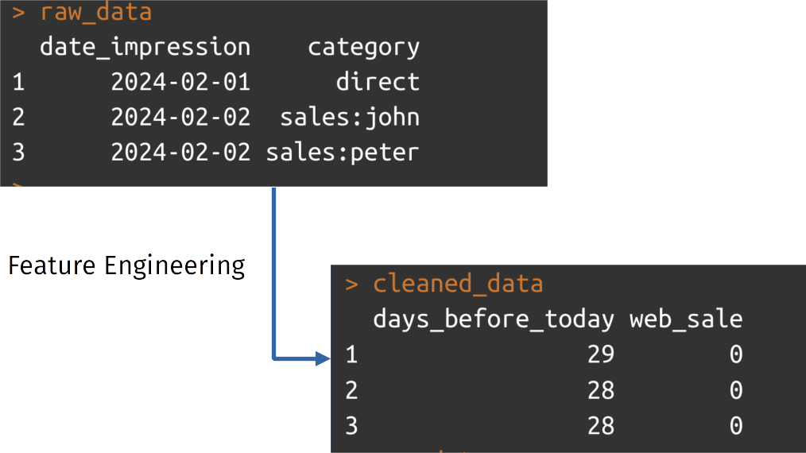

Data scientists, in general, do not just throw data into a model. They use feature engineering; transforming input data to make it easy for the chosen machine learning algorithm to pick up the subtleties in the data. Data scientists do this so the model can predict outcomes better. 

*In the image below you see a transformation of data into numeric values with meaning.* 

In this article I'll discuss why we still need feature engineering (FE) in the age of Large language models, and what some best practices are.

# Feature engineering is a must
With all the talk about Large Language Models (LLMs) you would think that we don't need feature engineering anymore. LLMs are deep neural networks, and neural networks need less feature engineering. But like every machine learning model you still need to transform your data into numeric values. 

Deep learning models are amazing at freeform text, images and sound inputs. However, many machine learning problems have a mix of numeric and categorical variables as input; data that fits into a (large) spreadsheet. In those cases deep learning is not the first choice. 

In fact the majority of actual Machine Learning applications in production are not deep learning models at all! Other techniques are way more efficient and powerful and will continue to be used in the future. For most models we still need extensive feature engineering.

## An experienced data scientist is extremely valueable
Feature engineering is an art form as well as a science. There are some best practices, which I will describe below, but there is also lived experience; knowing when to tweak what. Data scientists with a lot of experience are, in my experience, much better at this art form. Especially at new projects, experienced data scientists can achieve way more than junior data scientists. 

# Best practices for feature engineering
Feature engineering is the most important way to improve the performance of machine learning models. _In 2014, Facebook, in their paper 'Practical Lessons from predicting clicks on Ads at Facebook' claimed that having the right features is the most important thing in developing their ML models._ With feature engineering we can increase the signal in the data and this makes the performance better because the model has to do less work.

The practice of feature engineering borrows from experimental work and from software engineering. 

To be an effective data scientist, you need to iterate fast and keep track of what you did and how effective it was. The reason we called it data science is because, like **scientists**, we need to work precisely, iterate quickly,  measure accurately and report clearly. 

But, like **software engineers**, we also build software tools. Our product needs to be designed, easily modified, maintained and tested. Data scientist need a bit of both scientist and software engineer to make the most out of a data science project. So let's go through our best practices:

## Best practices from software engineering. 
We can borrow some great practices from software engineering:

- Put your code under **version control**: commit your code to a version control system like git. You can share and work together on a platform like github or gitlab.
- Put **everything in code**, even deploy scripts, even documentation. 
- **log** everything that is relevant for your experiments: data size, features used, hyper parameters, performance metrics, commithash

These three combined make it easier to reproduce earlier results and to re-use code.

Other great practices are:
- **write tests**: write tests to prove to yourself that metrics measure what they should measure, hyper parameter changes do affect your model, feature transformations perform the transformation you want to achieve. 
- make sure tests **run automatically** on every commit
- make sure **feature transformations** happen **in one place** in your codebase, this makes it easier to find, modify and iterate on features. 

## Best practices from (data) science
Use an experimental mindset; write down what you expect to happen, log all parameters and outcomes and learn from these experiments.

To do that, it is extremely important to **not fool yourself**.
- Use an **outcome measure** that is useful for the organisation and for you. That is usually not accuracy. 
- calculate some **guardrail metrics**; metrics that should not get worse while you tune your feature engineering and model hyper parameters. 
- Think really hard about **data leakage**; leaking testset information into your trainingset
- Think really hard about why data is missing: the **missingness** is probably telling you something

_Data leakage means you seem to perform really well on the testset during training, but when you deploy your application the trained model performs horribly. It is really easy to leak information! When you calculate the mean over the entire dataset and perform a training-test split afterwards, you have leaked future information into your trainingdata. The best way to avoid that is by using tools like scikit-learn's pipelines (or recipes in R)._

Some generic do's and don'ts for data leakage:
- 	**Don’t** do random splits on time series data
- 	**Don’t** calculate window functions (mean, median, stdev, etc.) on the entire set, but: 
- 	**Do**: calculations on the trainingset (fit on the trainingset); only apply learned weights on testset
- 	**Do**: Use pipelines and other tools build with data leakage in mind

Throwing away missing values without investigation is a sin. There are good reasons why data is missing and that tells us something. *Are people not answering a certain question? Do certain devices miss more information?* 
- 	Find out why data is missing, and model your features based on that.

## Best practices for sanity
Finally some recommendations to keep you sane.
- setup your experiments so you can **iterate fast**: that might mean using a bigger machine in the cloud. Or several processes in parallel. *(Your salary is probably a bigger cost than the cloud costs you incur)*
- use **templating** for new projects: like cookiecutter for python, to make sure you always create the same layout of new projects. 

So borrow from these best practices and make your work easier and more effective everyday!

*Image credit: Catherine Breslin & Rens Dimmendaal / Better Images of AI / Strawberries and milk / CC-BY 4.0*