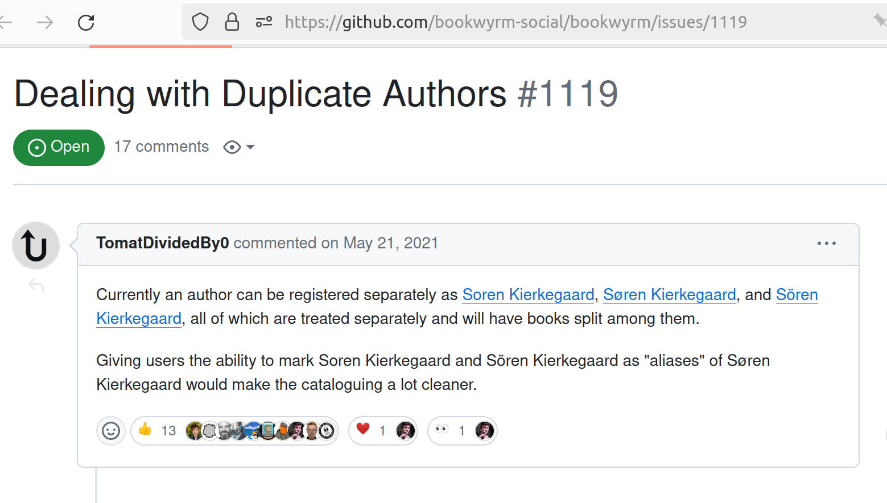
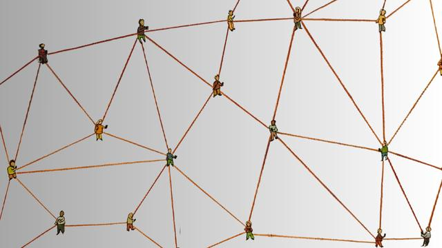
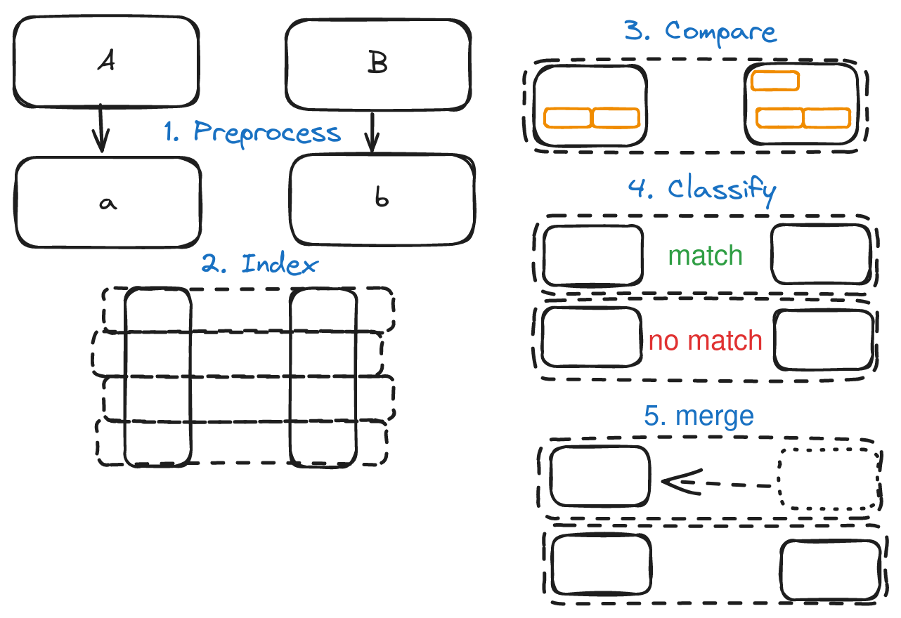

I have a problem. Others have it too, it is a problem of duplication. I'm trying to track the books I read in Bookwyrm so  I can talk about it online. But there are so many duplicates! How do we know if Soren Kierkegaard,Søren Kierkegaard, and Sören Kierkegaard are the same person?



This is an example of entity resolution[^4]. It is also called deduplication, record linkage and data matching [^1]. We want to compare entities from different datasets and make a confident claim that they match or not. We are not just talking about people, it works for addresses, companies, but also books, academic works or ships.

Why do I want to talk about entity resolution? This is a nice applied data science topic with very cool new developments. I want to highlight the practical applications, and how real world questions can be translated to data science questions.


_Much of this post was used in a talk about entity resolution I gave at $work._ _Also, I'm sorry, this is a quite lengthy post, I don't have time to split it into smaller parts._

Some examples from government, finance and marketing:
- police need to figure out who a person is when they apprehend someone
- financial institutions must know their customer (KYC) and check if the person or company is not sanctioned
- calculating the effect of a marketing campaign means matching up different datasets from different sources and attributing sales to a campaign.
- Is the person in the panama papers the same person as the current prime minister?
- historical data needs matching too, is Tywin Lannister the same as 'The Lion' or 'The protector of the Realm' or 'Lord of Casterly Rock' ^[^2]

## The entity resolution process, high over


When we do entity resolution we usually run a batch process, where we compare two large datasets with each other _(or with itself, to detect duplicates)_. 

If you naively compare two datasets of both one million rows. you have to do 1e^6 * 1e^6 = 1e12 comparisons. That becomes quickly infeasable. Fortunately we do not have to compare everything with everything, we can make smart decisions on what entities to compare.

There are 5 distinct steps, we preprocess, index, compare, classify and finally merge entities that match.

### Steps in entity resolution

First some terminology:
- **records** are what we compare
- records have **attributes**, like names, or date of birth or address
- We compare attribute **values**
- if we are sure two records are a match we call it a **true match** (a true positive)
- **match**: records are the same
- **non-match**: records are not the same
- **possible match**: possibly the same
 



In the **preprocess** phase we make the datasets on both sides as comparable as possible; we can add more information to our entities, remove stopwords, trim, make everything lowercase etc.

During **indexing** we make buckets (or groups or blocks; _that is why it is sometimes called blocking_) of data, we use a process group similar items together and we only compare within those smaller groups. We can index on things like: zipcodes (for addresses), similar sounding names (for persons and possibly companies too), etc. 

Then we **compare** pairs of items in the bucket on their attributes. We end up with a match score for every pair that we compare. We often create a vector of attribute similarities; _Is the name the same, is the year of birth the same, is the address the same etc._

The next step is **classifying** comparisons into a match or non-match. We set (or learn) boundaries for when to accept a comparison as the same (a match) and when not. We can also choose to make this a human intervention step, our classification detects non-match vs possible match, the final decision is made by a human.

Finally we **merge** entities together and choose what the cannonical name will be, and what attributes to pick. 

So we first make *groups*, *compare* attributes in every group, *classify* and finally end up with a new dataset of entities from both datasets that are the same.

## Enter data science

-1280x914.jpg)

In almost every step we can add a data science component to increase the effectiveness of the data matching process. 
Let's go into more detail to show how the business question is translated into data science language. 

### Indexing
The goal of indexing is to reduce the number of record pairs to compare. We are effectively removing as much unlikely matches (probable non-matches) from comparison. Put in another way, we want to bring likely matches closer together.

**This is a form of clustering**; bring similar items closer together. 

In an ideal world:
- all true matches are put together into one bucket
- the total number of candidate record pairs (to compare) is as small as possible. 

How does that work in practice? We create a grouping, an index, based on some criteria of similarity. If we compare persons^[^3], an extremely simple version would be to take the first 4 characters of the last name. This would put together `[John Smith, James Smitter, Bob Smith, Bernard Smithsonian, Alice Smitten]` ,etc. into one group. You probably want to use something a bit more advanced though, but you could still do this in SQL.  

Here is an example where we use the first 4 characters of the last name, the first letter and year of birth to create buckets (to index):

```sql
select 
    id, 
    firstname, 
    lastname, 
    dob 
from PERSONS 
group by 
    substring(lastname,4), 
    substring(firstname, 1), 
    YEAR(dob)
```
As with all approaches, this would exclude some true positives and lead to unnecessary matches too. For example this would not put `[Bob Ronson, Robert Ronson]` in the same group (because of the first letter). But in the US Bob can be a shorter version of Robert.

More sophisticated options:
- use the way names sound (phonetic encoding). The first versions of this encoding (soundex) were created in 1918 and only worked for English/American, the latest versions [(double metaphone)](https://en.wikipedia.org/wiki/Metaphone) work on many more cultures.
- Reduce addresses to larger geographical areas, use a part of the zipcode, only city, only province or use something like geographical hexatiles.


We can go even further:
- We can learn optimal indexing keys in a supervised way (you need labels)
- we can turn the indexing problem into a graph problem: all entities are nodes, we create edges between nodes that have matching attribute. We only compare the entities in the same graph component.


### comparison
Business question is: Given this pair of entities with these attributes, how much are these attributes the same? So this is a **similarity** or **(inverse) distance** question. 

We compare attributes of two entities. That comparison results in a value between 1 (exactly the same) and 0 (completely different) for every attribute that we compare.  

In other words we want to encode the comparison between two records as features!

Here is a very simple, and rather stupid example in SQL (only when exactly the same 1, otherwise 0).
```SQL
select
case 
    when first_name_left = first_name_right then 1
    else 0 
    as match_fname,
    id_left,
    id_right
from person_comparison_cte
```

In the real world we want some values between 1 and 0. 
The most important skill here, is using your brain; what actually makes sense as a comparison here? Given that two fields are a reflection of a 'true' value, how are errors made? typos, parts of names that don't come with, special character issues? Think about the data sources and how data gets there. Under what circumstances is it filled? Filled in by person themselves? over the phone? Is it advantageous for a person if data is not entirely correct? This could all influence the way data is entered, and might inspire your choice of similarity measure.

Now for some inspiration:

For names we can use editing distance (how many characters do I need to change to get from one to the other), or phonetic encoding (like in indexing). For numeric values we can take a direct distance measure. For addresses we can use geographical distance. 

For some more advanced properties:

- make use of known frequency distribution of properties: if you know some last names are more common, how likely is it that an exact match on the last name is also a true match? Example: the last name 'Jansen' is very common in the Netherlands, if two people have the same last name 'Jansen' I would find that a weaker signal then a more uncommon name. 

- another thing to think about is missing values. Very often the fact that someting is missing, is a signal in itself. But two attributes missing does not mean they are the same. If attributes are missing most of the time, it is hard to use that as a comparison. 


So now we end up with scores on every attribute, a vector of scores for attributes *(nicely constraint between 1 and 0, ideal features for a machine learning classification!)*.

### classification
We use the values from the comparison phase (a vector of scores; features) to make a decision: is the entity on the left indeed the same as the one on the right?

This is a decision problem. 

If you have labels, you can turn this into a supervised classification problem, and let the algorithm decide how to weigh the features. But at the start, you often do not have labels. 

If you have no labels, you can use unsupervised learning. You can more or less eyeball the results and set up your first decision boundaries. This is less problematic then you might think, looking at a few cases will give you a feel of the results, but I advise you to take expert opinion as well. You are probably able to make informed decisions about what weight features should have in a decision. Rule based classification is a valid option: for example: lastname should match at least x percent and birthyear must be within 1 year, etc. 

If you don't have labels, you can label a few hundred cases and use active learning to select cases that give the model the most information, creating a very effective training and evaluation set. 

If you do have labels (maybe after labeling a few (see above)) you can use supervised learning to learn how to weigh the similarity scores to predict the outcome. Note that this is a very imbalanced problem, there are many more non-matches if you compare records randomly through the dataset, but when you only compare in the blocks the problem becomes more balanced. 

If you have a system that requires more human review, you can classify your record pairs not as match and non-match, but potential match and non-match, and send those matches to human review.

There is also a completely different approach:

- don't take a decision about matches, cluster similar records together and leave it there for the end user to decide. 

In classification we have a potential problem, called transative closure. What if you classify record pairs and A=B and B=C but A and C are not a match? There is no definative answer here, you have to look at the cases and make a decision or create rules for these cases. 

### merging
Once you have matches, what you do next depends on your goal; do you want 1 golden record for your warehouse/data lake/lake house? Do you want to remove duplicates? Do you want to push 'correct' versions back to all source systems? Your usecase informs your next decisions. 

## Summary
Entity resolution is used in many places, though we don't always recognize the thing as entity resolution (we call it deduplication for example). A structured approach to entity resolution consists of (at least) three phases (steps): indexing, comparison, classification. We can rephrase those steps as data science problems: indexing; cluster similar items, comparison; create a similarity vector of attributes, classification; _... I mean, ..._ classification. People who start out on this realization often get stymied because we don't have labels at the start, but active learning and a few heuristics or even unsupervised methods can already have a huge impact.


## Read more
- The seminal work on data matching is the book 'Data Matching:  Concepts and Techniques for Record Linkage, Entity Resolution, and Duplicate Detection' by Peter Christen (2012) ([_openlibrary link_](https://openlibrary.org/works/OL17492382W/Data_Matching_Concepts_And_Techniques_For_Record_Linkage_Entity_Resolution_And_Duplicate_Detection?edition=key%3A/books/OL26079434M), [_worldcat link_](https://search.worldcat.org/title/1165571392)) In fact I lifted many definitions from this awesome book, and I feel very inspired by it! 
- Opensanctions has a great post about data deduplication, they do amazing work and I will probably dedicate an entire post on their work https://www.opensanctions.org/articles/2021-11-11-deduplication/
- Opensanctions uses an advanced data model https://www.opensanctions.org/reference/

## Read even more (modern papers about entity resolution)
- Pre-trained embeddings for entity resolution; experimental analysis [@zeakisPreTrainedEmbeddingsEntity2023]
- Unsupervised graph-based entity resolution [@kirielleUnsupervisedGraphBasedEntity2023]
- An overview of end-to-end Entity resolution for big data  oftewel [@christophidesOverviewEndtoEndEntity2021]
- Entity resolution on demand [@simoniniEntityResolutionOndemand2022]
- Benchmarking filtering techiques for entity resolution [@papadakisBenchmarkingFilteringTechniques2023]
- Entity matching using large language models [@peetersEntityMatchingUsing2023]

[^1]: This is what you get when stuff keeps being reinvented, statisticians tried to describe the process, and computer scientists apperently never read anything outside of their field and invented it all over again. So now it is called entity resolution, data matchine and sometimes deduplication. 
[^2]: Yes, I know, game of thrones is not real. But I have spend years reading the longwinded books (We still wait for the last two books, George!) and watching a series that started out awesome and became gradually worse and worse. Let's channel those long long years of suffering into a joke.
[^3]: In western Europe and possibly parts of the US. There are many reasons why this simple example doesn't work at all in practice, but I thought it was simple enough to start with.
[^4]: Yes this is a very tortured way to introduce this topic. I was already preparing a set of articles about data matching, but this screenshot is real and is a real usecase.

## Images
<span>Image by <a href="https://www.jemimahknightstudio.com/work/ai">Jamillah Knowles</a> & <a href="">Reset.Tech Australia</a> / © https://au.reset.tech/ / <a href="https://www.betterimagesofai.org">Better Images of AI</a> / Detail from Connected People / <a href="https://creativecommons.org/licenses/by/4.0/">Licenced by CC-BY 4.0</a></span>
<span><a href="https://philippschmitt.com/">Philipp Schmitt</a> / <a href="https://www.betterimagesofai.org">Better Images of AI</a> / Data flock (digits) / <a href="https://creativecommons.org/licenses/by/4.0/">Licenced by CC-BY 4.0</a></span>
