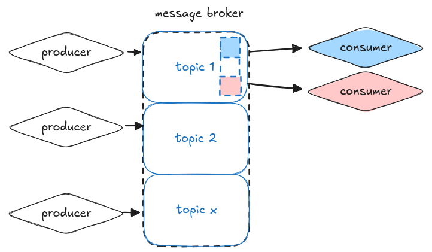
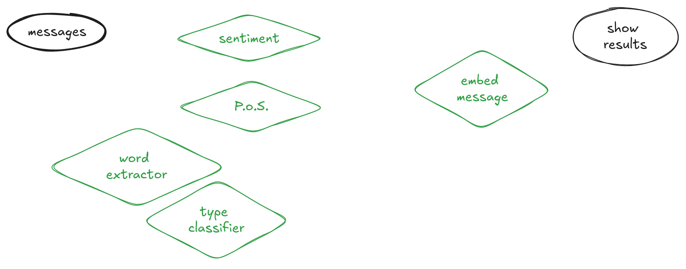

<!-- categories: R and blog. Blog is general, R means rweekly and r-bloggers -->

<!-- share img is either a complete url or build on top of the base url (https://blog.rmhogervorst.nl) so do not use the same relative image link. But make it more complete post/slug/image.png -->

I've seen a pattern in different places but it is most useful for streaming data. Data that comes in over time, with quite some volume. The core of the solution is a message broker, this could be light weight like redis[^1], or a heavier log-like solution like kafka[^2]. In stead of sending data from one microservice to another through API calls, we publish data to a central place, and services subscribe to data, and publish their results back _(that is why it is called PubSub; publish - subscribe)_.

The message broker is a central place that receives timestamped data from producers, and sends that timestamped data to consumers. Usually a message broker contains several topics. Think of it like a one central database, where topics == tables. Producers write to tables (usually append only). And consumers read from the table. The neat thing is that in message brokers, the broker keeps track of what messages are read by the consumer and sends the next information when asked. That way consumers can work through the messages in their own tempo, and different consumers that consume the same topic can read in their own tempo. The implementation on the service side is relatively easy, a consumer (service) asks for (or gets send) the next X messages in the topic, processes that and outputs (produces) the results into a different topic. 

Now this is an enterprise architecture, and those can be extremely boring. So I'm going to describe it with examples, I hope to show you that using a message broker pattern can be really beneficial, compared to other approaches.

Let's say you have a stream of incoming text data; voice transcription, costumer support over chat, emails, support tickets, whatever. There are several things you want to do with that stream of data. You want to (1) gauge sentiment[^4], you want to (2) predict the class of the message (is this help-needed, is this a compliment, etc.) you might want to (3) extract specific words ( are they talking about the same robot vacuum?), and possibly you want to (4) embed the message[^5]. If this is customer support you might want to find the most probable help-checklist to solve a particular issue. Some of these things can happen in parallel, you can do sentiment analysis and embedding at the same time, but predicting the class and detecting specific words can be much better done after you have tagged the sentence with a (5) part of speech tagger and so need to happen in series. 

### A chain of APIs
You could set this up as a chain of APIs: Create 5 microservices and chain them together, your message goes in parallel to (1) sentiment, (5) part of speech tagger, (4) embedding service. From the part of speech tagger the result goes to (2) class predictor, and (3) specific keyword extractor. Somehow you collect everything and return it so that the customer rep can work with this. You're waiting on the slowest component in the chain.  If you want to add another component you need to put it into the chain, that means that you have to change multiple API services so that they send messages to other components. Even without adding other services, a large part of your code is about routing the messages to the correct services. Not only is this picture messy[^6], reality is too.

## Using a central coordinator

With a central coordinator you still have to maintain a lot of glue code, but now it lives in the central coordinator. All of the API services only have to talk to the coordinator. The coordinator has to keep track of the status of all the components. 

Some API services work just as fast with a microbatch and some don't. it is not easy to collect a batch for some APIs. 
You are still waiting for the slowest component. 

## with a message broker
Or you could use a central message broker. In stead of a central service that calls the services, we let the message broker do that (it is what they are designed for). Every service gets data from a topic and sends the results of the computation to a different topic.

Now to be fair, this picture does not make it look cleaner.

But if we reorganize it a bit you see that the broker is in between the messages

Every service only has to know about 1 or multiple topics and writes its results back to 1 topic. 

It is relatively easy to add new machine learning models to this setup, they are new consumers that read from topics and produce predictions. Slow predictions are not blocking other systems (unless they need that prediction). The individual services have a very clean API: the glue-code to consume and produce is relatively small and can be reused on multiple services. As long as the new service adheres to the same in and output format you can swap implementation without problems. There is a clean separation of concerns: delivery of messages to all relevant services is managed by the broker and your service does not need to change when the number of consumers multiplies.

I've seen this pattern in the real world in:
- electric cars and self-driving ships
- indoor vegetable growing
- package tracking through a warehouse and beyond

Should you always use this pattern when you have several machine learning models? Of course not, if timeliness is not a factor you can batch in blob storage of data warehouse tables and process all at once. If there is no overlap between services and they do not depend on the output of the other simple REST apis are still the way to go. If workloads are very spiky this might not work so well either. 

[^1]: or it's various spinoffs like ValKey or MemCached.
[^2]: or its proprietary cousins; on AWS that is called Kinesis, on GCP it is called Data flow, and on Azure they call it Stream analytics.
[^3]: Greatly explained by Chip Huyen, she explains there are 3 types (Huyen, Chip. 2022. Designing Machine Learning Systems: An Iterative Process for Production-Ready Applications. First edition. Beijing Boston Farnham Sebastopol Tokyo: O’Reilly.)
[^4]: You know, this is always given as an example and I have never understood why? Is it because it is easy to do? Do you want to put negative sentiment messages in a different box?
[^5]: So hot right now! We used to use word2vec, and sentence2vec, but now we can use a LLM I guess?
[^6]: I absolutely love <https://excalidraw.com/> it creates drawings that have a hand drawn feel.
