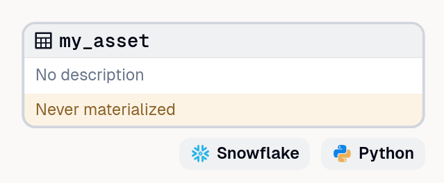

When you have more than 10 assets in dagster, you might want to be able to quickly identify them.
Here are all the ways _(I think)_ you can differentiate assets. 

- **naming convention**: This might not be for everyone but with a strong naming convention you can easily identify the asset. You could use a schema like `<type>_<source>__<additional_context>`  ([_the dbt docs have excellent naming suggestions_](https://docs.getdbt.com/blog/stakeholder-friendly-model-names#embed-information-in-the-name-using-an-agreed-upon-pattern))
- **prefixes**: it is possible to add a prefix to an asset (I don't really like this), but it would be like `groupingsname/assetname`
- **groups**: you can group multiple related assets together. this allows you to hide and unfold all the assets in the group. this is a hierarchical way of labeling assets (and you can only go one level).
- **tags**: You can add as many tags as you want to an asset. I strongly recommend a fixed scheme for tags, so that everyone in de org uses the same tags. Tags also serve as a mechanism to push information into the underlying run  execution with `dagster/[keyword]:value` For example you can tag priority, max_retries, concurrency limits _(because you only want to run 3 database heavy jobs at the same time)_ or set CPU and memory limits for the kubernetes job. Things you could tag; priority, domain, pii, SLOs [_(tags on the dagster docs)_](https://docs.dagster.io/concepts/metadata-tags/tags#tags)
- **metadata**: any `key:value` thing you might want, I like to add links to docs, but you can also link to a git repository. You can even add table and column information. [_(asset metadata in dagster docs)_](https://docs.dagster.io/concepts/metadata-tags/asset-metadata#attaching-definition-metadata)
- **owners** (experimental) we used to use metadata to label our assets with owners. But there is now a new owner field that takes a list of email addresses or special `team:NAME` strings.
- **kind**: you can specify kinds _(for example compute, storage, type)_. A kind is an extra label that is also visible in the UI, and for 200 predefined ones it shows an icon in stead of the name.  The kind  list has not just product names such as airflow, s3, spark, snowflake, dbt, but also bronze, zilver, gold. and icons for table, view, dashboard. [(kind tags, docs on dagster)](https://docs.dagster.io/concepts/metadata-tags/kind-tags#kind-tags)

In the dagster UI you can filter on owners, tags, groups, and kind

