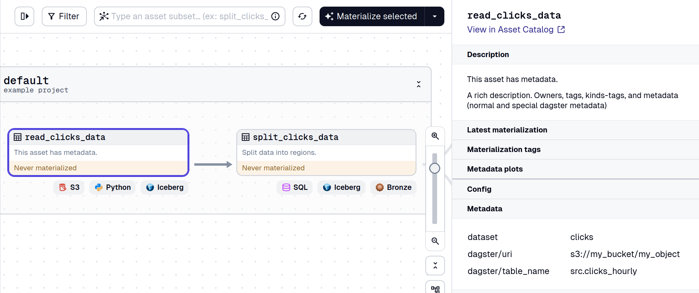

<!-- content  -->
Dagster assets can be labelled with `owners`, `tags`, `kind`s and metadata.
This is super useful but if you want to enforce a particular style on every
merge request you will mess up eventually. But, you can use pytest to enforce
this.



## testing for components

You can find the file in the github linked below, but here it is in steps.

```python
import pytest
from dagster import AssetSpec, AssetsDefinition

# Import all the assets from your project as one list.
from project.definitions import all_assets


@pytest.mark.parametrize("asset", all_assets)
def test_assets_style(asset):
    if isinstance(asset, AssetSpec):
        spec = asset
    else:
        assert isinstance(asset, AssetsDefinition), "not an asset"
        spec = asset.get_asset_spec()
```

- import all your assets
- use pytest.mark.parametrize to pass every single asset to the test.
- you can test both assets specs (for external assets) and actual assets with the same functionality


```python
    assert spec.description is not None, f"{spec.key.to_string()} needs a description"
```
By adding a specific error message after the assert, the error message is more
actionable (and it adds the asset name too). 

```python
    if spec.metadata.get("Status"):
        assert spec.metadata.get("Status") in ["PoC", "Prototype", "Product"]
        if spec.metadata.get("Status") == "Product":
            asset_spec_tester_prototype(spec)
            asset_spec_tester_product(spec)
        if spec.metadata.get("Status") == "Prototype":
            asset_spec_tester_prototype(spec)
```

I often label my assets with 'Status', and I enforce that you pick one of three options.
I enforce the following rules:

```python
def asset_spec_tester_prototype(spec):
    """Tests for assets in prototype stage."""
    assert spec.owners is not None, f"{spec.key.to_string()} needs owners"

def asset_spec_tester_product(spec):
    """test specific things for assets in product stage."""
    assert spec.metadata.get("docs"), f"{spec.key.to_string()} needs a docs link"

```

- everything prototype and higher needs to have a owners label
- everything product needs to have a docs matadata value


```python
    if "dashboard" in spec.kinds:
        assert (
            spec.metadata.get("dashboard_url") is not None
        ), f"{spec.key.to_string()} has kind dashboard, and therefore needs a dashboard_url."
    # spec.kinds
    # spec.metadata
    # spec.owners
    # spec.tags
```

- if you have a kind `dashboard` label, you need to have a `dashboard_url` metadata value

## finally

So here is how you enforce things on your assets.

I have put everything [in this github repo](https://github.com/RMHogervorst/dagster_labeling_testing_example), since it uses poetry you can literally install the exact same package versions.
