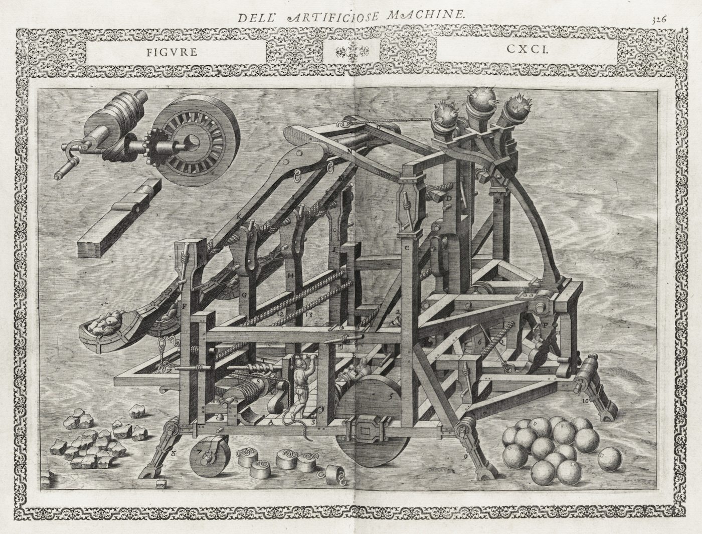

<!-- content  -->

Ah it is so alluring! With this search engine you will finally be able to find the documents of your organization! This vendor even has a large language model so you can search on 'meaning' not only actual words! Alas one million dollars later you still can't find your shit.

I think the main reason you can't find shit in your company is because you don't organize your documents. As a messy person I empathize, but you need to get your shit together. Organizing means throwing away stuff, it means curating the files that you want to keep. It means making choices. 

I've been in places where internal documents live in a shared drive, places where documents live in sharepoint and places where no one really knows, and you have to ask the most senior person and they will email you final version 342. I thinktechnology is not really the issue. It is the organization. There is a reason for the academic study of librarianship. Shit is not easy.

You need to cater your documentation to different use-cases, here are some examples:

- your new hire needs to onboard, and learn about your internal jargon and how to find things in your org
- your manager (or lead) needs to find your work
- You would like to repeat your work for a different client, can you find your work from last year?
- an intern did a project a few years ago and you are finally ready to build on that, can you find it?

Generally you need to distinguish between what needs to be available for you, for your team, and for the rest of the org. You need to build in time to archive your docs: not only save them, but think about how you will need to retrieve it later on.

First you need to throw away everything that is not relevant to keep, like all your previous drafts (with mystyrious names like version 12a). The files left can be organized. You can use folder structure, tags, ontologies and metadata in the files themselves. There a many ways, but your organization needs to figure out a way and stick to it. Of course this is a rather invisible job and therefore the first thing people stopped doing. And librarians were pushed out of larger organizations long ago so the knowledge of how to organize data is long gone.

But it is problematic (and even kind of awkward) that organizations cannot find their documents again. So I understand that people keep trying to find technical solutions. But every solution requires work from employees, and if you don't do that I think it fails every time. Your internal search engine will not magically solve your problems if you don't apply some structure. Yes sharepoint sucks, undoubtedly, but it does not help that you just threw documents without extra metadata into the system. If you throw all your word files in all their versions into a 'semantic' search engine, all you get in answer to your question is: "these 300 documents look similar to your query". 

Documentation is hard. Maintaining usable docs is even harder. Maintaining an usable archive  is hard core difficult, but very valuable! You need structure, conventions, and possibly hire a librarian. And also, not every document is valuable enough to save, throw your shit away.

_Image from [The Public Domain Image Archive (PDIA)](https://pdimagearchive.org/images/ff1e3f10-141f-4a8f-84c6-4f20cb2dd3e6/)_.
 _Artist: Agostino Ramelli date: 1588 From 'Le diverse et artificiose machine' Library of congress_
